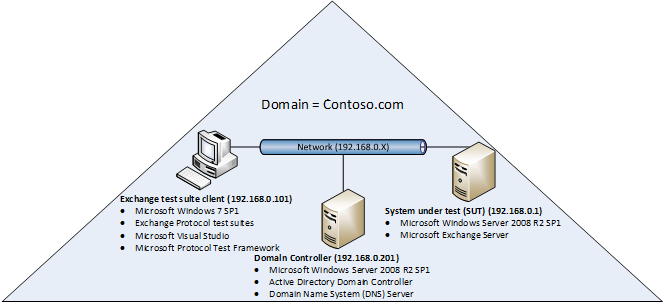
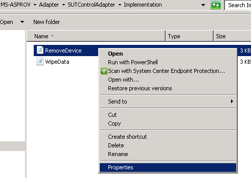
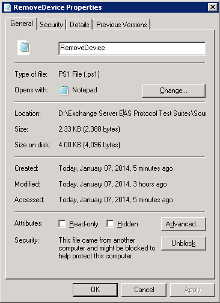
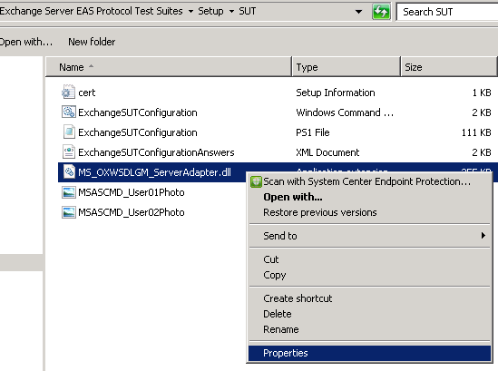
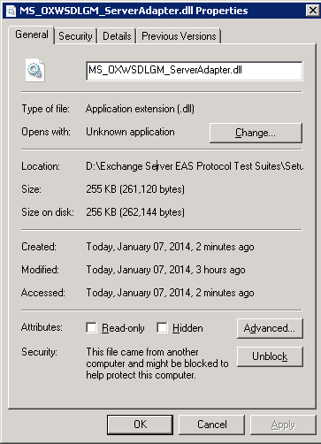
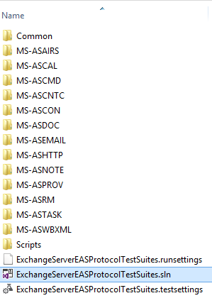
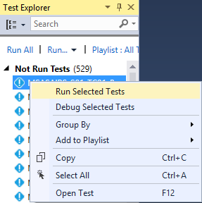
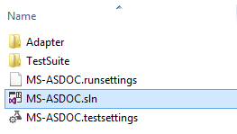
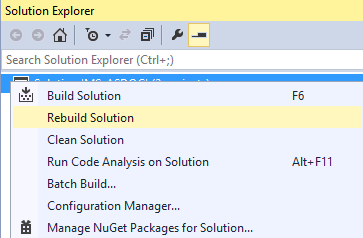
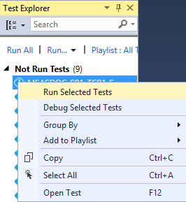

Exchange EAS Test Suite deployment guide
======================================================================================================

- [Overview](#overview)
- [Prerequisites](#prerequisites)
- [Deploying test suites](#deploying-test-suites)
- [Using test suite directories](#using-test-suite-directories)
- [Configuring test suites](#configuring-test-suites)
- [Running test suites](#running-test-suites)
- [Viewing test suite results, logs, and reports](#viewing-test-suite-results-logs-and-reports)
- [Appendix](#appendix)

Overview
======================================================================================================

Exchange Server EAS Protocol Test Suites are implemented as
synthetic clients running against the server-side implementation of a
given Exchange protocol. They are designed in a client-to-server
relationship and were originally developed for the in-house testing of
Microsoft Open Specifications. Test suites have been used
extensively in Plugfests and Interoperability Labs to test partner
implementation.

The Exchange EAS Test Suite deployment guide introduces the hardware and
software requirements of the test suite client, and the requirements of
the system under test (SUT) if the test suites run against Exchange
Server. The guide also introduces topics on how to deploy, configure and run the
test suites, and view the test suite reports.

Prerequisites
======================================================================================================

This section describes the hardware and software requirements for the
test suites. In an Exchange Server environment, the test suite
deployment takes place on both the client and server side. The following
information helps test suite users to plan their deployment.

Hardware requirements
------------------------------------------------------------------------------------------------------------------------------

### System under test

The SUT is the server side of the test suite environment. Exchange
server(s) and Active Directory have defined system requirements which
should be taken into account during deployment. Exchange Server EAS
Protocol Test Suites do not have any additional SUT resource
requirements.

### Test suite client

The test suite client is the client side of the test suite environment.
The following table shows the minimum resource requirements for the test
suite client.

**Test suite client resource requirements**

| Component | Test suite client minimum requirement |
| :--- | :--- |
|**RAM**|2GB|
|**Hard Disk**| 3G of free space|
|**Processor**| >= 1GHz|

Software requirements
------------------------------------------------------------------------------------------------------------------------------

### System under test

This section is only relevant when running the test suites against the
following versions of Exchange Server:

-   Microsoft Exchange Server 2007 Service Pack 3 (SP3)
-   Microsoft Exchange Server 2010 Service Pack 3 (SP3)
-   Microsoft Exchange Server 2013 Service Pack 1 (SP1)
-	Microsoft Exchange Server 2016
-	Microsoft Exchange Server 2019

The following table describes the required server roles for a
test suite deployment with Microsoft implementation. Installing
Exchange Server on a domain controller (DC) is not recommended.

**Required SUT roles**

|Role  |Description |
| :--- | :--- |
| **Active Directory Domain Controller (AD DC)** |Active Directory Domain Controller is used to provide secure data for users and   computers. An AD DC can coexist with Exchange Server. A typical test configuration has an AD DC and Exchange Server installed on separate machines.|
| **Domain Name System Server (DNS)**  |Domain Name System (DNS) Server provides a name resolution for TCP/IP networks. A DNS Server is easier to manage when it is installed on the server as Active Directory Domain Services.  |
|  **Exchange Server (SUT)** |The Exchange Server in the topology. |

The following diagram is an example of what a typical Exchange test suite environment may look like. This example uses an IPv4, but IPv6 is also supported by the test suites.

**Note** When AD DC and SUT are on the same machine, test cases for MS-ASRM will fail.
 

### Test suite client

This section describes the prerequisite software for installing Exchange Server EAS Protocol Test Suites on the test suite client. The following
table outlines the software dependencies for the test suite client.

**Test suite client software dependencies**

|Operating systems  |
| :--- |
|Windows 7 x64 Service Pack 1 and above|
|Windows 8 x64 and above|
|Windows 2008 R2 x64 Service Pack 1 and above|

|Software |
|:--- |
|Microsoft Visual Studio 2013 Professional|
|Microsoft Protocol Test Framework 1.0.2220.0 and above|

Deploying test suites
=======================================================================================================================

This section describes the deployment of Exchange Server EAS Protocol
Test Suites on the test suite client and the SUT. Exchange Server
EAS Protocol Test Suites are packaged in a .zip file, available
at [Microsoft Connect](http://go.microsoft.com/fwlink/?LinkId=516921).
Once you've downloaded the test suites, perform the following
steps to successfully configure the test suites:

1.  Extract the **Exchange Server EAS Protocol Test Suites** folder from the zip file to a
    directory of your choice on the test suite client.

2.  Copy the **SUT** folder under **…\\Exchange Server EAS Protocol Test
    Suites\\Setup** to a directory of your choice on the SUT. The SUT
    configuration scripts are the only requirement for the SUT. The
    scripts facilitate the SUT configuration process and are
    in the **ExchangeServerEASProtocolTestSuites.zip** file.

**Note** If your computer blocks scripts that are downloaded from the Internet
for security reasons, follow these steps to unblock
PowerShell scripts and the MS\_OXWSDLGM\_ServerAdapter.dll file.

 1.  Right-click xxxx.ps1, and then click **Properties**.

 2.  Click **Unblock,** and then click **OK**.              
                                                                                                                          

To unblock MS\_OXWSDLGM\_ServerAdapter.dll, do the following:

1.  Browse to **MS\_OXWSDLGM\_ServerAdapter.dll** in **\\Setup\\SUT**.

2.  Right click **MS\_OXWSDLGM\_ServerAdapter.dll,** and then click **Properties**.   

                                                                                        

3.  Click **Unblock,** and then click **OK**.                                           
                                                                                       

Using test suite directories
============================================================================================================

This section shows the folder structures in the **ExchangeServerEASProtocolTestSuites.zip** file.

**ExchangeServerEASProtocolTestSuites.zip file contents**

| Folder/file | Description |
| :--- | :--- |
|**EULA.rtf** | End-User License Agreement. |
|**ReadMe.txt** | A doc on deployment and prerequisite software. |
| **Exchange Server EAS Protocol Test Suites** |--|            
|**- Docs**| A folder with documents of all protocol test suites.|
|**- ExchangeEASTestSuiteDeploymentGuide.docx** |A doc on the protocol test suite deployment. |
|**+ MS-XXXX** | The MS-XXXX help documentation |
| **- \[MS-XXXX\].pdf**   | The protocol technical specification.|
| **- MS-XXXX \_SUTControlAdapter.chm**  | A help doc on the SUT control adapter class library such as declaration syntax and their description.|
|**- MS-XXXX \_RequirementSpecification.xlsx**|A spreadsheet that outlines all requirements that are associated with the technical specification.|
|**- Setup**|A folder with configuration scripts.|
| **- Test Suite Client**| A folder with the configuration script to configure the test suite client.|
| **- ExchangeClientConfiguration.cmd** | A command file that runs the ExchangeClientConfiguration.ps1 file to configure the properties for the protocol test suites.|
| **- ExchangeClientConfiguration.ps1**|A configuration script that will be triggered by the ExchangeClientConfiguration.cmd.|
| **- SUT** | A folder with the configuration script to configure the Exchange Server.|
|**- ExchangeSUTConfiguration.cmd**| A command file that runs the ExchangeSUTConfiguration.ps1 file to create resources and configure settings on the SUT.|
|**- ExchangeSUTConfiguration.ps1**| A configuration script that will be triggered by ExchangeSUTConfiguration.cmd.|
|**- Source** | A folder with Microsoft Visual Studio solutions that contain source code for the test suites.|
|**- Common** | A folder with Microsoft Visual Studio projects that contains the common source code for the test suites.|
|**- ExchangeCommonConfiguration.deployment.ptfconfig** | A common configuration file.|
|**- ExchangeServerEASProtocolTestSuites.runsettings**  |A configuration file for the unit test.|
|**- ExchangeServerEASProtocolTestSuites.sln**| A Visual Studio solution with projects that encapsulate the protocol test suites source code.|
|**- ExchangeServerEASProtocolTestSuites.testsettings** |  A configuration file for running test cases.|
|**- MS-XXXX**    |  A folder for the MS-XXXX test suite source code.|
|**- MS-XXXX.sln**|  A Microsoft Visual Studio solution with projects of the MS-XXXX test suite.|
|**- MS-XXXX.runsettings** | A configuration file for the MS-XXXX unit test.|
|**- MS-XXXX.testsettings**| A configuration file for running MS-XXXX test cases.|
|**+ Adapter**|The Adapter test suite code.|
|**+ TestSuite**|The test suite code.|
|**- Scripts** | Exchange Server EAS Test Suites can be run using Visual Studio or batch scripts. The Scripts directory contains a collection of command files that allows users to run specific test cases in the test suite or the entire test suite.|
|**- RunAllExchangeEASTestCases.cmd**| A script that can be used to run all test cases in the whole package.|
|**- MS-XXXX**| A folder with scripts that belong to the MS-XXXX test suite.|
|**- RunAllMSXXXXTestCases.cmd**|  A script that can be used to run all test cases of MS-XXXX.|
|**- RunMSXXXX\_SXX\_TCXX\_Name.cmd**| A script that can be used to run a single test case of MS-XXXX.|

Configuring test suites
==============================================================================================================================

This section provides the guidance on configuring Exchange
Server EAS Protocol Test Suites on the SUT and the test suite client.
The configuration should be done in this order: configure the SUT, and
then configure the test suite client.

For the configuration script, the exit code definition is as follows:

-   A normal termination will set the exit code to 0.
-   An uncaught THROW will set the exit code to 1.
-   Script execution warning and issues will set the exit code to 2.
-   Exit code is set to the actual error code for other issues.

Configuring the SUT
---------------------------------------------------------------------------------------------------------------------------------------

You can configure the SUT using automated scripts, as described in
[Configuring the SUT using the setup configuration script](#configuring-the-sut-using-the-setup-configuration-script); or configure the SUT
manually, as described in [Configuring the SUT manually](#configuring-the-sut-manually).

**Note** The scripts should be run by a user who has domain
administrator rights with a mailbox on Exchange Server.

### SUT resource requirements 

Each test suite in the Exchange Server EAS Protocol Test
Suites package may require a varying level of resources on Exchange
Server. The following table outlines these resources for each test
suite. The SUT configuration scripts will automatically create all the
required resources for the Microsoft server implementation. To configure
the SUT manually, see [Configuring the SUT manually](#configuring-the-sut-manually).

The client configuration script follows the naming convention shown in
the following table. If a change to the resource name is required, the
corresponding change to the resource name defined in the client
configuration script is required.

**Exchange server resources**

|  Test suite | Resource type |  Resource name | Notes |
| :--- | :--- | :--- |:--- |
|  **All**       |   --   |   --|   --|
|  **MS-ASAIRS**  |  User Mailbox | MSASAIRS\_User01  | --|
|             |User Mailbox | MSASAIRS\_User02| --|
| **MS-ASCAL**  |User Mailbox  | MSASCAL\_User01  | --|
|             |User Mailbox |   MSASCAL\_User02 | --|
| **MS-ASCMD**|User Mailbox | MSASCMD\_UserY  | “Y” represents the numerate value count and the value range of Y from 01 to 19, since 19 mailbox users will be used.|
| | User Mailbox     | MSASCMD\_SearchUser01 | --|
| | User Mailbox     | MSASCMD\_SearchUser02 |--|
| | DistributionGroup| MSASCMD\_TestGroup | --|
| | DistributionGroup| MSASCMD\_LargeGroup| --|
| | Folder| MSASCMD\_SharedFolder| The folder is shared and read permissions are granted to user MSASCMD\_User01 and denied to user MSASCMD\_User02.|
| | TextFile| MSASCMD\_Non-emptyDocument.txt|The document should be created under MSASCMD\_SharedFolder, and be at least 4 bytes in size.|
| | TextFile| MSASCMD\_EmptyDocument.txt| The document should be created under MSASCMD\_SharedFolder and be empty.|
| | Picture | MSASCMD\_User01Photo| The file size should be bigger than 1KB.|
| | Picture | MSASCMD\_User02Photo  | The file size should be smaller than 1KB.|
| | EMail| MSASCMD\_SecureEmailForTest|--|
| **MS-ASCNT**  | User Mailbox |   MSASCNTC\_User01  | --|
| | User Mailbox  |MSASCNTC\_User02|--|
|**MS-ASCON**| User Mailbox|  MSASCON\_User01 |--|
| | User Mailbox| MSASCON\_User02  |--|
| | User Mailbox| MSASCON\_User03  |--|
|**MS-ASDOC**| User Mailbox| MSASDOC\_User01|--|
| | Folder| MSASDOC\_SharedFolder|The folder is shared and the full control should be granted to the specified user MSASDOC\_User01.|
| |  Folder| MSASDOC\_VisibleFolder|The folder should be created under MSASDOC\_SharedFolder.|
| | Folder| MSASDOC\_HiddenFolder|The folder is hidden and should be created under MSASDOC\_SharedFolder.|
| | TextFile|MSASDOC\_VisibleDocument|  The document should be created under MSASDOC\_SharedFolder.|
| | TextFile| MSASDOC\_HiddenDocument|The document is hidden and should be created under MSASDOC\_SharedFolder.|
| **MS-ASEMAIL**|User Mailbox| MSASEMAIL\_User01  |--|
| | User Mailbox| MSASEMAIL\_User02|--|
| | User Mailbox| MSASEMAIL\_User03|--|
| | User Mailbox| MSASEMAIL\_User04|--|
| | User Mailbox| MSASEMAIL\_User05|--|
| **MS-ASHTTP** | User Mailbox|MSASHTTP\_User01 |--|
| | User Mailbox| MSASHTTP\_User02|--|
| | User Mailbox| MSASHTTP\_User03|--|
| | User Mailbox| MSASHTTP\_User04|--|
|**MS-ASNOTE**|User Mailbox|MSASNOTE\_User01|--|
|**MS-ASPROV**|User Mailbox|MSASPROV\_User01|--|
| | User Mailbox| MSASPROV\_User02 |--|                             
| | User Mailbox| MSASPROV\_User03|--|                              
| | Active sync mailbox policy|MSASPROV\_UserPolicy01|--|                        
| | Active sync mailbox policy|MSASPROV\_UserPolicy02|--|                        
|**MS-ASRM**|User Mailbox  |  MSASRM\_User01|--|
| | User Mailbox| MSASRM\_User02|--|
| | User Mailbox| MSASRM\_User03|--|
| | User Mailbox| MSASRM\_User04|--|
| | User|  MSASRM\_ADUser |A domain user who is granted AD RMS Enterprise Administrator permission.|
| | DistributionGroup   | MSASRM\_SuperUserGroup    |   --|
| | Distributed Right Policy Template |  MSASRM\_AllRights\_AllowedTemplate|Allowed all rights|
| | Distributed Right Policy Template |  MSASRM\_View\_AllowedTemplate| Denied all rights except View|
| | Distributed Right Policy Template |  MSASRM\_ViewReplyAll\_AllowedTemplate| Allowed View and ReplyAll|
| | Distributed Right Policy Template |  MSASRM\_ViewReply\_AllowedTemplate|Allowed View and Reply|
| | Distributed Right Policy Template |  MSASRM\_ViewReplyReplyAll\_AllowedTemplate|   Allowed View, Reply, and ReplyAll|
| | Distributed Right Policy Template |  MSASRM\_EditExport\_NotAllowedTemplate|Allowed all rights except Edit and Export|
| | Distributed Right Policy Template |  MSASRM\_Export\_NotAllowedTemplate  | Allowed all rights except Export|
| | Distributed Right Policy Template |  MSASRMReplyAll\_NotAllowedTemplate  | Allowed all rights except ReplyAll|
|**MS-ASTASK**|User Mailbox |MSASTASK\_User01 |--|
|**MS-ASWBXML** |--|--|--|

### Configuring the SUT using the setup configuration script 

The setup configuration script is only used for configuring Exchange
Server on the Windows platform.

To configure the SUT using the setup configuration script, navigate to the
**SUT** folder, right-click **ExchangeSUTConfiguration.cmd** and select
**Run as administrator**.

### Configuring the SUT manually 

If the SUT is non-Microsoft implementation of Exchange Server, you
will not be able to run the setup configuration script. The following
steps explain what needs to be created or configured on the SUT in order
to run the test suites.

1.  Create the following mailbox users:

    MSASAIRS\_User01, MSASAIRS\_User02, MSASCAL\_User01, MSASCAL\_User02,
    MSASCMD\_UserY, MSASCMD\_SearchUser01, MSASCMD\_SearchUser02,
    MSASCNTC\_User01, MSASCNTC\_User02, MSASCON\_User01, MSASCON\_User02,
    MSASCON\_User03, MSASDOC\_User01, MSASEMAIL\_User01, MSASEMAIL\_User02,
    MSASEMAIL\_User03, MSASEMAIL\_User04, MSASEMAIL\_User05,
    MSASHTTP\_User01, MSASHTTP\_User02, MSASHTTP\_User03, MSASHTTP\_User04,
    MSASNOTE\_User01, MSASPROV\_User01, MSASPROV\_User02, MSASPROV\_User03,
    and MSASTASK\_User01

2.  Create the mailbox user MSASCMD\_UserY specified in the SUT resource
    requirements table in [SUT resource requirements](#sut-resource-requirements).

3.  Add a delegate of MSASCMD\_User07 to MSASCMD\_User08, and also add a
    delegate of MSASEMAIL\_User04 to MSASEMAIL\_User05. The delegated
    user will be granted Edit permissions on Calendar, Tasks, Inbox,
    Contacts, Notes and Journal.

4.  Set the following properties for MSASCMD\_User01:

    -   SamAccountName: "MSASCMD\_User01"      
    -   GivenName: "MSASCMD\_FirstName"
    -   Surname: "MSASCMD\_LastName"
    -   Office: "D1042"
    -   Company: “MS”
    -   Title: “Manager”
    -   HomePhone: “22222286”
    -   OfficePhone: “55555501”
    -   MobilePhone: “8612345678910”

5.  Create the following distribution groups:
    MSASCMD\_TestGroup, MSASCMD\_LargeGroup, MSASRM\_SuperUserGroup.

6.  Create two ActiveSync mailbox policies MSASPROV\_UserPolicy01 and
    MSASPROV\_UserPolicy02

7.  Create a shared folder MSASCMD\_SharedFolder. Also, remove read
    permissions from MSASCMD\_User02. Under the folder
    MSASCMD\_SharedFolder, create a non-empty document named
    MSASCMD\_Non-emptyDocument.txt, and an empty document
    named MSASCMD\_EmptyDocument.txt.

 **Note** The file size of MSASCMD\_Non-emptyDocument.txt should be at least 4 bytes.

8.  Create a shared folder named MSASDOC\_SharedFolder. Also, grant full
    control to MSASDOC\_User01. Under the folder MSASDOC\_SharedFolder,
    create a hidden folder named MSASDOC\_HiddenFolder, a visible folder
    named MSASDOC\_VisibleFolder, a hidden document named
    MSASDOC\_HiddenDocument.txt, and a visible
    document MSASDOC\_VisibleDocument.txt.

 **Note** The document MSASDOC\_HiddenDocument.txt and MSASDOC\_VisibleDocument.txt should not be empty.

9.  Grant local administrator permissions to the following mailbox
    users:

    MSASCMD\_User03, MSASHTTP\_User04, MSASPROV\_User01

10. Grant administrator permissions to the SUT for the following mailbox
    users:

    MSASCMD\_User03, MSASPROV\_User01.

11. Grant distribute message permissions to the group
    MSASCMD\_TestGroup, and add the following mailbox users into the
    group:
    MSASCMD\_User01, MSASCMD\_User02.

12. Grant distribute message permissions to the group
    MSASCMD\_LargerGroup, and add 19 mailbox users specified in
    MSASCMD\_UserY section [SUT resource requirements](#sut-resource-requirements), MSASCMD\_SerachUser01, and
    MSASCMD\_SearchUser02 into the group MSASCMD\_LargerGroup.

13. Apply the following policy settings for the Mobile Device mailbox
    policy MSASPROV\_UserPolicy02. The value of **Allow non-provisionable
    devices** must be set to **false**, while the value for other properties
    listed below are not restricted.

    -   Allow non-provisionable devices
    -   Password expiration (days)
    -   Maximum attachment size (KB)
    -   Number of failed attempts allowed
    -   Time without user input before password must be re-entered (in minutes)
    -   Minimum password length
    -   Blocked applications
    -   Allowed applications

14.  Set the mailbox policy MSASPROV\_UserPolicy01 MSASPROV\_User01 and
    MSASPROV\_UserPolicy02 to MSASPROV\_User02.

15.  Enable the setting of moving meeting forward notification email to
    Deleted Items for MSASCMD\_User01 and MSASHTTP\_User03.

16.  Disable ActiveSync for MSASCMD\_User04.

17.  Add an SMTP email address to MSASCMD\_User01.

18.  Configure the external URL of ActiveSync virtual directory on
    the server.

19.  Configure the web site which contains the application that
    implements the EAS protocols.

	a.  Configure Secure Sockets Layer (SSL) as **not required** and ignore
    client certificates on the following sites: Default Web Site, Server
    ActiveSync website, and Autodiscover website.

20.  Configure Certificate Authority and Certificate Authority Web
    enrollment services.

21.  Create and export a user certificate named MSASCMD\_PfxFile to be
    able to send a secure email to MSASCMD\_User03.

22.  MSASCMD\_User03 should send an email to MSASCMD\_User09.

  **Note** The subsequent steps in this procedure are only necessary for Exchange Server 2010 or Exchange Server 2013.

23.  Add the photo MSASCMD\_User01Photo.jpg to MSASCMD\_User01 and
    MSASCMD\_User02Photo.jpg to MSASMCD\_User02.

24.  Create a user named MSASRM\_ADUser.

25.  Create a local group named AD RMS Enterprise Administrators and add
    the user MSASRM\_ADUser into this group.

26.  Create mailbox users MSASRM\_User01, MSASRM\_User02, MSASRM\_User03,
    and MSASRM\_User04.

27.  Grant local administrator permission to MSASRM\_User04.

28.  Create a distribution group named MSASRM\_SuperUserGroup.

29. Install the Active Directory Right Management Service (AD RMS)
    role .

30. Configure the website which contains the application that implements
    the EAS protocols.

	a.  Configure Secure Sockets Layer (SSL) as not required and ignore
    client certificates on the following sites:

    - Default Web Site/\_wmcs
	- Default Web Site/\_wmcs/admin
    - Default Web Site/\_wmcs/certification
	- Default Web Site/\_wmcs/licensing

31.  Add Read and Execute permission for the groups Users, Product
    Servers, and AD RMS Service Group on the
    ServerCertification.asmx file.

32.  Add Read and Execute permission for the group Product Servers on the
    license.asmx file.

33.  Add RMS shared identity user into the distribution
    group MSASRM\_SuperUserGroup.

34.  Set MSASRM\_SuperUserGroup as the super user group.

35.  Create the following distributed rights policy templates:

  |  Template Name | Rights |
  | :--- | :--- |
  |**MSASRM\_View\_AllowedTemplate**|       View and View Rights|
  |**MSASRM\_ViewReplyAll\_AllowedTemplate**|      View, Reply All, and View Rights|
  |**MSASRM\_ViewReply\_AllowedTemplate** |      View, Reply, and View Rights|
  |**MSASRM\_ViewReplyReplyAll\_AllowedTemplate**|   View, Reply, Reply All, and View Rights|
  |**MSASRM\_EditExport\_NotAllowedTemplate**|View, Print, Forward, Reply, Reply All, Extract, Allow Macros, and View Rights|
  |**MSASRM\_Export\_NotAllowedTemplate**| View, Edit, Save, Print, Forward, Reply, Reply All, Extract, Allow Macros, View Rights, and Edit Rights|
  |**MSASRMReplyAll\_NotAllowedTemplate**|View, Edit, Save, Export, Print, Forward, Reply, Extract, Allow Macros, View Rights, and Edit Rights|
  |**MSASRM\_AllRights\_AllowedTemplate**| View, Edit, Save, Export, Print, Forward, Reply, Reply All, Extract, Allow Macros, View Rights, and Edit Rights|
36.  Configure IRM features to enable licensing for internal messages.

37.  Enable IRM features to allow the client to access the SUT.

Configuring the test suite client
------------------------------------------------------------------------------------------------------------------------------

The test suite client is managed through a common configuration file,
two test-suite specific configuration files, and three SHOULD/MAY
configuration files that all have a “.ptfconfig” extension. These
configuration files can be modified directly. The common configuration
file and the test-suite specific configuration files can also be
modified through a script.

### Common configuration file

The common configuration file contains configurable properties common to
all Exchange Server EAS Protocol Test Suites. This file must be modified
to match the characteristics of the environment where the test suites
are installed.

| Configuration file | Description |
| :--- | :--- |
| **ExchangeCommonConfiguration.deployment.ptfconfig**|The deployment configuration file provides the common environmental details for the test suites. |

### Test-suite specific configuration files

In addition to the common configuration file, each individual test suite
has the following two configuration files for test-suite specific
modification.

**Test-suite specific configuration files**

| Configuration file | Description |
| :--- | :--- |
| **MS-XXXX\_TestSuite.deployment.ptfconfig** | The deployment configuration file provides the environmental details that are specific to the test suite. The configuration file allows for test- suite specific customization.|
| **MS-XXXX\_TestSuite.ptfconfig**| The test suite configuration file contains details that specify the behavior of the test suite operation.|

Both files are in the TestSuite folder in each test suite directory.

If you need to modify the common configuration values for a specific
test suite, you must copy the common properties to the
**MS-XXXX\_TestSuite.deployment.ptfconfig** file and change the values
of the properties. The specific configuration file will take precedence
over the common configuration file when the same property exists in both
places.

#### Set the test suite to interactive mode 

If the SUT is non-Microsoft implementation of Exchange Server, it is
recommended that you further configure the test suite by setting the
test suite to interactive mode. Interactive mode enables the test suite
to function in a manual way, enabling you to perform setup, teardown,
and other tasks in a step-by-step approach. To enable interactive mode
for a specific test suite, do the following:

1.  Browse to the **MS-XXXX\_TestSuite.ptfconfig** configuration file in **\\Source\\MS-XXXX\\TestSuite\\**.

2.  Set the type value of Adapter property to **interactive** for the
    SUT control adapter\*\*.

**Interactive mode values**

| Property name  | Default value\*|Optional value| Description|
| :--- | :--- |:--- |:--- |
|  Adapter   | managed or powershell | interactive\*\* | **managed**:The SUT control adapter is implemented in C# managed code.
||||**powershell**: The SUT control adapter is implemented through Windows PowerShell.
||||**interactive**: Interactive adapters are used for manually configuring a server. Interactive adapter displays a dialog box to perform a manual test each time when one of its methods is called. The dialog box will show the method name, parameter names, and values\*\*\*|

\*The Adapter property value is set to either managed or powershell
depending on whether the SUT control adapter was implemented in managed
C\# code or through PowerShell.

\*\*When changing from managed mode to interactive mode, the
“adaptertype” attribute must be deleted to avoid a runtime error. When
changing from powershell mode to interactive mode, an additional step is
required—delete the “scriptdir” attribute to avoid a runtime error.

\*\*\*When the manual operation completes successfully, enter the
return values (if any) in **Action Results** and click **Succeed** in
the dialog-box. When the manual operation is unable to complete, enter
the error messages in the **Failure Message** text box and click
**Fail** to terminate the test. In this case, the test will be treated
as “Inconclusive”.

Further customization can be done by creating your own SUT control
adapter that matches the server implementation. For more information
about how to create a SUT control adapter, see the [Protocol Test
Framework (PTF) user documentation](https://github.com/Microsoft/ProtocolTestFramework).

#### Configure TSAP broadcast

Test Session Announcement Protocol (TSAP) is used by PTF to broadcast
test information when the test suite is running. TSAP broadcast helps
with mapping test cases to captured frames.

By default, TSAP packets are broadcasted in the network. The user can change
a TSAP broadcast by adding an entry “BeaconLogTargetServer” to
TestSuite.deployment.ptfconfig to target TSAP for the specified
machine.

To change the TSAP packet broadcast, do the following:

1.  Browse to the **MS-XXXX\_TestSuite.deployment.ptfconfig**
    configuration file in the **\\Source\\MS-XXXX\\TestSuite\\** folder.

2.  Add a property “BeaconLogTargetServer” along with the value of the
    specified machine name.

	For example: &lt;Property name="BeaconLogTargetServer" value="dc01"/&gt;

### SHOULD/MAY configuration files

The test suite has three SHOULD/MAY configuration files that are
specific to all supported versions of the SUT. Each SHOULD/MAY
requirement has an associated parameter with a value of either “true”
or “false” corresponding to the server version that is supported. A value of “true”
means that the requirement must be validated, whereas “false” means
that the requirement must not be validated.

If the SUT is non-Microsoft implementation of Exchange Server,
configure the properties in the configuration file for Exchange
Server to be the closest match to the SUT implementation.

SHOULD/MAY configuration files

|Configuration file  | Description |
| :--- | :--- |
|**MS-XXXX\_ExchangeServer2007\_SHOULDMAY.deployment.ptfconfig**| Provides the configuration properties for SHOULD and MAY requirements supported by Microsoft Exchange Server 2007 Service Pack 3 (SP3).|
|**MS-XXXX\_ExchangeServer2010\_SHOULDMAY.deployment.ptfconfig**| Provides the configuration properties for SHOULD and MAY requirements supported by Microsoft Exchange Server 2010 Service Pack 3 (SP3).|
|**MS-XXXX\_ExchangeServer2013\_SHOULDMAY.deployment.ptfconfig**| Provides the configuration properties for SHOULD and MAY requirements supported by Microsoft Exchange Server 2013 Service Pack 1 (SP1).|
**MS-XXXX\_ExchangeServer2016\_SHOULDMAY.deployment.ptfconfig** | Provides the configuration properties for SHOULD and MAY requirements supported by Microsoft Exchange Server 2016.
**MS-XXXX\_ExchangeServer2019\_SHOULDMAY.deployment.ptfconfig** | Provides the configuration properties for SHOULD and MAY requirements supported by Microsoft Exchange Server 2019.

### Configuring the test suite client using the setup configuration script

**Note** The setup configuration script is only implemented for configuring the test
suite client on the Windows platform.

To configure the test suite using the setup configuration script,
navigate to the **Setup\\Test Suite Client**\\ folder, right-click
**ExchangeClientConfiguration.cmd** and select **Run as administrator.**

### Configuring the test suite client manually

If you didn’t use the setup configuration script to configure the test
suite client as described in the previous section, follow the steps
below to update configuration files and configure the test suite client.

1.  Update the property value in the common configuration file and the
    test-suite specific configuration files according to the comment of
    the property.

2.  By default, the test suites use PowerShell script in the SUT control
    adapter to configure the SUT. If you chose interactive mode for the
    SUT control adapter as described in section
    [Set the test suite to interactive mode](#set-the-test-suite-to-interactive-mode), skip this step.

    a.  Set the execution policy to **RemoteSigned**.

    b.  Add the SUT to **TrustedHosts** to ensure that the Windows Remote
    Management (WinRM) client can process remote calls against the SUT
    when the test suite client is not joined to the domain.

Running test suites
=================================================================================================================

Once the required software is installed and both the SUT and test suite client
are configured appropriately, the test suite is ready to run. The test
suite can run only on the test suite client and can be initiated in one
of the following two ways: Visual Studio or batch scripts.

Microsoft Visual Studio
---------------------------------------------------------------------------------------------------------------------

A Microsoft Visual Studio solution file
**ExchangeServerEASProtocolTestSuites.sln** is provided in the
**Source** folder. You can run a single or multiple test cases in Visual
Studio.

1.  Open **ExchangeServerEASProtocolTestSuites.sln** in Visual Studio                                                                         
                                                                                                                                          

2.  In the **Solution Explorer** pane, right-click **Solution ‘ExchangeServerEASProtocolTestSuites’**, and then click **Rebuild Solution**.   

                                                                                                                                         

3.  Open **Test Explorer**. On the ribbon, click **TEST** then click **Windows**, and finally click **Test Explorer**.                        

                                                                                                                                         

  4.  Select the test case to run. Right-click and then select **Run Selected Tests**.

A Visual Studio solution file
**MS-XXXX.sln** is provided in each test suite folder.

1.  Select the test suite you would like to run. Let’s take MS-ASDOC as an example here, so browse to the **Source\\MS-ASDOC** directory.

2.  Open **MS-ASDOC.sln** in Visual Studio.

3.  In the **Solution Explorer** pane, right-click **Solution ‘MS-ASDOC’**, and then click **Rebuild Solution**.

4.  Open Test Explorer. On the ribbon, click **TEST**, then click **Windows**, and finally click **Test Explorer**.

5.  Select the test case to run. Right-click and then select **Run Selected Tests**.

Batch scripts
---------------------------------------------------------------------------------------------------------------------------------------

Exchange Server EAS Protocol test suites are installed with a collection
of scripts that enable a user to run individual test cases
(RunMSXXXX\_SXX\_TCXX\_Name.cmd) or all test cases in a test suite
(RunAllMSXXXXTestCases.cmd), or all test cases of Exchange Server EAS
Protocol test suites at once (RunAllExchangeEASTestCases.cmd). These
scripts can be found in the **\\Source\\Scripts** directory.

**Note**  These scripts depend on having the compiled binaries in the bin folder.

|Batch script| Script Description |
| :--- | :--- |
| **RunAllExchangeEASTestCases.cmd**  |  Runs all the test cases in Exchange Server EAS Protocol Test Suites.|
| **RunAllMSXXXXTestCases.cmd**       |  Runs all MS-XXXX test cases.|
| **RunMSXXXX\_SXX\_TCXX\_Name.cmd**  |  Runs a specific test case in the test suite.|

Viewing test suite results, logs, and reports
=============================================================================================================================

The test suites provide detailed reporting in a variety of formats that enables users to quickly debug failures.

Test suite configuration logs
---------------------------------------------------------------------------------------------------------------------------

The configuration logs show whether or not each configuration step succeeds and detailed information on errors if the configuration step fails.

### SUT configuration logs

The SUT configuration scripts create a directory named **SetupLogs**
under **…\\Setup\\SUT\\** at runtime. The SUT configuration scripts save
the logs as “ExchangeSUTConfiguration.ps1.debug.log” and
“ExchangeSUTConfiguration.ps1.log”.

### Test suite client configuration logs

The configuration scripts create a directory named **SetupLogs** under
**…\\Setup\\Test Suite Client\\** at runtime. The test suite client
configuration scripts save the logs as
“ExchangeClientConfiguration.ps1.debug.log” and
“ExchangeClientConfiguration.ps1.log”.

Test suite reports
------------------

### Microsoft Visual Studio

Reports are created only after the package level solution or an
individual test suite solution has run successfully in Visual Studio.

-   Reporting information for
    **ExchangeServerEASProtocolTestSuites.sln** is saved in
    **…\\Source\\TestResults**.

-   Reporting information for an individual test suite **MS-XXXX.sln**
    is saved in **…\\Source\\MS-XXXX\\TestResults**.

### Batch scripts

If Exchange Server EAS Protocol Test Suites are run by the
RunAllExchangeEASTestCases.cmd batch file, the reporting information is
saved in **…\\Source\\Scripts\\TestResults**.

If the test suite is run by the batch file RunAllMSXXXXTestCases.cmd or
RunMSXXXX\_SXX\_TCXX\_Name.cmd, the reporting information is saved in
**…\\Source\\Scripts\\MS-XXXX\\TestResults.**

By default, a .trx file containing the pass/fail information of the run
is created in the TestResults folder along with an associated directory
named **user\_MACHINENAME DateTimeStamp** that contains a log file in an
XML format and an HTML report.

Appendix
===================================================================================================
For more information, see the following:

| Reference  | Description |
| :--- | :--- |
|<dochelp@microsoft.com>|The alias for Interoperability documentation help, which provides support for Open Specifications and protocol test suites.|
|[Open Specifications Forums](http://go.microsoft.com/fwlink/?LinkId=111125)| The Microsoft Customer Support Services forums, the actively monitored forums that provide support for Open Specifications and protocol test suites.|
|[Open Specifications Developer Center](http://go.microsoft.com/fwlink/?LinkId=254469)| The Open Specifications home page on MSDN.|
|[Open Specifications](http://go.microsoft.com/fwlink/?LinkId=179743)| The Open Specifications documentation on MSDN.|
|[Exchange Products and Technologies Protocols](http://go.microsoft.com/fwlink/?LinkId=119904) |The Exchange Server Open Specifications documentation on MSDN.|
|[RFC2119](http://go.microsoft.com/fwlink/?LinkId=117453) | The normative language reference.|
[Exchange Server 2016/2019 deployment](https://learn.microsoft.com/en-us/exchange/plan-and-deploy/plan-and-deploy?view=exchserver-2019#deploy-exchange-2016-or-exchange-2019)              | The Exchange Server 2016/2019 planning and deployment on TechNet.
|[Exchange Server 2013 deployment](http://go.microsoft.com/fwlink/?LinkID=266569) |The Exchange Server 2013 planning and deployment on TechNet.
|[Exchange Server 2010 deployment](http://go.microsoft.com/fwlink/?LinkID=517397) |The Exchange Server 2010 planning and deployment on TechNet.
|[Exchange Server 2007 deployment](http://go.microsoft.com/fwlink/?LinkID=512508) |The Exchange Server 2007 deployment on TechNet.
