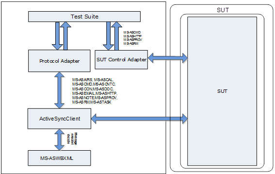

Exchange EAS Test Suites Specification
======================================================================================================

- [Introduction](#introduction)
- [Requirement specification](#requirement-specification)
- [Design considerations](#design-considerations)
- [Package design](#package-design)

Introduction
=====================================================================================================================================================================================================================================================================================================================================================================================================================================================================

Exchange EAS Protocol Test Suites are implemented as synthetic
clients running against the server-side implementation of a given Exchange
protocol. They are designed in a client-to-server relationship and were
originally developed for the in-house testing of Microsoft Open
Specifications. 

Microsoft Open Specifications are written using the normative
language defined in [RFC2119](http://go.microsoft.com/fwlink/?LinkId=117453); from which
statements are extracted as protocol requirements to be
listed in the requirement specification. See [Requirement specification](#requirement-specification). 
This document describes how Exchange EAS Protocol Test Suites are
designed to verify that the server behavior is in compliance
with normative protocol requirements in the technical
specification.

In a single test suite, similar or related requirements are grouped into one
test case. Test cases on the same command or operation are
grouped into one scenario.

The technical specifications in the following table are included
in the Exchange EAS Protocol Test Suites package. The version of technical specification MS-ASAIRS, MS-ASEMAIL, MS-ASTASK are v20211116. The version of MS-ASCMD is v20190618. The version of MS-ASWBXML is v20190319.
The version of MS-ASCNTC, MS-ASHTTP, MS-ASPROV are v20181211. The version of MS-ASCAL, MS-ASCON, MS-ASDOC, MS-ASNOTE, MS-ASRM are v20181001. And the version of MS-ASDTYPE is v20150630.

**Exchange EAS Protocol technical specifications**

| Technical specification | Protocol name |
| :--- | :--- |
|  **MS-ASAIRS** |                [Exchange ActiveSync: AirSyncBase Namespace Protocol](http://go.microsoft.com/fwlink/?LinkID=301330) |
|  **MS-ASCAL**  |                [Exchange ActiveSync: Calendar Class Protocol](http://go.microsoft.com/fwlink/?LinkID=301331) |
|  **MS-ASCMD**  |                [Exchange ActiveSync: Command Reference Protocol](http://go.microsoft.com/fwlink/?LinkID=301332) |
|  **MS-ASCNTC** |                [Exchange ActiveSync: Contact Class Protocol](http://go.microsoft.com/fwlink/?LinkID=301333) |
|  **MS-ASCON**  |                [Exchange ActiveSync: Conversations Protocol](http://go.microsoft.com/fwlink/?LinkID=301334) |
|  **MS-ASDOC**  |                [Exchange ActiveSync: Document Class Protocol](http://go.microsoft.com/fwlink/?LinkID=301335) |
|  **MS-ASDTYPE**|                [Exchange ActiveSync: Data Types](http://go.microsoft.com/fwlink/?LinkID=708453) |
|  **MS-ASEMAIL**|                [Exchange ActiveSync: Email Class Protocol](http://go.microsoft.com/fwlink/?LinkID=301336) |
|  **MS-ASHTTP** |                [Exchange ActiveSync: HTTP Protocol](http://go.microsoft.com/fwlink/?LinkID=301337) |
|  **MS-ASNOTE** |                [Exchange ActiveSync: Notes Class Protocol](http://go.microsoft.com/fwlink/?LinkID=301338) |
|  **MS-ASPROV** |                [Exchange ActiveSync: Provisioning Protocol](http://go.microsoft.com/fwlink/?LinkID=301339) |
|  **MS-ASRM**   |                [Exchange ActiveSync: Rights Management Protocol](http://go.microsoft.com/fwlink/?LinkID=301340) |
|  **MS-ASTASK** |                [Exchange ActiveSync: Tasks Class Protocol](http://go.microsoft.com/fwlink/?LinkID=301341) |
|  **MS-ASWBXML**|                [Exchange ActiveSync: WAP Binary XML (WBXML) Algorithm](http://go.microsoft.com/fwlink/?LinkID=708454) |

Requirement specification 
======================================================================================================================================================================================================================================================================

A requirement specification contains a list of requirements that is
extracted from statements in the technical specification. Each technical
specification has one corresponding requirement specification named as
MS-XXXX\_RequirementSpecification.xlsx, which can be found in the
Docs\\MS-XXXX folder in the Exchange EAS Protocol Test Suites package
with the technical specification.

The requirements are categorized as normative or informative. If the
statement of the requirement is required for interoperability, the
requirement is normative. If the statement of the requirement is for
a high-level introduction or clarification, and removal of the content
does not affect interoperability, the requirement is informative.

Each requirement applies to a specific scope: server, client, or both.
If the requirement describes the behavior of the responder, the
scope of the requirement is the server. If the requirement describes the
behavior of the initiator, the scope of the requirement is
the client. If the requirement describes the behavior of the
initiator and responder, the scope of the requirement is both the client and server.

Test suites cover normative requirements that describe the behavior
of the responder. For a detailed requirement list and
classification, see MS-XXXX\_RequirementSpecification.xlsx.

Design considerations
=====================

Assumptions
-----------

-   Exchange EAS Protocol Test Suites are not designed to run
    multi-protocol user scenarios, but rather to provide a way to exercise
    certain operations documented in a technical specification.

-   Test suites are functional tests that verify the compatibility
    of the system under test (SUT) with protocol implementation.

-   Test suites do not cover every protocol requirement and in no
    way certify implementation even if all tests pass.

-   Test suites verify the server-side testable requirements, but
    do not verify the requirements related to client behavior and
    server internal behavior.

-   Test suites assume that there is a shared folder on the server.

-   Test suites assume that there is a hidden folder and a visible
    folder under the shared folder.

-   Test suites assume that there is a hidden document and a
    visible document under the shared folder.

-   Test suites assume that authentication has been performed by
    the underlying protocols.

Dependencies
------------

-   All Exchange EAS Protocol Test Suites depend on Protocol Test
    Framework (PTF) to derive managed adapters.

-   All Exchange EAS Protocol Test Suites depend on the HTTP protocol
    or the HTTPS protocol to transmit the messages.

-   All Exchange EAS Protocol Test Suites depend on MS-ASWBXML to
    encode XML requests bodies into WBXML for transmission to an
    ActiveSync server.

-   All Exchange EAS Protocol Test Suites depend on MS-ASHTTP to
    synchronize the data stored on the server.

-   All Exchange EAS Protocol Test Suites depend on the xsd.exe tool in
    the .NET Framework SDK to generate structures used in the MS-ASCAL
    request and response.

Package design
==============

Exchange EAS Protocol Test Suites are implemented as synthetic
clients running against the server-side implementation of a given Exchange
protocol. The test suites verify the server-side and testable
requirements.

Architecture
------------

The following figure illustrates the Exchange EAS Protocol Test Suites
architecture.

**Figure 1: Architecture**

The following outlines details of the test suites architecture:

**SUT**

The system under test (SUT) hosts the server-side implementation of the
protocol, which test suites run against.

-   From a third-party’s point of view, the SUT is of server implementation.

-   The following products have been tested with the test suites on the
    Windows platform.

	-   Microsoft Exchange Server 2007 Service Pack 3 (SP3)
	-   Microsoft Exchange Server 2010 Service Pack 3 (SP3)
	-   Microsoft Exchange Server 2013 Service Pack 1 (SP1)
	-   Microsoft Exchange Server 2016
    -   Microsoft Exchange Server 2019

**Test Suite Client**

Test suites act as synthetic clients to communicate with an SUT and
validate the requirements gathered from technical specifications.
Exchange EAS Protocol Test Suites include one common library, thirteen
adapters and twelve test suites.

-   Test suites communicate with an SUT via a protocol adapter and an SUT
    control adapter to verify if an SUT is behaving in 
    compliance with normative protocol requirements.

-   All protocol adapters use ActiveSyncClient to send command request
    and retrieve command response.

-   ActiveSyncClient encodes and decodes commands defined in
    [\[MS-ASCMD\]](https://msdn.microsoft.com/en-us/library/dd299441(v=exchg.80).aspx) by using MS-ASWBXML and communicates with an SUT
    via MS-ASHTTP.

Common library
--------------

The common library provides implementation of ActiveSyncClient,
messages, structures, and helper methods.

### ActiveSyncClient

The ActiveSyncClient works as an intermediary between the protocol
adapter and the SUT. The protocol adapter calls the ActiveSyncClient to connect,
disconnect, and execute commands. The ActiveSyncClient passes the
protocol adapter requests and sends the protocol adapter request to the
SUT. The ActiveSyncClient receives the response from the SUT and sends
the response back to the protocol adapter.

### Helper methods

The common library defines a series of helper methods. The helper
methods can be classified into the following categories:

-   Access the properties in the configuration file.
-   Generate resource name.
-   Used by multiple test suites.

### Message structures

Becuase the C\# proxy class is used by the multiple test suites. So
the C\# proxy class is defined in the common library.

Adapters
-------

Adapters are interfaces between the test suites and the SUT. There are
two types of adapters: the protocol adapter and the SUT control adapter. In most
cases, modifications to the protocol adapter will not be required for
non-Microsoft SUT implementation. However, the SUT control adapter
should be appropriately configured to connect to non-Microsoft SUT
implementation. All test suites in the package contain a protocol
adapter, and six of which contain an SUT control adapter.

### Protocol Adapter

The protocol adapter is a managed adapter, which is derived from the
ManagedAdapterBase class in PTF. It provides an interface that is
used by test cases to construct protocol request messages that will
be sent to the SUT. The protocol adapter also acts as an intermediary
between test cases and transport classes to receive messages,
send messages, parse responses from transport classes, and
validate the SUT response according to normative requirements in
the technical specification.

All protocol adapters use ActiveSyncClient transport classes defined in
the common library to send and receive messages.

### SUT Control Adapter 

The SUT control adapter manages all control functions of the test
suites that are not associated with the protocol. For example, the setup
and the teardown are managed through the SUT control adapter. The SUT
control adapter is designed to work with Microsoft implementation of
the SUT. However, it is configurable to allow test suites to run
against non-Microsoft implementation of the SUT.

There are four protocols that have an SUT control adapter in the Exchange
EAS Protocol Test Suites package: MS-ASCMD, MS-ASHTTP, MS-ASPROV and
MS-ASRM.

Test suites
----------

Test suites verify the server-side and testable requirements 
in the requirement specification. Test suites call a protocol
adapter to send and receive message between a protocol adapter and an
SUT, and call an SUT control adapter to change the SUT state. A test
suite consists of a series of test cases that are categorized into several
scenarios.

### MS-ASAIRS

The six scenarios are designed to verify the server-side, testable
requirements in the MS-ASAIRS test suite. The following table lists the
scenarios in the test suite.

| Scenario | Description |
| :--- | :--- |
| S01\_BodyPartPreference  | Test the BodyPartPreference element and the BodyPart element in the AirSyncBase namespace, which is used by the Sync command, the Search command and the ItemOperations command to identify the data that the client sent and returned to the client.|
| S02\_BodyPreference      | Test the BodyPreference element and the Body element in the AirSyncBase namespace, which is used by the Sync command, the Search command and the ItemOperations command to identify the data that the client sent and returned to the client.|
| S03\_Attachment          | Test the Attachments element and its subelements in the AirSyncBase namespace, which is used by the Sync command, the Search command and the ItemOperations command to identify the data that the client sent and returned to the client.|
| S04\_StatusError         | Test the status error that is returned by the Sync command, the Search command and the ItemOperations command when XML elements in the AirSyncBase namespace don't comply with requirements regarding the data type, the number of instance, the order and placement in the XML hierarchy.|
| S05\_Location            | Test the Location element and its sub elements, which is used by the Sync command, the Search command and the ItemOperations command.|
| S06\_MeetingResponseCommand | Test the MeetingResponse command.|

### MS-ASCAL

The two scenarios are designed to verify the server-side, testable requirements in the MS-ASCAL test suite. The following table lists the scenarios in this test suite.

| Scenario | Description |
| :--- | :--- |
|   S01\_CalendarElement | Test the Calendar class elements, which are not attached in a Meeting request, including synchronizing the calendar on the server, fetching information of the calendar or searching a specific calendar.| 
|   S02\_MeetingElement  | Test the Calendar class elements, which are attached in a Meeting request when a meeting is either accepted, tentatively accepted, cancelled or declined.| 

### MS-ASCMD

The twenty-two scenarios are designed to verify the server-side, testable
requirements in the MS-ASCMD test suite. The following table lists the
scenarios in this test suite.

| Scenario | Description |
| :--- | :--- |
| S01\_Autodiscover    | Discover the account settings by using the Autodiscover command.|
| S02\_FolderCreate    | Create the folders by using the FolderCreate command.|
| S03\_FolderDelete    | Delete the folders by using the FolderDelete command.|
| S04\_FolderSync      | Synchronize the folders by using the FolderSync command.|
| S05\_FolderUpdate    | Update the folders by using the FolderUpdate command.|
| S06\_GetAttachment   | Retrieve an email attachment from the server by using the GetAttachment command.|
| S07\_GetItemEstimate | Get an estimate for the number of items in a collection or a folder on the server that has to be synchronized by using the GetItemEstimate command.|
| S08\_ItemOperations  | Provide the batched online handling of Fetch, empty the folder contents and move the operations against the server by using the ItemOperations command.|
| S09\_MeetingResponse |   Accept, tentatively accept, or decline a meeting request in the user's Inbox folder or the Calendar folder by using the MeetingResponse command.|
| S10\_MoveItems        |   Move an item or items from one folder on the server to another by using the MoveItems command.|
| S11\_Ping             |   Ping the server for updating the folder by using the Ping command.|
| S12\_Provision        |  Download and acknowledge policies of Provision by using the Provision command.|
| S13\_ResolveRecipients|   Resolve the recipients and retrieve the free or busy data by using the ResolveRecipients command.|
| S14\_Search           |   Find the entries in an address book, mailbox, or document library by using the Search command.|
| S15\_SendMail         |   Send the email message by using the SendMail command.|
| S16\_Settings         |   Set or change the device information, OOF setting and user information by using the Settings command.|
| S17\_SmartForward     |   Forward the email message by using the SmartForward command.|
| S18\_SmartReply       |   Reply the email message by using the SmartReply command.|
| S19\_Sync             |   Synchronize the data by using the Sync command.|
| S20\_ValidateCert     |  Validate a certificate that has been received via an S/MIME mail by using the ValidateCert command.|
| S21\_CommonStatusCode |   Test the common negative status for the commands.|
| S22\_GetHierarchy |       Test the GetHierarchy command.|

### MS-ASCNTC

The three scenarios are designed to verify the server-side, testable
requirements in the MS-ASCNTC test suite. The following table lists the
scenarios in this test suite.

| Scenario | Description |
| :--- | :--- |
|S01\_Sync | Use the Sync command to synchronize the Contact class data between the client and server.|
|S02\_ItemOperations |  Use the ItemOperations command to retrieve the Contact class data from the server.|
|S03\_Search         |  Use the Search command to search the Contact class data on the server.|

### MS-ASCON

The five scenarios are designed to verify the server-side, testable
requirements in the MS-ASCON test suite. The following table lists the
scenarios in this test suite.

| Scenario | Description |
| :--- | :--- |
|  S01\_Sync| Mark a conversation as Read or Unread, flag a conversation for follow-up, apply a conversation-based filter, delete a conversation and request a Message part using the Sync command.|
|  S02\_GetItemEstimate |  Apply a conversation-based filter using the GetItemEstimate command.|
|  S03\_ItemOperations  |  Ignore a conversation, set up a conversation to be moved always and request a Message part using the ItemOperations command.|
|  S04\_MoveItems       |  Move a conversation from the current folder using the MoveItems command.|
|  S05\_Search          |  Find a conversation using the Search command.|

### MS-ASDOC

The two scenarios are designed to verify the server-side, testable
requirements in the MS-ASDOC test suite. The following table lists the
scenarios in this test suite.

| Scenario | Description |
| :--- | :--- |
|  S01\_SearchCommand | Retrieve the Document class items that match the criteria specified by the client through the Search command messages.|
|  S02\_ItemOperationsCommand |  Retrieve the data from the server for one or more individual documents through the ItemOperations command messages.|

### MS-ASEMAIL

The four scenarios are designed to verify the server-side, testable
requirements in the MS-ASEMAIL test suite. The following table lists the
scenarios in this test suite.

| Scenario | Description |
| :--- | :--- |
|  S01\_Email | Test normal e-mail events, including sending an e-mail to a server, synchronizing e-mails with a server, retrieving e-mail items that match the criteria specified by the client from a server, retrieving data from a server for one or more specific e-mail items.|
|  S02\_EmailVoiceAttachment| Test voice attachment e-mail events, including sending an e-mail with voice attachment to a server, synchronizing the e-mail with voice attachment with a server.|
|  S03\_EmailFlag | Test flag events, including setting a flag on an email or a task, updating a flag on an email or a task, marking a flag on an email or a task as complete, clearing a flag from an email or a task.|
|  S04\_MeetingRequest| Test meeting request events, including sending a meeting request to a server, synchronizing the meeting request with a server.|

### MS-ASHTTP

The four scenarios are designed to verify the server-side, testable
requirements in the MS-ASHTTP test suite. The following table lists the
scenarios in this test suite.

| Scenario | Description |
| :--- | :--- |
| S01\_HTTPPOSTPositive| Test the positive behavior issued by the HTTP POST command.|
| S02\_HTTPPOSTNegative | Test the negative behavior issued by the HTTP POST command.|
| S03\_HTTPPOSTOptionalHeader | Test the optional request header of the HTTP POST command.|
| S04\_HTTPOPTIONSMessage  | Test the HTTP OPTIONS command.|

### MS-ASNOTE

The three scenarios are designed to verify the server-side, testable
requirements in the MS-ASNOTE test suite. The following table lists the
scenarios in this test suite.

| Scenario | Description |
| :--- | :--- |
|S01\_SyncCommand   | Synchronize the Notes class items for a specified user with existing notes stored on the server.|
|S02\_SearchCommand | Retrieve the Notes class items that match the criteria specified by the client.|
|S03\_ItemOperationsCommand | Retrieve the data from the server for one or more notes items.|

### MS-ASPROV

The three scenarios are designed to verify the server-side, testable
requirements in the MS-ASPROV test suite. The following table lists the
scenarios in this test suite.

| Scenario | Description |
| :--- | :--- |
|  S01\_AcknowledgePolicySettings |Test the acknowledgement phase of Provision.|
|  S02\_RemoteWipe |Test the remote wipe directive.|
|  S03\_ProvisionNegative |Test the negative status of the Provision command.|

### MS-ASRM

The five scenarios are designed to verify the server-side and testable
requirements in the MS-ASRM test suite. The following table lists the
scenarios in this test suite.

| Scenario | Description |
| :--- | :--- |
|S01\_Settings\_SendMail\_Sync | Get templateIDs, send email messages and synchronize data from the server by using the Settings, SendMail and Sync commands.|
|S02\_ItemOperations|Fetch a rights-managed e-mail message with or without the RemoveRightsManagementProtection element by using the ItemOperations command.|
|S03\_Search        |Find rights-managed e-mail messages by using the Search command.|
|S04\_SmartForward  |Forward messages by using the SmartForward command.|
|S05\_SmartReply    |Reply messages by using the SmartReply command.|

### MS-ASTASK

The three scenarios are designed to verify the server-side, testable
requirements in the MS-ASTASK test suite. The following table lists the
scenarios in this test suite.

| Scenario | Description |
| :--- | :--- |
| S01\_SyncCommand|Test the Task class element on the server by using the Sync command.|
| S02\_ItemOperationsCommand|Test the Task class element on the server by using the ItemOperations command.|
| S03\_SearchCommand | Test the Task class element on the server by using the Search command.|
