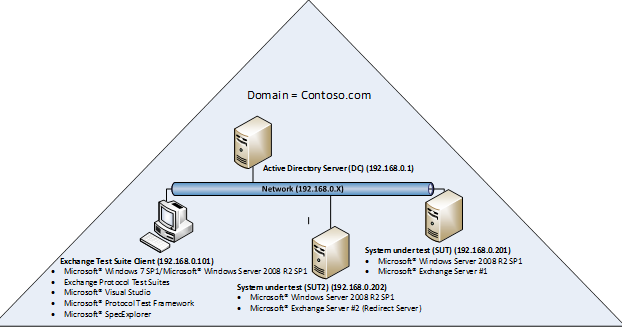
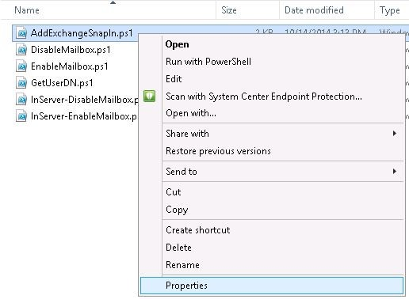
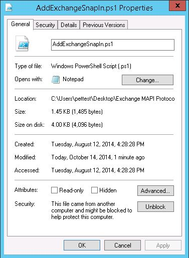
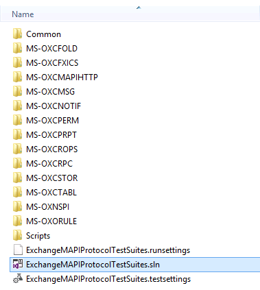
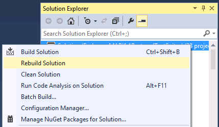
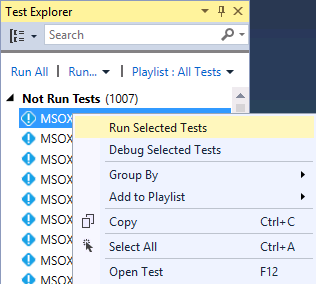
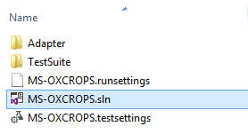
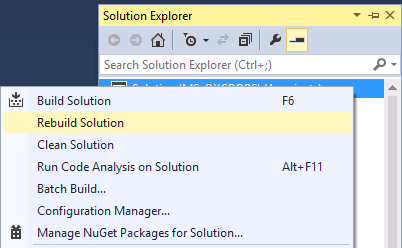
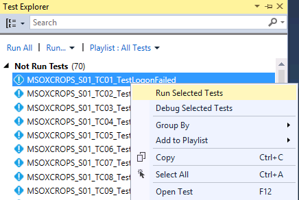

Exchange MAPI Test Suite deployment guide
======================================================================================================

- [Overview](#overview)
- [Prerequisites](#prerequisites)
- [Deploying test suites](#deploying-test-suites)
- [Using test suite directories](#using-test-suite-directories)
- [Configuring test suites](#configuring-test-suites)
- [Running test suites](#running-test-suites)
- [Viewing test suite results, logs, and reports](#viewing-test-suite-results-logs-and-reports)
- [Appendix](#appendix)

Overview
======================================================================================================

Exchange MAPI Protocol Test Suites are implemented as synthetic
clients running against the server-side implementation of a given Exchange
protocol. They are designed in a client-to-server relationship and were
originally developed for the in-house testing of Microsoft Open
Specifications. Test suites have been used extensively in Plugfests and
Interoperability Labs to test partner implementation.

The Exchange MAPI Test Suite deployment guide introduces the hardware
and software requirements of the test suite client, and the requirements
of the system under test (SUT) if the test suites run against Exchange
Server. The guide also introduces topics on how to deploy, configure and run the
test suites, and view the test suite reports.

Prerequisites
=============

This section describes the hardware and software requirements for the
test suites. In an Exchange Server environment, the test suite
deployment takes place on both the client and server side. The following
information helps test suite users to plan their deployment.

Hardware requirements
------------------------------------------------------------------------------------------------------------------------------------------------------------------

### System under test

The SUT is the server side of the test suite environment. Exchange
Server(s) and Active Directory have defined system requirements which
should be taken into account during deployment. Exchange MAPI
Protocol Test Suites do not have any additional SUT resource
requirements.

### Test suite client

The test suite client is the client side of the test suite environment.
The following table shows the minimum resource requirements for the test
suite client.

**Test suite client resource requirements**

Component | Test suite client minimum requirement
:------------ | :-------------
**RAM**       |    2GB
**Hard Disk** |   500M of free space
**Processor** | >= 1GHz

Software requirements
-------------------------------------------------------------------------------------------------------------------

### System under test

This section is only relevant when running the test suites against the
following versions of Exchange Server. Some test suites (MS-OXCFOLD,
MS-OXCFXICS, MS-OXCROPS, and MS-OXCSTOR) support two SUTs depending on
the protocol requirements:

-   Microsoft Exchange Server 2007 Service Pack 3 (SP3)
-   Microsoft Exchange Server 2010 Service Pack 3 (SP3)
-   Microsoft Exchange Server 2013 Service Pack 1 (SP1)
-	Microsoft Exchange Server 2016
-	Microsoft Exchange Server 2019

The following table describes the required server roles for a
test suite deployment with Microsoft implementation. An Exchange
Server installed on a domain controller (DC) is not recommended. For the
MS-OXNSPI test suite, the DC and SUT should be installed on two separate
servers.

**Required SUT roles**

Role  | Description
:------------ | :-------------
**Active Directory Domain Controller (DC)** | Active Directory Domain Controller (AD DC) is required for Exchange. Key Distribution Center (KDC) is a service that runs on the AD DC and is required when Kerberos is used as the authentication method in the test suite.
**Exchange Server \#1 (SUT1)**  |  The first Exchange Server in the topology.
**Exchange Server \#2 (SUT2, Redirect Server)** | Installation of this server is optional. If this server is not present, then the dependent test cases will not be run. The presence of SUT2 will enable certain multi-server scenarios and other test cases that pertain to a second SUT.

The following diagram is an example of what a typical Exchange test suite
environment may look like. This example uses an IPv4, but IPv6 is also
supported by the test suites.

### Test suite client

This section describes the prerequisite software for installing Exchange MAPI Protocol Test Suites on the test suite client. The following
table outlines the software dependencies for the test suite client.

**Test suite client software dependencies**

|Operating systems |
|:------------
| Windows 7 x64 Service Pack 1 and above |
| Windows 8 x64 and above |
| Windows 2008 R2 x64 Service Pack 1 and above |

|Software|
|:------------ |
|Microsoft Visual Studio 2013 Professional|
| Microsoft Protocol Test Framework 1.0.2220.0 and above|
| Microsoft Spec Explorer 3.6.14230.01 and above|

Deploying test suites
=======================================================================================================================

This section describes the deployment of Exchange MAPI Protocol Test
Suites on the test suite client and the SUT. Exchange MAPI Protocol
Test Suites are packaged in a .zip file, available at [Microsoft
Connect](http://go.microsoft.com/fwlink/?LinkId=516921). Once you've
downloaded the test suites, perform the following steps to successfully configure the test suites.

1.  Extract the **Exchange MAPI Protocol Test Suites** folder from the zip file to a
    directory of your choice on the test suite client.

2.  Copy the **SUT** and **Common** folders under **…\\Exchange MAPI
    Protocol Test Suites\\Setup** to a directory of your choice on
    the SUT. The SUT configuration scripts are the only requirement for
    the SUT. The scripts facilitate the SUT configuration process and
    are in the **ExchangeMAPIProtocolTestSuites.zip** file.

**Note** If your computer blocks scripts that are downloaded from the Internet
for security reasons, follow these steps to unblock PowerShell scripts.

  --------------------------------------------------------
1.  Right-click xxxx.ps1 and select **Properties**.   
                                                 

2.  Click **Unblock** and then click **OK**.          
                                                  

Using test suite directories
======================

This section shows the folder structures in the **ExchangeMAPIProtocolTestSuites.zip** file.

**ExchangeMAPIProtocolTestSuites.zip** file contents

| Folder/file   | Description |
| :--- | :--- |
|  **EULA.rtf** | End-User License Agreement.|
|  **ReadMe.txt** | A doc on deployment and prerequisite software.|
|  **Exchange MAPI Protocol Test Suites** | -- |
|  **- Docs** | A folder with documents of all protocol test suites.|
|  **- ExchangeMAPITestSuiteDeploymentGuide.docx** | A doc on the protocol test suite deployment.|
|  **- ExchangeMAPITestSuiteSpecification.docx** |  A doc on the test suite configuration details, architecture, adapters and test case details.|
|  **+ MS-XXXX** | The MS-XXXX help documentation|
|  **- \[MS-XXXX\].pdf** |  The protocol technical specification.|
|  **- MS-XXXX \_SUTControlAdapter.chm** | A help doc on the SUT control adapter class library such as declaration syntax and their description.|
|  **- MS-XXXX \_RequirementSpecification.xlsx** |  A spreadsheet that outlines all requirements that are associated with the technical specification.|
|  **- Setup** |A folder with configuration scripts.|
|  **- Test Suite Client** |  A folder with the configuration script to configure the test suite client.|
|  **- ExchangeClientConfiguration.cmd** | A command file that runs the ExchangeClientConfiguration.ps1 file to configure the properties for the protocol test suites.|
|  **- ExchangeClientConfiguration.ps1** | A configuration script that will be triggered by the ExchangeClientConfiguration.cmd.|
|  **- SUT** | A folder that contains the configuration script to configure the Exchange Server.|
|  **- ExchangeSUTConfiguration.cmd** | A command file that runs the ExchangeSUTConfiguration.ps1 file to create resources and configure settings on the first SUT.|
|  **- ExchangeSecondSUTConfiguration.cmd** | A command file that runs the ExchangeSecondSUTConfiguration.ps1 file to create resources and configure settings on the second SUT.|
|  **- ExchangeSUTConfiguration.ps1** |  A configuration script that will be triggered by ExchangeSUTConfiguration.cmd.|
|  **- ExchangeSecondSUTConfiguration.ps1** | A configuration script that will be triggered by ExchangeSecondSUTConfiguration.cmd.|
|  **- Common** | A folder with common configuration scripts and resources.|
|  **- CommonConfiguration.ps1** | A library of common functions for configuring the Microsoft server SUT and test suite client.|
|  **- ExchangeCommonConfiguration.ps1** | A library of common functions for configuring Exchange Server.|
|  **- ExchangeTestSuite.config** | The configuration file to store all configuration resources.|
|  **- Source** | A folder with Microsoft Visual Studio solutions that contain the source code for the test suites.|
|  **- Common** | A folder with Microsoft Visual Studio projects that contains the common source code for the test suites.|
|  **- Common** | A folder with common methods or properties that are used by the test suites.|
|  **- ExchangeCommonConfiguration.deployment.ptfconfig** |  The common configuration file.|
|  **+ OXCRPCStub** | The RPC transport with unmanaged code.|
|  **- ExchangeMAPIProtocolTestSuites.sln** |  A Microsoft Visual Studio solution with projects that encapsulate the protocol test suites source code.|
|  **- ExchangeMAPIProtocolTestSuites.runsettings** | A configuration file for the unit test.|
|  **- ExchangeMAPIProtocolTestSuites.testsettings**| A configuration file for running test cases.|
|  **- MS-XXXX** | A folder for the MS-XXXX test suite source code.|
|  **- MS-XXXX.sln** | A Microsoft Visual Studio solution that contains projects of the MS-XXXX test suite.|
|  **- MS-XXXX.runsettings** | A configuration file for the MS-XXXX unit test.|
|  **- MS-XXXX.testsettings** | A configuration file for running MS-XXXX test cases.|
|  **+ Adapter** | The Adapter test suite code.|
|  **+ TestSuite** |  The test suite code.|
|  **- Scripts** | Exchange MAPI Test Suites can be run using Visual Studio or batch scripts. The Scripts folder contains a collection of command files that allows users to run specific test cases in the test suite or the entire test suite.|
|  **- RunAllExchangeMAPITestCases.cmd** |  A script that can be used to run all test cases in the whole package.|
|  **- MS-XXXX** | A folder that contains scripts which belong to the MS-XXXX test suite.|
|  **- RunAllMSXXXXTestCases.cmd** | A script that can be used to run all test cases of MS-XXXX.|
|  **- RunMSXXXX\_SXX\_TCXX\_TestCaseName.cmd** | A script that can be used to run a single test case of MS-XXXX.|

Configuring test suites
===========================

This section provides the guidance on configuring Exchange
MAPI Protocol Test Suites on the SUT and the test suite client. The
configuration should be done in this order: configure the SUT1,
configure the SUT2 (optional), and then configure the test suite client.

For the configuration script, the exit code definition is as follows:

1.  A normal termination will set the exit code to 0.

2.  An uncaught THROW will set the exit code to 1.

3.  Script execution warning and issues will set the exit code to 2.

4.  Exit code is set to the actual error code for other issues.

Configuring the SUT
-----------------------------------------------------------------------------------------------------------------

You can configure the SUT using automated scripts, as described in
[Configuring SUT1 using the setup configuration script](#configuring-sut1-using-the-setup-configuration-script) and
[Configuring SUT2 using the setup configuration script](#configuring-sut2-using-the-setup-configuration-script); or configure the SUT manually, as
described in [Configuring SUT1 manually](#configuring-sut1-manually) and
[Configuring SUT2 manually](#configuring-sut2-manually).

**Note**  The scripts should be run by a user who has domain
administrator rights with a mailbox on the Exchange Server.

### SUT resource requirements

Each test suite in the Exchange MAPI Protocol Test Suites
package may require a varying level of resources on Exchange Server. The
following table outlines these resources for each test suite. The SUT
configuration scripts will automatically create all the required
resources for the Microsoft server implementation. To configure the SUT
manually, see [Configuring SUT1 manually](#configuring-sut1-manually) and
[Configuring SUT2 manually](#configuring-sut2-manually).

The client configuration script follows the naming convention shown in
the following table. If a change to the resource name is required, the
corresponding change to the resource name defined in the
ExchangeTestSuite.config is required.

**Exchange server resources**

| Test suite     | Resource type | Resource name | Notes |
| :--- | :--- |:--- |:--- |
| **All** | Public Folder Database | PublicFolderDatabase | A public folder database is required on Microsoft Exchange Server 2007 SP3 and Microsoft Exchange Server 2010 SP3.|
|| Redirect Server Public Folder Database | PublicFolderDatabase2 | A redirect server is optional.|
|| Public Folder Mailbox | PublicFolderMailbox\_&lt;Server1Name&gt; |   A public folder mailbox is required on Microsoft Exchange Server 2013 SP1.|
|| Redirect Server\* Public Folder Mailbox  | PublicFolderMailbox\_&lt;Server2Name&gt;|--|
| **MS-OXCFOLD**  | Mailbox | MSOXCFOLD\_TestUser01 |The mailbox name should be below 20 characters.|
|| Mailbox |MSOXCFOLD\_TestUser02  |--|
||Public Folder       |   MSOXCFOLD\_PublicFolderMailEnabled | All public folders are created directly in the root directory.|
||Redirect Server Public Folder  |  MSOXCFOLD\_PublicFolderGhosted  |--|           
  **MS-OXCFXICS**  | Public Folder |  MSOXCFXICS\_GhostedPublicFolder |--|           
|| Public Folder| MSOXCFXICS\_PublicFolder01 |--|          
|| Mailbox | MSOXCFXICS\_TestUser  | The mailbox name should be below 20 characters.|
|| Redirect Server Mailbox |  MSOXCFXICS\_TestUser2 |--|      
| **MS-OXCMAPIHTTP** | Mailbox |  MSOXCMAPIHTTP\_User01 | MS-OXCMAPIHTTP is supported in Microsoft Exchange 2013 SP1. The mailbox name should be below 20 characters. |
|| Mailbox  | MSOXCMAPIHTTP\_User02  | The mailbox name should be below 20 characters.|
|| Distribution Group  |  MSOXCMAPIHTTP\_ATDG01  |--|                    
| **MS-OXCMSG** | Mailbox   | MSOXCMSG\_TestUser01 |  The mailbox name should be below 20 characters.|
|| Mailbox    | MSOXCMSG\_TestUser02| The mailbox name should be below 20 characters.|
| **MS-OXCNOTIF** | Mailbox   | MSOXCNOTIF\_TestUser| The mailbox name should be below 20 characters.|
| **MS-OXCPERM**  | Mailbox   | MSOXCPERM\_TestUser01| The mailbox name should be below 20 characters.|
||  Mailbox    | MSOXCPERM\_TestUser | The mailbox name should be below 20 characters.|
|**MS-OXCPRPT**  |     Mailbox   | MSOXCPRPT\_TestUser | The mailbox name should be below 20 characters.|
||Public Folder | MSOXCPRPT\_PublicFolder01 |--|                 
| **MS-OXCROPS**|     Mailbox     | MSOXCROPS\_TestUser01 | The mailbox name should be below 20 characters.|
||Mailbox | MSOXCROPS\_TestUser |  The mailbox name should be below 20 characters.|
||Redirect Server Public Folder |  MSOXCROPS\_PublicFolderGhosted  |--|
| **MS-OXCRPC**   |     Mailbox     |  MSOXCRPC\_TestUser01 | The mailbox name should be below 20 characters.|
|| Mailbox    |  MSOXCRPC\_TestUser   | The mailbox name should be below 20 characters.|
| **MS-OXCSTOR**  |     Mailbox     |  MSOXCSTOR\_TestUser01| The mailbox name should be below 20 characters.|
||Redirect Server Mailbox | MSOXCSTOR\_TestUser02 |--|           
||Mailbox       | MSOXCSTOR\_TestUser03 |  The mailbox name should be below 20 characters.|
||Mailbox       |  MSOXCSTOR\_TestUser  | The mailbox name should be below 20 characters.|
| **MS-OXCTABL**  |     Mailbox      |  MSOXCTABL\_TestUser01 | The mailbox name should be below 20 characters.|
||Mailbox |  MSOXCTABL\_TestUser02|  The mailbox name should be below 20 characters.|
| **MS-OXNSPI**    |     Mailbox        |  MSOXNSPI\_TestUser01|MS-OXNSPI is not supported in Microsoft Exchange Server 2007 SP3. The mailbox name should be below 20 characters.|
||Mailbox | MSOXNSPI\_TestUser02  |  The mailbox name should be below 20 characters.|
||Mailbox  |  MSOXNSPI\_TestUser      | The mailbox name should be below 20 characters.|
||Public Folder | MSOXNSPI\_PublicFolderMailEnabled  |--|
||Dynamic Distribution Group| MSOXNSPI\_ADDG01 |--|
||Distribution Group | MSOXNSPI\_ATDG01 |--|
||Mail Contact | MSOXNSPI\_MailContact01|--|
|**MS-OXORULE**|  Mailbox | MSOXORULE\_TestUser01| The mailbox name should be below 20 characters.|
||Mailbox | MSOXORULE\_TestUser02| The mailbox name should be below 20 characters.|

### Configuring SUT1 using the setup configuration script 

The setup configuration script is only used for configuring Microsoft
Exchange Server on the Windows platform.

To configure SUT1 using the setup configuration script, navigate to the
**SUT** folder, right-click **ExchangeSUTConfiguration.cmd** and select
**Run as administrator**.

### Configuring SUT1 manually 

If the SUT is non-Microsoft implementation of Exchange Server, you
will not be able to run the setup configuration script. The following
steps explain what needs to be created or configured on the SUT to run the test suites.

1.  Configure the web site which contains the application that
    implements the MAPI protocols.

	a.  Configure Secure Sockets Layer (SSL) as **not required** and ignore
		client certificates.

	b.  Enable "Anonymous Authentication", "Basic Authentication" and
		"Windows Authentication", disable the rest of options. Set the
		anonymous user identity as “IUSR” with empty password.

1.  Create the following mailbox users:

    MSOXCFOLD\_TestUser01, MSOXCFOLD\_TestUser02, MSOXCFXICS\_TestUser,
    MSOXCMAPIHTTP\_User01, MSOXCMAPIHTTP\_User02, MSOXCMSG\_TestUser01,
    MSOXCMSG\_TestUser02, MSOXCNOTIF\_TestUser, MSOXCPERM\_TestUser01,
    MSOXCPERM\_TestUser, MSOXCPRPT\_TestUser, MSOXCROPS\_TestUser01,
    MSOXCROPS\_TestUser, MSOXCRPC\_TestUser01, MSOXCRPC\_TestUser,
    MSOXCSTOR\_TestUser01, MSOXCSTOR\_TestUser03, MSOXCSTOR\_TestUser,
    MSOXCTABL\_TestUser01, MSOXCTABL\_TestUser02, MSOXNSPI\_TestUser01,
    MSOXNSPI\_TestUser02, MSOXNSPI\_TestUser, MSOXORULE\_TestUser01, and
    MSOXORULE\_TestUser02

2.  Set the appropriate values for the mailbox users
    MSOXNSPI\_TestUser01 and MSOXNSPI\_TestUser02:

	a.  For MSOXNSPI\_TestUser01, set the following values:

	-  AssistantName: "assistant"
	-  PhoneticDisplayName: "phoneticdisplayname"

	b.  For MSOXNSPI\_TestUser02, set the following values:

	-  AssistantName: "assistant"
	-  PhoneticDisplayName: "phoneticdisplayname"
	-   Office: "Test"
	-   Department: "Test"
	-   OtherHomePhone: "BusinessOne"

1.  Export the HTTPS certificate of the web site which contains the
    application that implements the MAPI protocols, and add the
    certificate to the mailbox user MSOXNSPI\_TestUser01.

2.  Add the mailbox users MSOXNSPI\_TestUser01, MSOXCSTOR\_TestUser,
    MSOXCFOLD\_TestUser02, MSOXCMAPIHTTP\_User01, MSOXCMSG\_TestUser02,
    and MSOXCRPC\_TestUser to the Exchange Organization
    Management group.

3.  Create a mail contact MSOXNSPI\_MailContact01.

4.  Create a dynamic distribution group called MSOXNSPI\_ADDG01.

5.  Create two distribution groups called MSOXNSPI\_ATDG01
    and MSOXCMAPIHTTP\_ATDG01.

6.  Set the MSOXNSPI\_ATDG01 group to be managed
    by MSOXNSPI\_TestUser01.

7.  Create the following public folders:

	MSOXCFOLD\_PublicFolderMailEnabled, MSOXCFXICS\_PublicFolderGhosted,
	MSOXCFXICS\_PublicFolder01, MSOXCPRPT\_PublicFolder01,
	MSOXNSPI\_PublicFolderMailEnabled

1.  Grant the mailbox users MSOXCFXICS\_TestUser, MSOXCROPS\_TestUser,
    MSOXCFOLD\_TestUser02, MSOXCPRPT\_TestUser, MSOXCMSG\_TestUser02 and
    MSOXORULE\_TestUser01 permission to manage public folders.

2.  Set the public folders MSOXCFOLD\_PublicFolderMailEnabled and
    MSOXNSPI\_PublicFolderMailEnabled to mail-enabled.

3.  Disable encryption.

4.  If the SUT supports MAPI over HTTP, enable the feature.

5.  Ensure that auxiliary buffers on **EcDoConnectEx** and **EcDoRpcExt2**
    methods can be returned from the SUT to the test suite client.

6.  Set the Max Extended Rule Size to 96KB.

7.  By default, the test suites use Exchange Web Service and Windows
    PowerShell script in the SUT control adapter. If you chose
    interactive mode for the SUT control adapter as described in
    [Set the test suite to interactive mode](#set-the-test-suite-to-interactive-mode), skip the
    following steps.

	a.  The test suites use Exchange Web Service in SUT control adapter to
		send email, get user free busy status, set a user’s Out of
		Office state. Configure the Exchange Web Services to require SSL and
		ignore client certificates.

	b.  Set the execution policy to **RemoteSigned**, enable remoting, and
		increase the memory allocated per shell for remote shell management
		to **1024MB** or more.

	c.  The MS-OXCSTOR protocol test suite runs DisableMailbox.ps1 and
		EnableMailbox.ps1 on the SUT to disable and enable mailbox. The test
		suite keeps the script files path in registry.

		Registry Key:
		HKEY\_LOCAL\_MACHINE\\SOFTWARE\\Microsoft\\ExchangeTestSuite

		Value type: String

		Value data: the absolute folder path where the DisableMailbox.ps1 and
		EnableMailbox.ps1 reside.

### Configuring SUT2 using the setup configuration script 

The setup configuration script is only used for configuring Microsoft Exchange
Server on Windows.

To configure SUT2 using the setup configuration script, navigate to the
SUT folder, right-click on **ExchangeSecondSUTConfiguration.cmd**
and select **Run as administrator.**

### Configuring SUT2 manually 

If the SUT is non-Microsoft implementation of Exchange Server, you are
not able to run the setup configuration script. The following steps
explain what needs to be created or configured on the SUT to run the test suites.

1.  Configure the web site which contains the application that
	implements the MAPI protocols.

2.  Create the following mailbox users:

	MSOXCFXICS\_TestUser2, MSOXCSTOR\_TestUser02

1.  Create the following public folders:

	MSOXCFOLD\_PublicFolderGhosted, MSOXCROPS\_PublicFolderGhosted

1.  Replicate the MSOXCFXICS\_PublicFolderGhosted public folder on the
    first SUT to the public folder database on the second SUT, assuming
    the two SUTs support the **FolderReplicaInfo** structure defined in
    MS-OXCFXICS protocol.

2.  Disable encryption on the SUT.

3.  In Windows PowerShell, set the execution policy to **RemoteSigned**
    and enable remoting if you plan to run the SUT control adapter in
    Windows PowerShell mode.

Configuring the test suite client
----------------------------------------------------------------------------------------------------------------------------------------------------------------------------------------

The test suite client is managed through a common configuration file,
two test-suite specific configuration files, and three SHOULD/MAY
configuration files that all have a “.ptfconfig” extension. These
configuration files can be modified directly. The common configuration
file and the test-suite specific configuration files can also be
modified through a script.

### Common configuration file

The common configuration file contains configurable properties common to
all Exchange MAPI Protocol Test Suites. This file must be modified to
match the characteristics of the environment where the test suites are
installed.

|**Configuration file** |  **Description**
|:-- | :--
|**ExchangeCommonConfiguration.deployment.ptfconfig** | The deployment configuration file provides the common environmental details for the test suites.|

### Test-suite specific configuration files

In addition to the common configuration file, each individual test suite
has the following two configuration files for test-suite specific
modification.

**Test-suite specific configuration files**

|**Configuration file** |  **Description**
|:-- | :--|
| **MS-XXXX\_TestSuite.deployment.ptfconfig** | The deployment configuration file provides the environmental details that are specific to the test suite. The configuration file allows test- suite specific customization. |
| **MS-XXXX\_TestSuite.ptfconfig** |  The test suite configuration file contains details that specify the behavior of the test suite operation. |

Both files are in the TestSuite folder in each test suite
directory.

If you need to modify the common configuration values for a specific
test suite, you must copy the common properties to the
**MS-XXXX\_TestSuite.deployment.ptfconfig** file and change the values
of the properties. The specific configuration file will take precedence
over the common configuration file when the same property exists in both
places.

#### Set the test suite to interactive mode 

If the SUT is non-Microsoft implementation of Exchange Server, it is
recommended that you further configure the test suite by setting the
test suite to interactive mode. Interactive mode enables the test suite
to function in a manual way, enabling you to perform setup, teardown,
and other tasks in a step-by-step approach. To enable interactive mode
for a specific test suite, do the following:

1.  Browse to the **MS-XXXX\_TestSuite.ptfconfig** configuration file
    in **\\Source\\MS-XXXX\\TestSuite\\**.

2.  Set the type value of Adapter property to **interactive** for the
    SUT control adapter\*\*.

**Interactive mode values**

Property name | Default value\* |Optional value|Description|
:-- | :--  | :--  | :--  
Adapter |  managed or powershell  | interactive\*\* |  **managed**: The SUT control adapter is implemented in C\# managed code.
||||**powershell**:The SUT control adapter is implemented through Windows PowerShell.
||||**interactive**: Interactive adapters are used when manually configuring a server. Interactive adapter uses a dialog box to perform a manual test each time one of its methods is called. The dialog box contains the method name, parameter names, and values\*\*\*                                     

\*The Adapter property value is set to either managed or powershell
depending on whether the SUT control adapter was implemented in managed
C\# code or through Windows PowerShell.

\*\*When changing from managed mode to interactive mode, the
“adaptertype” attribute must be deleted to avoid a runtime error. When
changing from powershell mode to interactive mode , an additional step is
required—delete the “scriptdir” attribute to avoid a runtime error.

\*\*\*When the manual operation completes successfully, enter the
return values in **Action Results** (if any) and click **Succeed**
button in the dialog-box. When the manual operation is unable to
complete, enter the error messages in the **Failure Message** text box
and click **Fail** to terminate the test. In this case, the test will be
treated as “Inconclusive”.

Further customization can be done by creating your own SUT control
adapter that matches the server implementation. For more information
about how to create a SUT control adapter, see the [Protocol Test
Framework (PTF) user documentation](https://github.com/Microsoft/ProtocolTestFramework).

#### Configure TSAP broadcast

Test Session Announcement Protocol (TSAP) is used by PTF to broadcast
test information when the test suite is running. TSAP broadcast helps
with mapping test cases to captured frames.

By default, TSAP packets are broadcasted in the network. The user can change
a TSAP broadcast by adding an entry “BeaconLogTargetServer” to
TestSuite.deployment.ptfconfig to target TSAP for the specified
machine.

To change the TSAP packet broadcast, do the following:

1.  Browse to the **MS-XXXX\_TestSuite.deployment.ptfconfig**
    configuration file in the **\\Source\\MS-XXXX\\TestSuite\\** folder.

2.  Add a property “BeaconLogTargetServer” with the value of the
    specified machine name.

For example: &lt;Property name="BeaconLogTargetServer" value="dc01"
/&gt;

### SHOULD/MAY configuration files

The test suite has three SHOULD/MAY configuration files that are
specific to all supported versions of the SUT. Each SHOULD/MAY
requirement has an associated parameter with a value of either “true”
or “false” corresponding to the server version that is supported. The value of “true”
means that the requirement must be validated, whereas “false” means
that the requirement must not be validated.

If the SUT is non-Microsoft implementation of Exchange Server,
configure the properties in the configuration file for the Exchange
Server to be the closest match to the SUT implementation.

**SHOULD/MAY configuration files**

Configuration file |  Description
:------------ | :-------------
| **MS-XXXX\_ExchangeServer2007\_SHOULDMAY.deployment.ptfconfig** |  Provides the configuration properties for SHOULD and MAY requirements supported by Microsoft Exchange Server 2007 Service Pack 3 (SP3).
| **MS-XXXX\_ExchangeServer2010\_SHOULDMAY.deployment.ptfconfig** |  Provides the configuration properties for SHOULD and MAY requirements supported by Microsoft Exchange Server 2010 Service Pack 3 (SP3).
| **MS-XXXX\_ExchangeServer2013\_SHOULDMAY.deployment.ptfconfig** |  Provides the configuration properties for SHOULD and MAY requirements supported by Microsoft Exchange Server 2013 Service Pack 1 (SP1).
| **MS-XXXX\_ExchangeServer2016\_SHOULDMAY.deployment.ptfconfig** |  Provides the configuration properties for SHOULD and MAY requirements supported by Microsoft Exchange Server 2016.
| **MS-XXXX\_ExchangeServer2019\_SHOULDMAY.deployment.ptfconfig** |  Provides the configuration properties for SHOULD and MAY requirements supported by Microsoft Exchange Server 2019.

### Configuring the test suite client using setup configuration script

The setup configuration script is only implemented for configuring the test suite
client on the Windows platform.

To configure the test suite using the setup configuration script,
navigate to the **Setup\\Test Suite Client**\\ folder, right-click
**ExchangeClientConfiguration.cmd** and select **Run as administrator.**

### Configuring the test suite client manually

If you didn’t use the setup configuration script to configure the test
suite client as described in the previous section, follow the steps
below to update configuration files and configure the test suite client.

1.  Update the property value in the common configuration file and the
    test-suite specific configuration files according to the comment of
    the property.

2.  Add two firewall rules to allow local port to receive UDP data. The
    port numbers should be the value of property "NotificationPort" in
    **MS-OXCRPC\_TestSuite.deployment.ptfconfig** and
    **MS-OXCNOTIF\_TestSuite.deployment.ptfconfig**.

3.  Export the HTTPS certificate of the web site which contains the
    application that implements the MAPI protocols, and import it to
    local computer's Trusted Root Certification Authorities store.

4.  By default, the test suites use Windows PowerShell script in the SUT
    control adapter to configure the SUT. If you chose interactive mode
    for the SUT control adapter as described in section *Set the test suite to interactive mode*, skip this step.

	a.  Set the execution policy to **RemoteSigned**.

	b.  Add the SUT to the **TrustedHosts** to ensure that the Windows Remote
		Management (WinRM) client can process remote calls against the SUT
		when the test suite client is not joined to the domain.

Running test suites
=================================================================================================================

Once the required software is installed and both the SUT and test suite client are
configured appropriately, the test suite is ready to run. The test
suite can run only on the test suite client and can be initiated in one
of the following two ways: Visual Studio or batch scripts.

Microsoft Visual Studio
---------------------------------------------------------------------------------------------------------------------

A Microsoft Visual Studio solution file
**ExchangeMAPIProtocolTestSuites.sln** is provided in the **Source**
folder. You can run a single or multiple test cases in Visual Studio.

1.  Open **ExchangeMAPIProtocolTestSuites.sln** in Microsoft Visual Studio.                                                              
                                                                                                                                       

2.  In the **Solution Explorer** pane, right-click **Solution ‘ExchangeMAPIProtocolTestSuites’**, and then click **Rebuild Solution**.   

                                                                                                                                     

3.  Open **Test Explorer**. Select **TEST** and click **Windows**, then select **Test Explorer**.                                        

                                                                                                                                      

4.  Select the test case to run, right-click and then select **Run Selected Tests**.                                                     

                                                                                                                                     

  -------------------------------------------------------------------------------------------------------------------------------------------

A Microsoft Visual Studio solution file
**MS-XXXX.sln** is provided in each test suite folder.

1.  Select the test suite you would like to run. Let’s take MS-OXCROPS as an example here, so browse to the **Source\\MS-OXCROPS** directory.

2.  Open **MS-OXCROPS.sln** in Microsoft Visual Studio.

3.  In the **Solution Explorer** pane, right-click **Solution ‘MS-OXCROPS’**, and then click **Rebuild Solution**.

4.  Open **Test Explorer**. Select **TEST** and click **Windows**, then select **Test Explorer**.

5.  Select the test case to run, right-click and then select **Run Selected Tests**.

Batch scripts
------------------------------------------------------------------------------------------------------------------------------------------------------------------------------------------------------------

Exchange MAPI Protocol Test Suites are installed with a collection of
scripts that enable a user to run individual test cases
(RunMSXXXX\_SYY\_TCZZ\_Name.cmd) or all test cases in a test suite
(RunAllMSXXXXTestCases.cmd), or all test cases of Exchange MAPI Protocol
Test Suites at once (RunAllExchangeMAPITestCases.cmd). These scripts can
be found in the **\\Source\\Scripts** directory.

**Note**   These scripts depend on having the compiled binaries in the
bin folder.

Batch script  |  Script description
:------------ | :-------------
**RunAllExchangeMAPITestCases.cmd** |  Runs all the test cases in Exchange Server MAPI Protocol Test Suites.
**RunAllMSXXXXTestCases.cmd**       |  Runs all MS-XXXX test cases.
**RunMSXXXX\_SYY\_TCZZ\_Name.cmd**  |  Runs a specific test case in the test suite.

Viewing test suite results, logs, and reports
=====================================================================================================================================

The test suites provide detailed reporting in a variety of formats that
enables users to quickly debug failures.

Test suite configuration logs
---------------------------------------------------------------------------------------------------------------------------

The configuration logs contain information about whether or not each
configuration step succeeds, and detailed information on errors if the
configuration step fails.

### SUT configuration logs

The SUT configuration scripts create a directory named **SetupLogs**
under **…\\Setup\\SUT\\** at runtime. The SUT configuration scripts save
the logs as “ExchangeSUTConfiguration.ps1.debug.log” and
“ExchangeSUTConfiguration.ps1.log”.

The second SUT configuration scripts save the logs as
“ExchangeSecondSUTConfiguration.ps1.debug.log” and
“ExchangeSecondSUTConfiguration.ps1.log”.

### Test suite client configuration logs

The configuration scripts create a directory named **SetupLogs** under
**…\\Setup\\Test Suite Client\\** at runtime. The test suite client
configuration scripts save the logs as
“ExchangeClientConfiguration.ps1.debug.log” and
“ExchangeClientConfiguration.ps1.log”.

Test suite reports
------------------

### Microsoft Visual Studio

Reports are created only after the package level solution or an
individual test suite solution has run successfully in Visual Studio.

-   Reporting information for **ExchangeMAPIProtocolTestSuites.sln** is
    saved in **…\\Source\\TestResults**.

-   Reporting information for an individual test suite **MS-XXXX.sln**
    is saved in **…\\Source\\MS-XXXX\\TestResults**.

### Batch scripts

If Exchange MAPI Protocol Test Suites are run by the
RunAllExchangeMAPITestCases.cmd batch file, the reporting information is
saved in **…\\Source\\Scripts\\TestResults**.

If the test suite is run by the batch file RunAllMSXXXXTestCases.cmd or
RunMSXXXX\_SYY\_TCZZ\_Name.cmd, the reporting information is saved in
**…\\Source\\Scripts\\MS-XXXX\\TestResults.**

By default, a .trx file containing the pass/fail information of the run
is created in the TestResults folder along with an associated directory
named **user\_MACHINENAME DateTimeStamp** that contains a log file in an
XML format and an HTML report.

Appendix
=====================================================================================================================================

For more information, see the following:

References  |  Description
:------------ | :-------------
<dochelp@microsoft.com>  |  The alias for Interoperability documentation help, which provides support for Open Specifications and protocol test suites.
[Open Specifications Forums](http://go.microsoft.com/fwlink/?LinkId=111125) |  The Microsoft Customer Support Services forums, the actively monitored forums that provide support for Open Specifications and protocol test suites.|
[Open Specifications Developer Center](http://go.microsoft.com/fwlink/?LinkId=254469)     | The Open Specifications home page on MSDN.
[Open Specifications](http://go.microsoft.com/fwlink/?LinkId=179743) | The Open Specifications documentation on MSDN.
[Exchange Products and Technologies Protocols](http://go.microsoft.com/fwlink/?LinkId=119904) | The Exchange Server Open Specifications documentation on MSDN.
[RFC2119](http://go.microsoft.com/fwlink/?LinkId=117453)                                      | The normative language reference.
[Exchange Server 2016/2019 deployment](https://learn.microsoft.com/en-us/exchange/plan-and-deploy/plan-and-deploy?view=exchserver-2019#deploy-exchange-2016-or-exchange-2019)              | The Exchange Server 2016/2019 planning and deployment on TechNet.
[Exchange Server 2013 deployment](http://go.microsoft.com/fwlink/?LinkID=266569)              | The Exchange Server 2013 planning and deployment on TechNet.
[Exchange Server 2010 deployment](http://go.microsoft.com/fwlink/?LinkID=517397)              | The Exchange Server 2010 planning and deployment on TechNet.
[Exchange Server 2007 deployment](http://go.microsoft.com/fwlink/?LinkID=512508)              | The Exchange Server 2007 deployment on TechNet.
