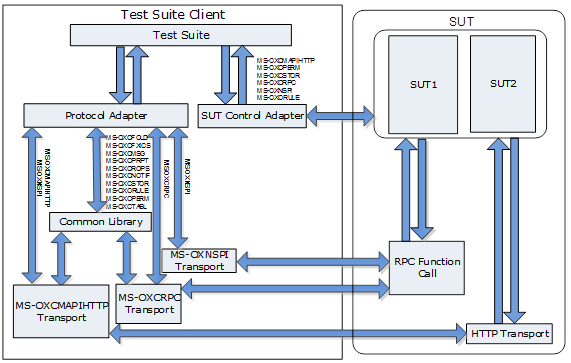

Exchange MAPI Test Suites Specification
=====================================================================================================================================================================================================================================================================================================================================================================================================================================================================

- [Introduction](#introduction)
- [Requirement specification](#requirement-specification)
- [Design considerations](#design-considerations)
- [Package design](#package-design)

Introduction
=====================================================================================================================================================================================================================================================================================================================================================================================================================================================================

Exchange MAPI Protocol Test Suites are implemented as synthetic
clients running against the server-side implementation of a given Exchange
protocol. They are designed in a client-to-server relationship and were
originally developed for the in-house testing of Microsoft Open
Specifications.

Microsoft Open Specifications are written using the normative
language defined in [RFC2119](http://go.microsoft.com/fwlink/?LinkId=117453); from which
statements are extracted as protocol requirements to be
listed in the requirement specification. See [Requirement specification](#requirement-specification).
This document describes how Exchange MAPI Protocol Test Suites are
designed to verify that the server behavior is in compliance
with normative protocol requirements in the technical
specification.

In a single test suite, similar or related requirements are grouped into one
test case. Test cases on the same command or operation are
grouped into one scenario.

The technical specifications in the following table are included
in the Exchange MAPI Protocol Test Suites package. The version of technical specification MS-OXCFOLD, MS-OXCRPC are v20220816. The version of MS-OXNSPI is v20220215. The version of MS-OXCNOTIF is v20211116. The version of MS-OXCTABL is 20210817. The version of MS-OXCFXICS, MS-OXCPERM, MS-OXCPRPT, MS-OXCSTOR, MS-OXORULE are v20210422. The version of MS-OXCMSG is v20190618. The version of OXCMAPIHTTP is v20181211. And the version of MS-OXCROPS is v20181001.

**Exchange MAPI Protocol technical specifications**

Technical specification  | Protocol name
 :------------- | :-------------
  MS-OXCFOLD       |  		  [Folder Object Protocol](http://go.microsoft.com/fwlink/?LinkID=267166)
  MS-OXCFXICS      |          [Bulk Data Transfer Protocol](http://go.microsoft.com/fwlink/?LinkID=267170)
  MS-OXCMAPIHTTP   |          [Messaging Application Programming Interface (MAPI) Extensions for HTTP](http://go.microsoft.com/fwlink/?LinkID=396883)
  MS-OXCMSG        |          [Message and Attachment Object Protocol](http://go.microsoft.com/fwlink/?LinkID=267172)
  MS-OXCNOTIF      |          [Core Notifications Protocol](http://go.microsoft.com/fwlink/?LinkID=330226)
  MS-OXCPERM       |          [Exchange Access and Operation Permissions Protocol](http://go.microsoft.com/fwlink/?LinkID=267175)
  MS-OXCPRPT       |          [Property and Stream Object Protocol](http://go.microsoft.com/fwlink/?LinkID=267174)
  MS-OXCROPS       |          [Remote Operations (ROP) List and Encoding Protocol](http://go.microsoft.com/fwlink/?LinkID=267173)
  MS-OXCRPC        |          [Wire Format Protocol](http://go.microsoft.com/fwlink/?LinkID=267171)
  MS-OXCSTOR       |          [Store Object Protocol](http://go.microsoft.com/fwlink/?LinkID=267169)
  MS-OXCTABL       |          [Table Object Protocol](http://go.microsoft.com/fwlink/?LinkID=267168)
  MS-OXNSPI        |          [Exchange Server Name Service Provider Interface (NSPI) Protocol](http://go.microsoft.com/fwlink/?LinkId=330225)
  MS-OXORULE       |          [E-Mail Rules Protocol](http://go.microsoft.com/fwlink/?LinkID=267176)

Requirement specification 
======================================================================================================================================================================================================================================================================

A requirement specification contains a list of requirements that is
extracted from statements in the technical specification. Each technical
specification has one corresponding requirement specification named as
MS-XXXX\_RequirementSpecification.xlsx, which can be found in the
Docs\\MS-XXXX folder in the Exchange MAPI Protocol Test Suites package
with the technical specification.

The requirements are categorized as normative or informative. If the
statement of the requirement is required for interoperability, the
requirement is normative. If the statement of the requirement is for
a high-level introduction or clarification, and removal of the content
does not affect interoperability, the requirement is informative.

Each requirement applies to a specific scope: server, client, or both.
If the requirement describes the behavior of the responder, the
scope of the requirement is the server. If the requirement describes the
behavior of the initiator, the scope of the requirement is
the client. If the requirement describes the behavior of the
initiator and responder, the scope of the requirement is both the client and server.

Test suites cover normative requirements that describe the behavior
of the responder. For a detailed requirement list and
classification, see MS-XXXX\_RequirementSpecification.xlsx.

Design considerations
=====================

Assumptions
-----------

-   Exchange MAPI Protocol Test Suites are not designed to run
    multi-protocol user scenarios, but rather to provide a way to exercise
    certain operations documented in a technical specification.

-   Test suites are functional tests that verify the compatibility
    of the system under test (SUT) with protocol implementation.

-   Test suites do not cover every protocol requirement and in no
    way certify implementation even if all tests pass.

-   Test suites verify the server-side testable requirements, but
    do not verify the requirements related to client behavior and
    server internal behavior.

Dependencies
------------

-   All Exchange MAPI Protocol Test Suites depend on Protocol Test
    Framework (PTF) to derive managed adapters.

-   MS-OXCFXICS, MS-OXCPRPT and MS-OXCTABL protocol test suites depend
    on Spec Explorer to generate the test suites code based on
    the models.

Package design
==============

Exchange MAPI Protocol Test Suites are implemented as synthetic
clients running against the server-side implementation of a given Exchange
protocol. Test suites verify the server-side and testable
requirements.

Architecture
------------

The following figure illustrates the Exchange MAPI Protocol Test Suites
architecture.

**Figure 1: Architecture**

The following outlines details of the test suites architecture:

**SUT**

The system under test (SUT) hosts the server-side implementation of the
protocol, which test suites run against.

-   From a third-party’s point of view, the SUT is of
    server implementation.

-   The following products have been tested with the test suites on the
    Windows platform:

	-   Microsoft Exchange Server 2007 Service Pack 3 (SP3)
	-   Microsoft Exchange Server 2010 Service Pack 3 (SP3)
	-   Microsoft Exchange Server 2013 Service Pack 1 (SP1)
	-   Microsoft Exchange Server 2016 
    -   Microsoft Exchange Server 2019

The presence of a second SUT will enable certain multi-server scenarios
and other test cases that pertain to a second SUT. If a second SUT is
not present, then some steps of test cases will not be run.

**Test Suite Client**

Test suites act as synthetic clients to communicate with an SUT and
validate the requirements gathered from technical specifications.
Exchange MAPI Protocol Test Suites include one common library, thirteen
adapters, thirteen test suites, and three models.

-   Test suites communicate with an SUT via a protocol adapter and an SUT
    control adapter to verify if an SUT's behavior is in
    compliance with normative protocol requirements.

-   The MS-OXNSPI, MS-OXCRPC and MS-OXCMAPIHTTP protocol adapters
    communicate directly with an SUT. All other protocol adapters
    communicate with an SUT through the common library.

Common library
--------------

The common library provides implementation of the transport layer,
common messages, structures, and helper methods.

### Transport classes

There are three transport classes in the common library:
MapiHttpAdapter, RpcAdapter and OxcropsClient.

The MapiHttpAdapter transport class implements HTTP communications
between test suites and SUTs.

The RpcAdapter transport class implements RPC communications by calling
native methods that are generated from IDL.

The MapiHttpAdapter transport class or RpcAdapter transport class is
chosen according to the setting of the “TransportSeq” property in the
ExchangeCommonConfiguration.deployment.ptfconfig file. If the
“TransportSeq” property is set as “mapi\_http”, the MapiHttpAdapter
transport class is chosen to send and receive message with the
MS-OXCMAPIHTTP transport. If the “TransportSeq” property is set as
either “ncacn\_ip\_tcp” or “ncacn\_http”, the RpcAdapter transport class
is chosen to send and receive messages with the MS-OXCRPC transport.

The OxcropsClient works as an intermediary between the protocol adapter
and MapiHttpAdapter/RpcAdapter class. The protocol adapter calls the
OxcropsClient to connect, disconnect, and run the ROP commands. The
Oxcropsclient passes the protocol adapter requests to the
MapiHttpAdapter/RpcAdapter, and the MapiHttpAdapter/RpcAdapter sends the
protocol adapter request to the SUT. The MapiHttpAdapter/RpcAdapter
receives the response from the SUT and passes the response to the
OxcropsClient, and the OxcropsClient sends the response back to the
protocol adapter.

### Helper methods

The common library defines a series of helper methods. The helper
methods can be classified into following categories:

-   Access the properties in the configuration file.
-   Generate resource name.
-   Used by multiple test suites.

### Message structures

Except for MS-OXMAPIHTTP, MS-OXNSPI and MS-OXCRPC, all other protocols
are ROP protocols. Therefore the ROP message structures are used by
multiple test suites. These ROP message structures are defined in the
common library.

Adapters
-------

Adapters are interfaces between the test suites and the SUT. There are
two types of adapter: the protocol adapter and the SUT control adapter. In most
cases, modifications to the protocol adapter will not be required for
non-Microsoft SUT implementation. However, the SUT control adapter
should be appropriately configured to connect to non-Microsoft SUT
implementation. All test suites in the package contain a protocol
adapter, and six of which contain an SUT control adapter.

### Protocol Adapter

The protocol adapter is a managed adapter, which is derived from the
ManagedAdapterBase class in PTF. It provides an interface that is
used by test cases to construct protocol request messages that will
be sent to the SUT. The protocol adapter also acts as an intermediary
between test cases and transport classes to receive messages,
send messages, parse responses from transport classes, and
validate the SUT response according to the normative requirement in
the technical specification.

Except for MS-OXMAPIHTTP, MS-OXNSPI and MS-OXCRPC, all other protocol
adapters use MapiHttpAdapter and RpcAdapter transport classes defined in
the common library to send and receive messages. MS-OXMAPIHTTP,
MS-OXNSPI, and MS-OXCRPC protocol adapters communicate directly with an
SUT.

### SUT Control Adapter

The SUT control adapter manages all control functions of the test
suites that are not associated with the protocol. For example, the setup
and the teardown are managed through the SUT control adapter (that is,
enabling or disabling the asynchronous RPC notification on the SUT). The
SUT control adapter is designed to work with Microsoft
implementation of the SUT. However, it is configurable to allow test
suites to run against non-Microsoft implementation of the SUT.

There are six protocols that have a SUT control adapter in Exchange
MAPI Protocol Test Suites package: MS-OXCMAPIHTTP, MS-OXCPERM,
MS-OXCSTOR, MS-OXCRPC, MS-OXNSPI, and MS-OXORULE.

Model
-----

There are three model-based test suites in the Exchange MAPI Protocol
Test Suites package: MS-OXCFXICS, MS-OXCRPRPT, and MS-OXCTABL. In the
model-based test suite, the protocol behaviors are modeled by defining
actions, states, and machines. The machines are used to generate the test
suite source code through Spec Explorer.

### Actions

The actions are abstracted from the protocol operations specified in the
technical specification. All the protocol operations have corresponding
actions. Besides the protocol operations, the models in the Exchange
MAPI Protocol Test Suites package also define the actions that check
whether or not the requirement is enabled for a given Exchange Server version,
and the actions check whether or not the MS-OXCMAPIHTTP transport is
supported for a given Exchange Server version.

The actions are defined as a series of rule methods with action
attribute in the model class. In the adapter, there is a corresponding
adapter method for each action. The adapter method will transform the
abstractive parameters of the actions to actual parameters and send the
real request.

### States

The models in the Exchange MAPI Protocol Test Suites package define a
series of states to simulate the state change of the SUT. The states are
defined as static variables in the model class. Each action checks the
current state to decide its appropriate operation, and it will also
update the state if the SUT state is changed.

### Machines

The models in the Exchange MAPI Protocol Test Suites package define a
series of machines to simulate the protocol operation sequences (defined
in the technical specification) and the SUT state transition after the
SUT receives the request from the test suite client.

There are three kinds of machines that are defined in the Cord file of the
model project: scenario machines, sliced machines, and test suite
machines. Scenario machines are designed to model the scenario defined
in [Test suite](#test-suite). Sliced machines are designed to slice the scenario
machines to be testable machines by limiting the parameters for each
operation in the scenario machines. Test suite machines are defined for
test cases generation. They construct the test cases by applying
“ShortTests” strategy to sliced machines.

### Model design patterns

Five patterns are used in the models of the Exchange MAPI Protocol Test
Suites package, including SynchronousProtocols, AbstractIdentifiers,
Server Initialization Pattern, Check Return Value, and Helper File
Pattern.

-   SynchronousProtocols: The protocol operations are modeled as
    synchronous behavior in which the test suite client sends a request and
    waits for a response. A request is always immediately followed by
    its response without interleaving packets from other interchanges.

-   AbstractIdentifiers: The models explore a set of simple types
    (Boolean, enumeration) as placeholders for the concrete values that
    will appear during the protocol testing. For example, the actual values
    of CodePage GUID cannot be identified at modeling time, so these
    variables are replaced by abstract identifiers and the real data is
    stored in the protocol adapter.

-   Server Initialization Pattern: The models make a connection to the
    server and log on to a private mailbox/public folder.

-   Check Return Value Pattern: The models verify protocol model
    actions’ return values related to some requirements that are
    verified by the model test case. The capture codes are written in
    corresponding actions in the protocol model.

-   Helper File Pattern: The models add a new file, ModelHelper.cs, in
    the Model project and design the capture requirement method in the
    ModelHelper.cs file.

Test suites
----------

Test suites verify the server-side and testable requirements listed
in the requirement specification. Test suites call a protocol
adapter to send and receive message between a protocol adapter and an
SUT, and call an SUT control adapter to change the SUT state. A test
suite consists of a series of test cases that are categorized into several
scenarios. Some test cases rely on a second SUT. If a second SUT is
not present, then some steps of these test cases will not be run.

### MS-OXCFOLD

The five scenarios are designed to verify the server-side, testable
requirements in the MS-OXCFOLD test suite. The S04\_OperateOnPublicFolder
scenario relies on the second SUT. It will not be run if the second SUT
is not available. The following table lists the scenarios in
the test suite.

Scenario  |  Description
:------------ | :-------------
S01\_FolderRopOperations     |     Verifies the ROP operations related to a general folder object.
S02\_MessageRopOperations    |     Verifies the ROP operations related to messages or subfolders in a folder object.
S03\_FolderInformation       |     Verifies the properties contained in a folder object or ROP operations related to a search folder.
S04\_OperateOnPublicFolder   |     Verifies the ROP operations on public folders.
S05\_InsufficientRightsOnFolder |  Verifies the ROP operations that the client has insufficient rights to operate on the specified private mailbox folder.

### MS-OXCFXICS

The nine scenarios are designed to verify the server-side, testable
requirements in the MS-OXCFXICS test suite. The following table lists the
scenarios in this test suite.

Scenario  |  Description
:------------ | :-------------
S01\_SyncFastTransferFolder         |  Tests the ROPs, properties, structures, FastTransfer stream format and the server behavior related to synchronizing content of folders between the client and the server.
S02\_SyncFastTransferMessage        |  Tests the ROPs, properties, structures, FastTransfer stream format and the server behavior related to synchronizing content of messages between the client and the server.
S03\_SyncFastTransferAttachment     |  Tests the ROPs, properties, structures, FastTransfer stream format and the server behavior related to synchronizing content of attachments between the client and the server.
S04\_SyncFastTransferBetweenServers |  Tests the ROPs and server behavior related to synchronizing data between different servers.
S05\_SyncICSHierarchy               |  Tests the ROPs, properties, structures, FastTransfer stream format and the server behavior related to hierarchy synchronizations.
S06\_SyncICSContents                |  Tests the ROPs, properties, structures, FastTransfer stream format and the server behavior related to contents synchronization.
S07\_SyncICSState                   |  Tests the ROPs, properties, structures, FastTransfer stream format and the server behavior related to ICS state synchronizations.
S08\_SyncICSFolderConfilict         |  Tests the ROPs, properties and the server behavior related to ICS folder conflict.
S09\_SyncICSMessageConflict         |  Tests the ROPs, properties and the server behavior related to ICS message conflict.

### MS-OXCMAPIHTTP

The two scenarios are designed to verify the server-side, testable
requirements in the MS-OXCMAPIHTTP test suite. The following table lists the
scenarios in this test suite.

Scenario  |  Description
:------------ | :-------------
S01\_RequestTypesForMailboxServerEndpoint    |   Verifies the HTTP header, the common response format, and the request types for a mailbox server endpoint.
S02\_RequestTypesForAddressBookServerEndpoint|   Verifies the request types for an address book server endpoint.

### MS-OXCMSG

The nine scenarios are designed to verify the server-side, testable
requirements in the MS-OXCMSG test suite. The following table lists the
scenarios in this test suite.

Scenario  |  Description
:------------ | :-------------
  S01\_CreateAndSaveMessage   |    Validates the behavior when the client calls the Message methods to create and save Message objects on the server. Finally, the client releases the Message object by calling the RopRelease operation.
  S02\_SetMessageStatus        |   Validates the behavior when the client calls the Message methods to set and get the message status. Finally, the client releases the Message object by calling the RopRelease operation.
  S03\_SetMessageFlags         |   Validates the behavior when the client calls the Message methods to set and get read flags of a message. Finally, the client releases the Message object by calling the RopRelease operation.
  S04\_MessageObjectProperties  |  Validates the Message object properties on the server. Finally, the client releases the Message object by calling the RopRelease operation.
  S05\_OpenMessage               | Validates the behavior when the client calls the Message methods to create, save, and open Message objects on the server. Finally, the client releases the Message object by calling the RopRelease operation.
  S06\_ReloadCachedInformation   | Validates the behavior when the client calls the Message methods to open and reload Message objects on the server. Finally, the client releases the Message object by calling the RopRelease operation.
  S07\_RopRecipient             |  Validates the behavior when the client calls the Recipient methods to read, modify, and remove all recipients on a Message object. Finally, the client releases the Message object by calling the RopRelease operation.
  S08\_RopAttachment             | Validates the behavior when the client calls the Attachment methods to open, get attachment tables, and delete attachment on a Message object. The client releases the Attachment object and Message object by calling RopRelease operation.
  S09\_RopEmbeddedMessage        | Validates the behavior when the client calls the Embedded Message methods to create, save, and open an embedded Message object in an Attachment object on the server.

### MS-OXCNOTIF

The two scenarios are designed to verify the server-side, testable
requirements in the MS-OXCNOTIF test suite. The following table lists the
scenarios in this test suite.

 Scenario  |  Description
:------------ | :-------------
  S01\_ReceivePendingNotifications   |     Verifies the four ways that the server uses to notify the client of pending notifications.
  S02\_SubscribeAndReceiveNotifications  | Verifies the notification details returned from the server after the client subscribes to the events on the server.

### MS-OXCPERM

The three scenarios are designed to verify the server-side, testable
requirements in the MS-OXCPERM test suite. The following table lists the
scenarios in this test suite.

   Scenario  |  Description
:------------ | :-------------
  S01\_RetrieveFolderPermissions |  Verifies the response for retrieving the folder permissions request.
  S02\_ModifyFolderPermissions   |  Verifies the response for modifying the folder permissions request.
  S03\_NegativeOrErrorValidation |  Verifies the responses for the wrong message sequences and the negative behaviors.

### MS-OXCPRPT

The six scenarios are designed to verify the server-side, testable
requirements in the MS-OXCPRPT test suite. The following table lists the
scenarios in this test suite.

 Scenario  |  Description
:------------ | :-------------
  S01\_QueryDataFromObject        |  Validates the operations used for querying data from an object.
  S02\_SetDataForObject           |  Validates the operations used for [setting data](#S2) for an object.
  S03\_QueryDataFromStreamObject  |  Validates the operations used for querying data of a stream object.
  S04\_SetDataForStreamObject     |  Validates the operations for setting data for a stream object.
  S05\_AsynchronousScenario       |  Validates the operations used for an asynchronous transition.
  S06\_TestCommonObjectProperties |  Validates the common object properties.

### MS-OXCROPS

The twelve scenarios are designed for this test suite to verify the server-side,
testable requirements in the MS-OXCROPS test suite. The scenario
S01\_LogonROPs relies on the second SUT. Some steps of the test cases
will not be run if the second SUT is not available. The following table
lists the scenarios in this test suite.

   Scenario  |  Description
:------------ | :-------------
  S01\_LogonROPs    |                          Verifies the response buffer formats of Logon ROPs.
  S02\_FolderROPs   |                          Verifies the response buffer formats of Folder ROPs.
  S03\_TableROPs    |                          Verifies the response buffer formats of Table ROPs.
  S04\_MessageROPs  |                          Verifies the response buffer formats of Message ROPs.
  S05\_TransportROPs|                          Verifies the response buffer formats of Transport ROPs.
  S06\_PropertyROPs |                          Verifies the response buffer formats of Property ROPs.
  S07\_StreamROPs   |                          Verifies the response buffer formats of Stream ROPs.
  S08\_PermissionROPs |                        Verifies the response buffer formats of Permission ROPs.
  S09\_RuleROPs       |                        Verifies the response buffer formats of Rule ROPs.
  S10\_FastTransferROPs |                      Verifies the response buffer formats of Fast Transfer ROPs.
  S11\_IncrementalChangeSynchronizationROPs |  Verifies the response buffer formats of Incremental Change Synchronization ROPs.
  S12\_NotificationROPs                     |  Verifies the response buffer formats of Notification ROPs and RopBufferTooSmall ROP.

### MS-OXCRPC

The two scenarios are designed to verify the server-side, testable
requirements in the MS-OXCRPC test suite. The following table lists the
scenarios in this test suite

   Scenario  |  Description
:------------ | :-------------
  S01\_SynchronousCall   |  Verifies the requirements related to the EMSMDB interface.
  S02\_AsynchronousCall  |  Verifies the requirements related to the AsyncEMSMDB interface.

### MS-OXCSTOR

The three scenarios are designed to verify the server-side, testable
requirements in the MS-OXCSTOR test suite. The following table lists the
scenarios in this test suite.

   Scenario  |  Description
:------------ | :-------------
  S01\_PrivateMailboxLogon        |                          Validates the operations performed against a private mailbox logon.
  S02\_PublicFoldersLogon         |                          Validates the operations performed against a public folder logon.
  S03\_SyncUpReadAndUnreadInformation |                      Validates the operations for clients synchronize Per-User Read/Unread data.

### MS-OXCTABL

The seven scenarios are designed to verify the server-side and testable
requirements in the MS-OXCTABL test suite. The following table lists the
scenarios in this test suite.

 Scenario  |  Description
:------------ | :-------------
  S01\_ColumnRops  |         Tests the ROPs for processing table columns in MS-OXCTABL.
  S02\_RowRops     |         Tests the ROPs for processing table rows in MS-OXCTABL.
  S03\_BookmarkRops|         Tests the ROPs on a table bookmark in MS-OXCTABL.
  S04\_ExpandRowRops |        Tests the ROPs for expanding or collapsing a categorized row in MS-OXCTABL.
  S05\_ResetSortTableRops |  Tests the ROPs for resetting or sorting a table in MS-OXCTABL.
  S06\_RestrictRop        |  Tests the ROP for restricting a table in MS-OXCTABL.
  S07\_AsyncRops          |  Tests the asynchronous ROPs in MS-OXCTABL.

### MS-OXNSPI

The five scenarios are designed to verify the server-side, testable
requirements in the MS-OXNSPI test suite. The following table lists the
scenarios in this test suite.

 Scenario  |  Description
:------------ | :-------------
  S01\_ObtainGeneralInfo   | Tests the server behavior for the NSPI calls related to obtaining the general information of an Address Book object.
  S02\_ObtainDetailsInfo   | Tests the server behavior for the NSPI calls related to obtaining the detailed information of an Address Book object.
  S03\_ANRRelatedBehavior  | Tests the server behavior for the NSPI calls related to the Ambiguous Name Resolution process.
  S04\_ModifyProperty      | Tests the server behavior for the NSPI calls related to modifying the property of an Address Book object.
  S05\_NegativeBehavior    | Tests the negative server behavior for each NSPI call.

### MS-OXORULE

The five scenarios are designed for the MS-OXORULE test suite to verify the
structure and the server behavior. The following table lists the
scenarios in this test suite.

|Scenario  |  Description|
|:------------ | :-------------|
|S01\_AddModifyDeleteRetrieveRules   |      Validates server behavior of the following:                                            
||   - The operations of RopModifyRules and RopGetRulesTable when adding, modifying, deleting and retrieving standard rules.    |      
||   - The functions of ROPs that are referenced in MS-OXCMSG and MS-OXCTABL for adding, modifying, deleting, and retrieving extended rules. |                                        
|  S02\_ProcessServerSideRulesOtherthanOOF |  Validates server behavior of processing server-side rules other than the Out-of-Office rule, because the action of OP\_OOF\_REPLY is complicated enough to be a separate scenario.|
|  S03\_ProcessOutOfOfficeRule             |  Validates server behavior of processing the Out-of-Office rule.|
|  S04\_ProcessRulesOnPublicFolder        |  Validates server behavior of processing server-side rules on the public folder.|
|  S05\_GenerateDAMAndDEM              |      Validates server behavior of DAM and the DEM message.|
  ------------------------------------------------------------------------------------------------------------------------------------------------------------------------------------------------------------------------------
