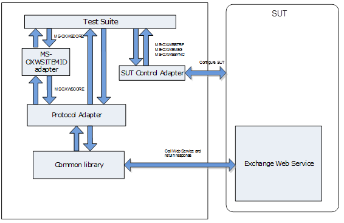

Exchange EWS Test Suites Specification
========================================================================================================================================================================================================

- [Introduction](#introduction)
- [Requirement specification](#requirement-specification)
- [Design considerations](#design-considerations)
- [Package design](#package-design)

Introduction
=====================================================================================================================================================================================================================================================================================================================================================================================================================================================================
Exchange EWS Protocol Test Suites are implemented as synthetic
clients running against the server-side implementation of a given Exchange
protocol. They are designed in a client-to-server relationship and were
originally developed for the in-house testing of Microsoft Open
Specifications.

Microsoft Open Specifications are written using the normative
language defined in [RFC2119](http://go.microsoft.com/fwlink/?LinkId=117453); from which
statements are extracted as protocol requirements to be
listed in the requirement specification. See [Requirement specification](#requirement-specification).
This document describes how Exchange EWS Protocol Test Suites are
designed to verify that the server behavior is in compliance
with normative protocol requirements in the technical
specification.

In a single test suite, similar or related requirements are grouped into one
test case. Test cases on the same command or operation are
grouped into one scenario.

The technical specifications in the following table are included
in the Exchange EWS Protocol Test Suites package. The version of technical specification MS-OXWSCONT is v20220517. The version of MS-OXWSMTGS is v20200219. The version of MS-OXWSATT, MS-OXWSCORE, MS-OXWSMSG are v20191119.
The version of MS-OXWSTASK is v20181211. And the version of MS-OXWSSYNC, MS-OXWSFOLD, MS-OXWSITEMID, MS-OXWSBTRF are v20181001.

**Exchange EWS Protocol technical specifications**

Technical specification  | Protocol name
:------------ | :-------------
  MS-OXWSATT     |           [Attachment Handling Web Service Protocol](http://go.microsoft.com/fwlink/?LinkID=267322)
  MS-OXWSBTRF    |           [Bulk Transfer Web Service Protocol](http://go.microsoft.com/fwlink/?LinkID=267323)
  MS-OXWSCONT    |           [Contacts Web Service Protocol](http://go.microsoft.com/fwlink/?LinkID=267324)
  MS-OXWSCORE    |           [Core Items Web Service Protocol](http://go.microsoft.com/fwlink/?LinkID=267325)
  MS-OXWSFOLD    |           [Folders and Folder Permissions Web Service Protocol](http://go.microsoft.com/fwlink/?LinkID=267326)
  MS-OXWSITEMID  |           [Web Service Item ID Algorithm](http://go.microsoft.com/fwlink/?LinkID=616012)
  MS-OXWSMSG     |           [E-Mail Message Types Web Service Protocol](http://go.microsoft.com/fwlink/?LinkID=267327)
  MS-OXWSMTGS    |           [Calendaring Web Service Protocol](http://go.microsoft.com/fwlink/?LinkID=267328)
  MS-OXWSSYNC    |           [Mailbox Contents Synchronization Web Service Protocol](http://go.microsoft.com/fwlink/?LinkID=267329)
  MS-OXWSTASK    |           [Tasks Web Service Protocol](http://go.microsoft.com/fwlink/?LinkID=267330)

Requirement specification 
======================================================================================================================================================================================================================================================================

A requirement specification contains a list of requirements that is
extracted from statements in the technical specification. Each technical
specification has one corresponding requirement specification named as
MS-XXXX\_RequirementSpecification.xlsx, which can be found in the
Docs\\MS-XXXX folder in the Exchange EWS Protocol Test Suites package
with the technical specification.

The requirements are categorized as normative or informative. If the
statement of the requirement is required for interoperability, the
requirement is normative. If the statement of the requirement is for
a high-level introduction or clarification, and removal of the content
does not affect interoperability, the requirement is informative.

Each requirement applies to a specific scope: server, client, or both.
If the requirement describes the behavior of the responder, the
scope of the requirement is the server. If the requirement describes the
behavior of the initiator, the scope of the requirement is
the client. If the requirement describes the behavior of the
initiator and responder, the scope of the requirement is both the client and server.

Test suites cover normative requirements that describe the behavior
of the responder. For a detailed requirement list and
classification, see MS-XXXX\_RequirementSpecification.xlsx.

Design considerations
=====================

Assumptions
-----------

-   Exchange EWS Protocol Test Suites are not designed to run
    multi-protocol user scenarios, but rather to provide a way to exercise
    certain operations documented in a technical specification.

-   Test suites are functional tests that verify the compatibility
    of the system under test (SUT) with protocol implementation.

-   Test suites do not cover every protocol requirement and in no
    way certify implementation even if all tests pass.

-   Test suites verify the server-side testable requirements, but
    do not verify the requirements related to client behavior and
    server internal behavior.

Dependencies
------------

-   All Exchange EWS Protocol Test Suites depend on Protocol Test
    Framework (PTF) to derive managed adapters.

Package design
==============

Exchange EWS Protocol Test Suites are implemented as synthetic
clients running against the server-side implementation of a given Exchange
protocol. Test suites verify the server-side and testable
requirements.

Architecture
------------

The following figure illustrates the Exchange EWS Protocol Test Suites
architecture.

**Figure 1: Architecture**

The following outlines details of the test suites architecture:

**SUT**

The SUT hosts the server-side implementation of the protocol, which test
suites run against.

-   From a third-party’s point of view, the SUT is of
    server implementation.

-   The following products have been tested with the test suites on the
    Windows platform.
	-   Microsoft Exchange Server 2007 Service Pack 3 (SP3)
	-   Microsoft Exchange Server 2010 Service Pack 3 (SP3)
	-   Microsoft Exchange Server 2013 Service Pack 1 (SP1)
	-	Microsoft Exchange Server 2016
	-	Microsoft Exchange Server 2019

**Test Suite Client**

Test suites act as synthetic clients to communicate with an SUT and
validate the requirements gathered from technical specifications.
Exchange EWS Protocol Test Suites include one common library, ten
adapters and nine test suites.

-   Test suites communicate with an SUT via a protocol adapter and an SUT
    control adapter to verify if an SUT is behaving in
    compliance with normative protocol requirements.

-   Except for the MS-OXWSITEMID adapter, all other protocol adapters
    communicate with an SUT through the common library.

-   The MS-OXWSITEMID protocol adapter implements Web Service
    Item Algorithm. All other test suites use the MS-OXWSITEMID protocol
    adapter to parse and process the Id of an ItemId object in a SOAP
    request and a SOAP response.

Common library
--------------

The common library provides implementation of the transport layer,
common messages, structures, and helper methods.

### Transport classes

There is one transport class in the common library:
ExchangeServiceBinding.

The ExchangeServiceBinding transport class implements SOAP over HTTP and
SOAP over HTTPS communications between test suites and SUTs.

### Helper methods

The common library defines a series of helper methods. The helper
methods can be classified into following categories:

-   Access the properties in the configuration file.
-   Generate resource name.
-   Validate certificate used for authentication.
-   Used by multiple test suites.

### Message structures

Except for MS-OXWSITEMID, all protocols are SOAP protocols. Therefore the
message structures are used by multiple test suites. These message
structures are defined in the common library.

Adapters
-------

Adapters are interfaces between the test suites and the SUT. There are
two types of adapters: a protocol adapter and an SUT control adapter. In most
cases, modifications to the protocol adapter will not be required for
non-Microsoft SUT implementation. However, the SUT control adapter
should be appropriately configured to connect to non-Microsoft SUT
implementation. All test suites in the package contain a protocol
adapter, and three of which contain an SUT control adapter.

### Protocol Adapter

The protocol adapter is a managed adapter, which is derived from the
ManagedAdapterBase class in PTF. It provides an interface that is
used by test cases to construct protocol request messages that will
be sent to the SUT. The protocol adapter also acts as an intermediary
between test cases and transport classes to receive messages,
send messages, parse responses from transport classes, and
validate the SUT response according to normative requirements in
the technical specification.

Except for MS-OXWSITEMID, all other protocol adapters use the
ExchangeServiceBinding transport class defined in the common library to
send and receive messages. The MS-OXWSITEMID protocol adapter implements the
Web Service Item Algorithm that describes the format of the Id and how
to process the Id. All other test suites use the MS-OXWSITEMID protocol
adapter to parse and process the Id of an ItemId object in a SOAP request
and a SOAP response.

### SUT Control Adapter

The SUT control adapter manages all control functions of the test
suites that are not associated with the protocol. For example, the setup
and teardown are managed through the SUT control adapter. The SUT
control adapter is designed to work with Microsoft implementation of
the SUT. However, it is configurable to allow the test suites to run
against non-Microsoft implementation of the SUT.

There are three protocols that have a SUT control adapter in the
Exchange EWS Protocol Test Suites package: MS-OXWSBTRF, MS-OXWSSYNC and
MS-OXWSMSG.

Test suites
----------

Test suites verify the server-side and testable requirements
in the requirement specification. Test suites call a protocol
adapter to send and receive message between a protocol adapter and an
SUT, and call an SUT control adapter to change the SUT state. A test
suite consists of a series of test cases that are categorized into several
scenarios.

### MS-OXWSATT

This scenario is designed to verify the server-side, testable
requirements in the MS-OXWSATT test suite. The following table lists the
scenarios in the test suite.

 Scenario  | Description
:------------ | :-------------
  S01\_AttachmentProcessing |   Test the operations on creating, retrieving, and deleting an attachment.

### MS-OXWSBTRF

This scenario is designed to verify the server-side, testable
requirements in the MS-OXWSBTRF test suite. The following table lists the
scenarios in this test suite.

 Scenario  | Description
:------------ | :-------------
S01\_ExportAndUploadItems  |   Test the operation on exporting items from a mailbox server and upload items to a mailbox server.

### MS-OXWSCONT

The six scenarios are designed to verify the server-side, testable
requirements in the MS-OXWSCONT test suite. The following table lists the
scenarios in this test suite.

   Scenario  | Description
:------------ | :-------------
  S01\_CreateGetDeleteContactItem      |         Test the operations on creating, retrieving and deleting contact items on the server.
  S02\_UpdateContactItem               |         Test the operation on updating contact items on the server.
  S03\_CopyContactItem                 |         Test the operation on copying contact items on the server.
  S04\_MoveContactItem                 |         Test the operation on moving contact items on the server.
  S05\_OperateMultipleContactItems     |         Test the operations on creating, updating, moving, retrieving, copying and deleting multiple contact items on the server.
  S06\_OperateContactItemWithOptionalElements |  Test the operations on creating, updating, moving, retrieving, and copying contact items with optional elements on the server.

### MS-OXWSCORE

The eight scenarios are designed to verify the server-side, testable
requirements in the MS-OXWSCORE test suite. The following table lists the
scenarios in this test suite.

   Scenario  | Description
:------------ | :-------------
  S01\_ManageBaseItems        |        Test the operations on creating, retrieving, updating, moving, copying, deleting and marking base items on the server.
  S02\_ManageContactItems     |        Test the operations on creating, retrieving, updating, moving, copying, deleting and marking contact items on the server.
  S03\_ManageDistributionListsItems |  Test the operations on creating, retrieving, updating, moving, copying, deleting and marking distribution list items on the server.
  S04\_ManageEmailItems            |   Test the operations on creating, retrieving, updating, moving, copying, sending, deleting and marking email items on the server.
  S05\_ManageMeetingItems          |   Test the operations on creating, retrieving, updating, moving, copying, deleting and marking calendar items on the server.
  S06\_ManagePostItems             |   Test the operations on creating, retrieving, updating, moving, copying, deleting and marking post items on the server.
  S07\_ManageTaskItems             |   Test the operations on creating, retrieving, updating, moving, copying, deleting and marking task items on the server.
  S08\_ManageSevenKindsOfItems     |   Test the operations on creating, retrieving, updating, moving, copying, and deleting items such as base, contact, distribution list, email, meeting, post, and task on the server.

### MS-OXWSFOLD

The eight scenarios are designed to verify the server-side, testable
requirements in the MS-OXWSFOLD test suite. The following table lists the
scenarios in this test suite.

Scenario  | Description
:------------ | :-------------
  S01\_CreateDeleteFolder |  Test the operations on creating and deleting folders from a mailbox.
  S02\_CopyFolder         |  Test the operations on copying an identified folder.
  S03\_MoveFolder         |  Test the operations on moving folders from a specified parent folder and putting them in another parent folder.
  S04\_GetFolder          |  Test the operations on retrieving folders.
  S05\_EmptyFolder        |  Test the operations on emptying identified folders and deleting subfolders of the specified folder.
  S06\_UpdateFolder       |  Test the operations on modifying properties of an existing folder.
  S07\_FolderPermission   |  Test the permission-related cases.
  S08\_OptionalElements   |  Test all operations with/without all optional elements.

### MS-OXWSMSG

The seven scenarios are designed to verify the server-side, testable
requirements in the MS-OXWSMSG test suite. The following table lists the
scenarios in this test suite.

  Scenario  | Description
:------------ | :-------------
  S01\_CreateGetDeleteEmailMessage  |  Test the operations on creating, retrieving, and deleting an email message from the server.
  S02\_UpdateEmailMessage         |    Test the operation on updating an email message on the server.
  S03\_CopyEmailMessage           |    Test the operation copying an email message on the server.
  S04\_MoveEmailMessage           |    Test the operation on moving an email message on the server.
  S05\_SendEmailMessage           |    Test the operation on sending an email message on the server.
  S06\_OperateMultipleEmailMessages |  Test the operations on creating, retrieving, updating, copy, moving, sending and deleting multiple email messages on the server at the same time.
  S07\_OptionalElementsValidation   |  Test the operations on creating, retrieving and deleting an email message with/without optional elements.

### MS-OXWSMTGS

The five scenarios are designed to verify the server-side, testable
requirements in the MS-OXWSMTGS test suite. The following table lists the
scenarios in this test suite.

  Scenario  | Description
:------------ | :-------------
  S01\_CreateGetDeleteCalendarRelatedItem |   Test the operations on creating, retrieving and deleting calendar related items on the server.
  S02\_UpdateCalendarRelatedItem          |   Test the operation on updating calendar-related items on the server.
  S03\_CopyCalendarRelatedItem            |   Test the operation on copying calendar-related items on the server
  S04\_MoveCalendarRelatedItem            |   Test the operation on moving calendar-related items on the server.
  S05\_OperateMultipleCalendarRelatedItems |  Test the operations on creating, retrieving, updating, copying, moving and deleting multiple calendar-related items on the server.

### MS-OXWSSYNC

The four scenarios are designed to verify the server-side, testable
requirements in the MS-OXWSSYNC test suite. The following table lists the
scenarios in this test suite.

  Scenario  | Description
:------------ | :-------------
  S01\_SyncFolderHierarchy            | Test the SyncFolderHierarchy operation on the following folders: inbox, calendar, contacts, tasks and search.
  S02\_SyncFolderItems                | Test the SyncFolderItems operation on the following items: MessageType, MeetingRequestMessageType, MeetingResponseMessageType, MeetingCancellationMessageType, TaskType, ContactItemType, PostItemType, CalendarItemType, DistributionListType and ItemType.
  S03\_OperateSyncFolderHierarchyOptionalElements  |  Test if the SyncFolderHierarchy operation succeeds in getting the synchronization information of five types of folders: inbox, calendar, tasks, contacts, and search regardless of setting the optional elements.
  S04\_OperateSyncFolderItemsOptionalElements | Test if the SyncFolderItems operation succeeds in getting the synchronization information of multiple items regardless of setting the optional elements.

### MS-OXWSTASK

The six scenarios are designed to verify the server-side, testable
requirements in the MS-OXWSTASK test suite. The following table lists the
scenarios in this test suite.

 Scenario  | Description
:------------ | :-------------
S01\_CreateGetDeleteTaskItem        | Test the operations on creating, retrieving, and deleting a task item from the server.
S02\_UpdateTaskItem                 | Test the operation on updating a task item on the server.
S03\_CopyTaskItem                   | Test the operation on copying a task item on the server.
S04\_MoveTaskItem                   | Test the operation on moving a task item on the server.
S05\_OperateMultipleTaskItems       | Test the operation on operating multiple task items on the server at the same time.
S06\_OperateTaskItemWithOptionalElements  | Test the operations on operating a task item with or without optional elements on the server.
