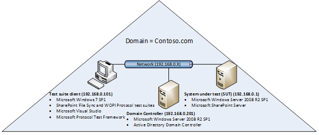
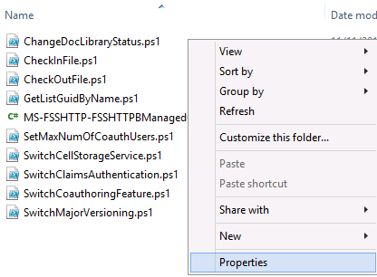
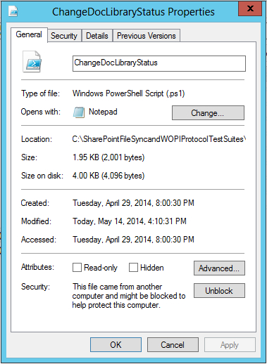
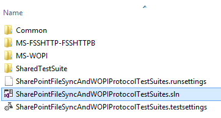
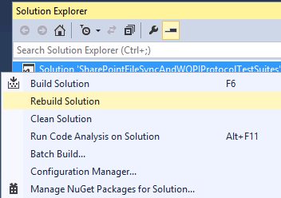
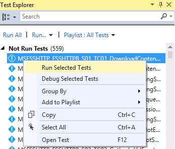
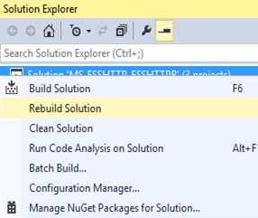
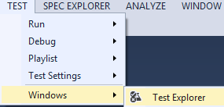
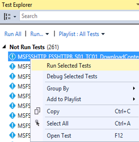

SharePoint File Sync and WOPI Protocol Test Suite deployment guide
=====================================================================================================================================================
- [Overview](#overview)
- [Prerequisites](#prerequisites)
- [Deploying test suites](#deploying-test-suites)
- [Using test suite directories](#using-test-suite-directories)
- [Configuring test suites](#configuring-test-suites)
- [Running test suites](#running-test-suites)
- [Viewing test suite results, logs, and reports](#viewing-test-suite-results-logs-and-reports)

Overview
=====================================================================================================================================================

SharePoint File Sync and WOPI Protocol Test Suites are implemented
as synthetic clients running against the server-side implementation of a
given SharePoint protocol. They are designed in a client-to-server
relationship and were originally developed for the in-house testing of
Microsoft Open Specifications. Test Suites have been used
extensively in Plugfests and Interoperability Labs to test partner
implementation.

The SharePoint File Sync and WOPI Protocol Test Suite deployment guide
introduces the hardware and software requirements of the test suite
client and the requirements of the system under test (SUT) if the test
suites run against SharePoint Server. The guide also introduces topics on how to
deploy, configure and run the test suites, and view the test suite reports.

Prerequisites
======================================================================================================================================

This section describes the hardware and software requirements for the
test suites. In a SharePoint server environment, the test suite
deployment takes place on both the client and server side. The following
information helps test suite users to plan their deployment.

Hardware requirements
----------------------------------------------------------------------------------------
###  System under test

The SUT is the server side of the test suite environment. SharePoint
Server(s) and Active Directory have defined system requirements which
should be taken into account during deployment. SharePoint File Sync
and WOPI Protocol Test Suites do not have any additional SUT resource
requirements.

### Test suite client

The test suite client is the client side of the test suite environment.
The following table shows the minimum resource requirements for the test
suite client.

**Test suite client resource requirements**

 Component  |Test suite client minimum requirement
:------------ | :-------------
  **RAM**       |  2GB
  **Hard Disk** |  3GB of free space
  **Processor** |  >= 1GHz

Software requirements
------------------------------------------------------------------------------------------------------------------------------------------------------------------------------------------------------------------------------------------------------------------------------------------------------------------------------------------------------------------------------------------------------------------------------------------------------------------------------------------------------------------------------------------------------------------------------------------------------------------------------------------------------------------------------------------------------------------------------------------------------

###  System under test

This section is only relevant when running the test suites against the
following versions of SharePoint Server:

-   Microsoft SharePoint Foundation 2010 Service Pack 2 (SP2)
-   Microsoft SharePoint Foundation 2013 Service Pack 1 (SP1)
-   Microsoft SharePoint Server 2010 Service Pack 2 (SP2)
-   Microsoft SharePoint Server 2013 Service Pack 1 (SP1)
-   Microsoft SharePoint Server 2016

The following table describes the required server roles for a
test suite deployment with Microsoft implementation.

**Required SUT roles**

|Role | Description|
|:------------ | :-------------|
|  **Active Directory Domain Controller (AD DC)**   |Active Directory Domain Controller provides secure data for users and computers. An AD DC can coexist with SharePoint Server. A typical test configuration has an AD DC and SharePoint Server installed on separate machines.|
|  **SharePoint Server (SUT)** |  The SharePoint Server in the topology.|

The following diagram is an example of what a typical SharePoint File
Sync and WOPI Protocol Test Suite environment may look like. This
example uses an IPv4, but IPv6 is also supported by the test suites.

### Test suite client

This section describes the prerequisite software for installing SharePoint File Sync and WOPI Protocol Test Suites on the test suite
client. The following table outlines the software dependencies for the test suite client.

**Test suite client software dependencies**

|Operating systems|
|:------------ |
| Windows 7 x64 Service Pack 1 and above|
|Windows 8 x64 and above|
|Windows 2008 R2 x64 Service Pack 1 and above|

|Software|
|:------------ |
| Microsoft Visual Studio 2013 Professional|
| Microsoft Protocol Test Framework 1.0.2220.0 and above|
----------------------------------------------------------------------------

Deploying test suites
================================================================================================================================================================================================================================================================================================================================================================================================================

This section describes the deployment of SharePoint File Sync and
WOPI Protocol Test Suites on the test suite client and the SUT. The
SharePoint Server Protocol test suites are packaged in a .zip file, available at [Microsoft
Connect](http://go.microsoft.com/fwlink/?LinkId=516921). Once you've
downloaded the test suites, perform the following steps to successfully configure the test suites:

1.  Extract the **SharePoint File Sync and WOPI Protocol Test Suites** folder from the zip file to a
    directory of your choice on the test suite client.

2.  Copy the **SUT** and **Common** folders under **…\\ SharePoint File
    Sync and WOPI Protocol Test Suites \\Setup\\** to a directory of
    your choice on the SUT. The SUT configuration scripts are the only
    requirement for the SUT. The scripts facilitate the SUT
    configuration process and are in the **SharePointFileSyncandWOPIProtocolTestSuites.zip** file.

	**Note**   

	-   If you configure the SUT using the setup configuration scripts,
	remember that the path of the setup script should contain at the most
	256 characters.

	-   If your computer blocks scripts that are downloaded from the Internet for
	security reasons, follow these steps to unblock
	PowerShell scripts.

1.  Right click xxx.ps1 and select **Properties**.   

	                                                

1.  Click **Unblock** and then click **OK**.         

		  

Using test suite directories
============================================================================================================================================================================================================================

This section shows the folder structures in the **SharePointFileSyncAndWOPIProtocolTestSuites.zip** file.

**SharePointFileSyncAndWOPIProtocolTestSuites.zip file contents**

|Folder/file| Description|
|:------------ | :-------------|
| **EULA.rtf**     |   End-User License Agreement. |
| **ReadMe.txt**   |   A doc on deployment and prerequisite software. |
| **SharePoint File Sync and WOPI Protocol Test Suites**          |-- |
| **- Docs**  |   A folder with documents of all protocol test suites. |
| **- FssWopiTestSuiteDeploymentGuide.docx**   |   A doc on the protocol test suite deployment. |
| **- FssWopiTestSuiteSpecification.docx**     |   A doc on the test suite configuration details, architecture, adapters and test case details.	|
| **+ MS-XXXX**                                |   The MS-XXXX help documentation |
| **- \[MS-XXXX\].md**                         |   The protocol technical specification. |
| **- MS-XXXX\_SUTControlAdapter.chm**         |   A help doc on the SUT control adapter class library such as declaration syntax and their description. |
| **- MS-XXXX\_RequirementSpecification.xlsx** |   A spreadsheet that outlines all requirements that are associated with the technical specification. |
| **- Setup**                                  |   A folder with configuration scripts. |
| **- Test Suite Client**                      |   A folder with the configuration script to configure the test suite client. |
| **- SharePointClientConfiguration.cmd**      |   A command file that runs the SharePointClientConfiguration.ps1 to configure the properties for the protocol test suites. |
| **- SharePointClientConfiguration.ps1**      |   A configuration script that will be invoked by SharePointClientConfiguration.cmd. |
| **- SUT**                                    |   A folder with the configuration script to configure the SUT. |
| **- SharePointSUTConfiguration.cmd**         |   A command file that runs the SharePointSUTConfiguration.ps1 to create resources and configure settings on the SUT. |
| **- SharePointSUTConfiguration.ps1**         |   A configuration script that will be invoked by SharePointSUTConfiguration.cmd. |
| **- Common**                                 |   A folder with common configuration scripts and resources. |
| **-CommonConfiguration.ps1**                 |   A library of common functions for configuring Microsoft products and the test suite client. |
| **-SharePointCommonConfiguration.ps1**       |   A library of common functions for configuring the SUT. |
| **-SharePointTestSuite.config**              |   The configuration file to store all configuration resources. |
| **- Source**                                 |   A folder with Microsoft Visual Studio solution that contains the source code for the test suites. |
| **- Common**                                 |   A folder with Visual Studio projects that contains the common source code for the test suites. |
| **-FssWopiCommonConfiguration.deployment.ptfconfig** |          The common configuration file. |
| **-SharePointFileSyncAndWOPIProtocolTestSuites.sln** |          A Visual Studio solution with projects that encapsulate the protocol test suites source code. |
| **- SharePointFileSyncAndWOPIProtocolTestSuites.runsettings** |   A configuration file for the unit test. |
| **-SharePointFileSyncAndWOPIProtocolTestSuites.testsettings** |   A configuration file for running test cases. |
| **- MS-XXXX**                                                 |   A folder for the MS-XXXX test suite source code. |
| **+ Adapter**                                                 |   The Adapter test suite code. |
| **+ TestSuite**                                               |   The test suite code. |
| **- MS-XXXX.sln**                                             |   A Visual Studio solution that contains projects of the MS-XXXX test suite. |
| **- MS-XXXX.runsettings**                                     |   A configuration file for the MS-XXXX unit test. |
| **- MS-XXXX.testsettings**                                    |   A configuration file for running the MS-XXXX test cases. |
| **-Scripts**                                                  |   SharePoint Server Protocol Test Suites can be run using Visual Studio or batch scripts. The Scripts folder has a collection of command files that allows users to run specific test cases in the test suite or the entire test suite. |
| **-RunAllSharePoint\_FileSyncAndWOPI\_TestCases.cmd**         |   A script that can be used to run all test cases in the package. |
| **-MS-XXXX**                                                  |   A folder with scripts that belong to the MS-XXXX test suite. |
| **- RunAllMSXXXXTestCases.cmd**                               |   A script that can be used to run all test cases of MS-XXXX. |
| **- RunMSXXXX\_SYY\_TCZZ\_Name.cmd**                          |   A script that can be used to run a single test case of MS-XXXX. |

Configuring test suites
========================================================================================================================================================================================================

This section provides the guidance on configuring SharePoint
File Sync and WOPI Protocol Test Suites on the SUT and the test suite
client. The configuration should be done in this order: configure the
SUT, and then configure the test suite client.

For configuration script, the exit code definition is as follows:

1.  A normal termination will set the exit code to 0.

2.  An uncaught THROW will set the exit code to 1.

3.  Script execution warning and issues will set the exit code to 2.

4.  Exit code is set to the actual error code for other issues.

Configuring the SUT
----------------------------------------------------------------------------------------------------------------------------------------------------------------

You can configure the SUT using automation scripts, as described in [Configuring the SUT using the setup configuration script](#configuring-the-sut-using-the-setup-configuration-script); or configure the SUT manually, as described in [Configuring the SUT manually](#configuring-the-sut-manually).

**Note** The scripts should be run by a user who has domain administrator rights on the SUT.

### SUT resource requirements

Each test suite in SharePoint File Sync and WOPI
Protocol Test Suites package may require varying levels of resources on
the SUT. The following table outlines these resources for each test
suite. The SUT configuration scripts will automatically create all the
required resources for the Microsoft server implementation. To configure
the SUT manually, refer to [Configuring the SUT manually](#configuring-the-sut-manually).

The client configuration script follows the naming convention shown in
the following table. If a change to the resource name is required, the
corresponding change to the resource name defined in the client
configuration script will be required.

**Note**   The MS-WOPI test suite only supports the following versions of SharePoint:

-  Microsoft SharePoint Server 2013 Service Pack 1 (SP1)
-  Microsoft SharePoint Foundation 2013 Service Pack 1 (SP1)
-  Microsoft SharePoint Server 2016

**SharePoint Server resources**

|Test suite |  Resource type |  Resource name
|:------------ | :-------------|:-------------
| **All**         | Domain User | User1
| |  Domain User   |  User2
| |  Domain User   |  User3
| |  Domain User   |  ReadOnlyUser
| |  Domain User   |  NoUseRemoteUser
| |  Text document |  FileSyncWOPIBigTest.txt
|**MS-FSSHTTP-FSSHTTPB**|  Site collection |  MSFSSHTTPFSSHTTPB\_SiteCollection
| |Document library |   MSFSSHTTPFSSHTTPB\_DocumentLibrary
| |Zip file         |   FileSyncWOPI\_ZipTestData.zip
| |Text document    |   FileSyncWOPI\_TestData.txt
| |Note file        |   FileSyncWOPI\_OneNoteWithODB.one
| |Permission level |   NoUseRemoteInterfacePermissionLevel
|**MS-WOPI**            |Site collection  |   MSWOPI\_SiteCollection
| | Document library |    MSWOPI\_SharedDocumentLibrary
| | Document library |    MSWOPI\_DocumentLibrary
| | Folder           |    MSWOPI\_TestFolder
| | Zip file         |    FileSyncWOPI\_ZipTestData.zip
| | Text document    |    FileSyncWOPI\_TestData.txt
| | Note file        |    FileSyncWOPI\_OneNoteWithODB.one
| | Text document    |    MSWOPI\_TestData1.txt
| | Text document    |                  MSWOPI\_TestData2.txt
| | Secure Store Service Application |  MSWOPI\_TargetAppWithNotGroupAndWindows
| | Secure Store Service Application |  MSWOPI\_TargetAppWithGroupAndNoWindows
| | Domain User                      |  MSWOPIUser
| | Domain User                      |  FileSyncWOPIUser
| | Folder                           |  MSWOPI\_TestFolderCreatedByUser1
| | Permission level                 |  NoUseRemoteInterfacePermissionLevel

### Configuring the SUT using the setup configuration script 

The setup configuration script is only used for configuring the SUT on the Windows platform.

To configure SUT using the setup configuration script, navigate to the
**SUT** folder, right-click the **SharePointSUTConfiguration.cmd** and
select **Run as administrator**.

### Configuring the SUT manually 

If the SUT is non-Microsoft implementation of SharePoint Server, you
will not be able to run the setup configuration script. The following
steps explain what needs to be created or configured on the SUT to run the test suites.

1.  In Windows Powershell, set the execution policy to **RemoteSigned**,
    enable remoting, and increase the memory allocated per shell for
    remote shell management to **1024MB** or more, if you plan to
    configure the SUT or test suite in PowerShell mode. If the user name
    has a prefix in the user policy of web application, you will need to
    add the user name without a prefix in the user policy.

2.  Configure the SUT to support HTTPS.

3.  Set the Alternate Access Mapping (AAM) value to HTTPS on the SUT.

4.  Change the web application’s authentication mode to claims-based.

5.  Create six domain users named User1, User2, User3, ReadOnlyUser,
    NoUseRemoteUser, and FileSyncWOPIUser.

6.  Grant local administrator permissions to User1, User2
    and FileSyncWOPIUser.

7.  If a database server needs to be installed, grant database server
    administrator permissions to User1, User2, User3, ReadOnlyUser
    and FileSyncWOPIUser.

	**Note**   The following steps should be performed by the SUT administrator.

#### MS-FSSHTTP-FSSHTTPB

For the MS-FSSHTTP-FSSHTTPB test suite, the SUT configuration steps are
as follows:

1.  Create a site collection named MSFSSHTTPFSSHTTPB\_SiteCollection.

2.  Create a document library named MSFSSHTTPFSSHTTPB\_DocumentLibrary
    in MSFSSHTTPFSSHTTPB\_SiteCollection.

3.  Upload a file FileSyncWOPIBigTest.txt with size of more than 1MB to
    MSFSSHTTPFSSHTTPB\_DocumentLibrary
    under MSFSSHTTPFSSHTTPB\_SiteCollection.

4.  Upload a file FileSyncWOPI\_ZipTestData.zip to
    MSFSSHTTPFSSHTTPB\_DocumentLibrary
    under MSFSSHTTPFSSHTTPB\_SiteCollection.

5.  Upload a file FileSyncWOPI\_TestData.txt to
    MSFSSHTTPFSSHTTPB\_DocumentLibrary
    under MSFSSHTTPFSSHTTPB\_SiteCollection.

6.  Upload a file FileSyncWOPI\_OneNoteWithODB.one to
    MSFSSHTTPFSSHTTPB\_DocumentLibrary
    under MSFSSHTTPFSSHTTPB\_SiteCollection.

7.  Grant Full control permissions to User1, User2 and User3 on
    MSFSSHTTPFSSHTTPB\_SiteCollection

8.  Create a permission level named NoUseRemoteInterfacePermissionLevel
    with the following permissions: ViewListItems, EditListItems,
    DeleteListItems, OpenItems, ViewVersions, Open, and ViewPages
    on MSFSSHTTPFSSHTTPB\_SiteCollection.

9.  Grant NoUseRemoteInterfacePermissionLevel to NoUseRemoteUser
    on MSFSSHTTPFSSHTTPB\_SiteCollection.

10. Grant Read permissions to ReadOnlyUser
    on MSFSSHTTPFSSHTTPB\_SiteCollection.

11. Add the username for the user (who will configure the SUT) in the
    user policy. Please note that if the user policy of the web
    application has a username with a claim prefix (such as i:0\#.w|),
    you will need to add the username without the claim in the
    user policy.

12. Make sure the MSFSSHTTPFSSHTTPB\_SiteCollection can be accessed
    before running the test suite.

#### MS-WOPI

For the MS-WOPI test suite, the SUT configuration steps are as follows:

1.  Create a site collection named MSWOPI\_SiteCollection*.*

1.  Create a document library named MSWOPI\_SharedDocumentLibrary
    in MSWOPI\_SiteCollection.

2.  Upload a file FileSyncWOPIBigTest.txt with size of more than 1MB to
    MSWOPI\_SharedDocumentLibrary under MSWOPI\_SiteCollection.

3.  Upload a file FileSyncWOPI\_ZipTestData.zip to
    MSWOPI\_SharedDocumentLibrary under MSWOPI\_SiteCollection.

4.  Upload a file FileSyncWOPI\_TestData.txt to
    MSWOPI\_SharedDocumentLibrary under MSWOPI\_SiteCollection.

5.  Upload a file FileSyncWOPI\_OneNoteWithODB.one to
    MSWOPI\_SharedDocumentLibrary under MSWOPI\_SiteCollection.

6.  Grant Full control permissions to User1, User2, User3 and
    FileSyncWOPIUser on MSWOPI\_SiteCollection.

7.  Add the username without prefix in the user policy for User1, User2,
    User3 and FileSyncWOPIUser on MSWOPI\_SiteCollection.

8.  Create a document library named MSWOPI\_DocumentLibrary
    in MSWOPI\_SiteCollection.

9.  Upload a file MSWOPI\_TestData1.txt to MSWOPI\_DocumentLibrary
    under MSWOPI\_SiteCollection.

10. Create a folder named MSWOPI\_TestFolder on MSWOPI\_DocumentLibrary,
    and upload an arbitrary content .txt file named
    MSWOPI\_TestData2.txt into this folder.

11. Create a folder named MSWOPI\_TestFolderCreatedByUser1 on
    MSWOPI\_DocumentLibrary by user User1.

12. Create a permission level named NoUseRemoteInterfacePermissionLevel
    with these permissions: ViewListItems, EditListItems,
    DeleteListItems, OpenItems, ViewVersions, Open, ViewPages
    on MSWOPI\_SiteCollection.

13. Grant NoUseRemoteInterfacePermissionLevel to NoUseRemoteUser
    on MSWOPI\_SiteCollection.

14. Grant Read permissions to ReadOnlyUser on MSWOPI\_SiteCollection.

15. Create a target application item in Secure Store
    named MSWOPI\_TargetAppWithNotGroupAndWindows. The target
    application item type is **Individual**.

16. Configure the Security Token Service to use HTTP.

17. Make sure the MSWOPI\_SiteCollection can be accessed before running
    the test suite.

Configuring the test suite client
-----------------------------------------------------------------------------------------------------------------------------------------------------

The test suite client is managed through a common configuration file,
two test-suite specific configuration files and four SHOULD/MAY
configuration files that have a “.ptfconfig” extension. These
configuration files can be modified directly. The common configuration
file and the test-suite specific configuration files can also be
modified through a script.

### Common configuration file

The common configuration file contains configurable properties common to all
SharePoint File Sync and WOPI Protocol Test Suites. This file must be
modified to match the characteristics of the environment where the test
suites are installed.

|Configuration file | Description|
|:------------ | :-------------|
**FssWopiCommonConfiguration.deployment.ptfconfig** |The deployment configuration file provides the common environmental details for the test suites.

### Test-suite specific configuration files

In addition to the common configuration file, each individual test suite
has the following two configuration files for test-suite specific
modification.

**Test-suite specific configuration files**

|Configuration file   | Description|
|:------------ | :-------------|
|**MS-XXXX\_TestSuite.deployment.ptfconfig**|  The deployment configuration file provides the environmental details that are specific to the test suite. The configuration file allows for the test- suite specific customization.|
|**MS-XXXX\_TestSuite.ptfconfig**|  The test suite configuration file contains details that specify the behavior of the test suite operation.|

Both files are in the TestSuite folder of each test suite directory.

If you need to modify the common configuration values for a specific
test suite, you must copy the common properties to the
**MS-XXXX\_TestSuite.deployment.ptfconfig** file and change the values
of the properties. The specific configuration file will take precedence
over the common configuration file when the same property exists in both
places.

#### Set the test suite to interactive mode 

If the SUT is non-Microsoft implementation of SharePoint Server, it is recommended that you further
configure the test suite by setting the test
suite to interactive mode. Interactive mode enables the test suite to
function in a manual way, enabling you to perform setup, teardown, and
other tasks in a step-by-step approach. To enable interactive mode for a
specific test suite, do the following:

1.  Browse to the **MS-XXXX\_TestSuite.ptfconfig** configuration file
    in **\\Source\\MS-XXXX\\TestSuite\\**.

1.  Set the type value of Adapter property to **interactive** for SUT
    control adapter\*\*.

**Interactive mode values**

|Property name | Default value\*  |Optional value |Description |
|:------------ | :------------- | :-------------| :-------------
|Adapter     |    managed or powershell |  interactive\*\*  | **managed**: The SUT control adapter is implemented in C\# managed code.|                                                      
||| | **powershell**: The SUT control adapter is implemented through PowerShell.|                                                       
||| | **interactive**: Interactive adapters are used for manually configuring the server. The interactive adapter displays a dialog box to perform a manual test each time when one of its methods is called. The dialog box will show the method name, parameter names, and values\*\*\*|
 -------------------------------------------------------------------------------------------------------------------------------------------------------------------------------------------------------------------------------------------------------------------------------------------------------------------------

\*The Adapter property value is set to either **managed** or
**powershell** depending on whether the SUT control adapter was
implemented in managed C\# code or through PowerShell.

\*\*When changing to interactive mode from managed mode, the
“adaptertype” attribute must be deleted to avoid a runtime error. When
changing to interactive mode from powershell mode, an additional step is
required—delete the “scriptdir” attribute to avoid a runtime error.

\*\*\*When the manual operation completes successfully, enter the
return value (if any) in **Action Results** and click **Succeed** in the
dialog box. When manual operation is unable to complete, enter the error
messages in the **Failure Message** text box and click the **Fail** to
terminate the test. In this case, the test will be treated as
“Inconclusive”.

Further customization can be done by creating your own SUT control
adapter that matches the server implementation. For information about
how to create a SUT control adapter, see the [Protocol Test Framework
(PTF) user documentation](https://github.com/Microsoft/ProtocolTestFramework).

#### Configure TSAP broadcast

Test Session Announcement Protocol (TSAP) is used by PTF to
broadcast test information when the test suite is running. TSAP
broadcast helps with mapping test cases to captured frames.

By default, TSAP packets are broadcasted in the network. User can
disable TSAP broadcast by adding an entry “BeaconLogTargetServer” to
TestSuite.deployment.ptfconfig to target TSAP only to the specified machine.

To change TSAP packet broadcast, do the following:

1.  Browse to the **MS-XXXX\_TestSuite.deployment.ptfconfig**
    configuration file in the **\\Source\\MS-XXXX\\TestSuite\\** folder.

1.  Add a property “BeaconLogTargetServer” along with the value of the
    specified machine name.

For example: &lt;Property name="BeaconLogTargetServer" value="SUT01"/&gt;

### SHOULD/MAY configuration files

The test suite has the following four SHOULD/MAY configuration files
that are specific to all supported versions of the SUT. Each SHOULD/MAY
requirement has an associated parameter with a value of either “true”
or “false”, corresponding to the server version that is supported. The value of “true”
means that the requirement must be validated, whereas “false” means
that the requirement must not be validated.

If the SUT is non-Microsoft implementation of SharePoint Server,
configure the properties in the configuration file for the SharePoint
Server to be the closest match to the SUT implementation.

**SHOULD/MAY configuration files**

|Configuration file | Description
|:------------ | :-------------
|  **MS-XXXX\_SharePointFoundation2010\_SHOULDMAY.deployment.ptfconfig** | Provides the configuration properties for SHOULD and MAY requirements supported by Microsoft SharePoint Foundation 2010 Service Pack 2 (SP2).
|  **MS-XXXX\_SharePointFoundation2013\_SHOULDMAY.deployment.ptfconfig** | Provides the configuration properties for SHOULD and MAY requirements supported by Microsoft SharePoint Foundation 2013 Service Pack 1 (SP1).
|  **MS-XXXX\_SharePointServer2010\_SHOULDMAY.deployment.ptfconfig**     |  Provides the configuration properties for SHOULD and MAY requirements supported by Microsoft SharePoint Server 2010 Service Pack 2 (SP2).
|  **MS-XXXX\_SharePointServer2013\_SHOULDMAY.deployment.ptfconfig**     |  Provides the configuration properties for SHOULD and MAY requirements supported by Microsoft SharePoint Server 2013 Service Pack 1 (SP1).
|  **MS-XXXX\_SharePointServer2016\_SHOULDMAY.deployment.ptfconfig**     |  Provides the configuration properties for SHOULD and MAY requirements supported by Microsoft SharePoint Server 2016.

### Configuring the test suite client using setup configuration script

**Note** The setup configuration script is only implemented for
configuring the test suite client on the Windows platform.

To configure the test suite using the setup configuration script,
navigate to the **Setup\\Test Suite Client**\\ folder, right-click
**SharePointClientConfiguration.cmd** and select **Run as
administrator.**

### Configuring the test suite client manually

If you didn’t use the setup configuration script to configure the test
suite client as described in the previous section, follow the steps
below to update configuration files and configure the test suite client.

1.  Update the property value in the common configuration file and the
    test-suite specific configuration files according to the comment of
    the property.

2.  By default, the test suites use PowerShell script in the SUT control
    adapter to configure the SUT. If you chose interactive mode for the
    SUT control adapter as described in [Set the test suite to interactive mode](#set-the-test-suite-to-interactive-mode), skip this step.

    a.  Set the execution policy to **RemoteSigned**.

    b.  Add the SUT to the **TrustedHosts** to ensure that the Windows
        Remote Management (WinRM) client can process remote calls
        against the SUT if the test suite client is not joined to
        the domain.

1.  If the client doesn’t join the domain and you plan to use PowerShell mode
    of SUT control adapter, add SUT machine to the TrustedHosts
    configuration setting to ensure the WinRM client can process remote
    calls against SUT machine.

1.  Add a firewall rule to allow the TCP protocol for port 80.

Running test suites
========================================================================================================================================================================================================

Once the required software is installed and both the SUT and test
suite client are configured appropriately, the test suite is ready
to run. The test suite can only run on the test suite client and can be
initiated in one of the following two ways: Visual Studio or batch
scripts.

**Note**   Do not run MS-WOPI and MS-FSSHTTP-FSSHTTPB test suites
simultaneously.

Microsoft Visual Studio
-------------------------------------------------------------------------------------------------------------------------------------------------------------------------------------------------------------------

A Visual Studio solution file
**SharePointFileSyncAndWOPIProtocolTestSuites.sln** is provided in the
**Source** folder.

  1.  Open **SharePointFileSyncAndWOPIProtocolTestSuites.sln** in Visual Studio.                                                                            

                                                                                                                                  

  2.  In the **Solution Explorer** pane, right-click **Solution** ‘**SharePointFileSyncAndWOPIProtocolTestSuites**’, and then click **Rebuild Solution**.                                                                                                                           

  

  3.  Open **Test Explorer**. On the ribbon, click **TEST,** then click **Windows**, and finally click **Test Explorer**.                                   

                                                                                                                                                                                                                                                                                                                 
  4.  Select the test case to run, right-click the test case and then select **Run Selected Tests**.                                                        

                                                                                                                                                    

A Visual Studio solution file
**MS-XXXX.sln** is provided in each test suite folder.

  1.  Select the test suite you would like to run. Let’s take MS-FSSHTTP-FSSHTTPB as an example here, so browse to the **Source\\MS-FSSHTTP-FSSHTTPB** directory.

  2.  Open **MS-FSSHTTP-FSSHTTPB.sln** in Visual Studio.

  

  3.  In the **Solution Explorer** pane, right-click **Solution** ‘**MS-FSSHTTP-FSSHTTPB**’, and then click **Rebuild Solution**.
  

  4.  Open **Test Explorer**. On the ribbon, click **TEST**, then click **Windows**, and finally click **Test Explorer**.
  

  5.  Select the test case to run. Right-click the test case and then select **Run Selected Tests**.
  

Batch scripts
----------------------------------------------------------------------------------------------------------------------------------------------------------------------------------------------------------------------------------------------------------------------------------------------------------------------------------------------------------------------------------------------------------------

SharePoint File Sync and WOPI Protocol Test Suites are installed with a
collection of scripts that enables a user to run individual test cases
(RunMSXXXX\_SYY\_TCZZ\_Name.cmd) or all test cases of one test suite
(RunAllMSXXXXTestCases.cmd), or all test cases of SharePoint File Sync
and WOPI Protocol Test Suites at once
(RunAllSharePoint\_FileSyncAndWOPI\_TestCases.cmd). These scripts can be
found in the **\\Source\\Scripts** directory.

**Note**   These scripts depend on having the compiled binaries in the
bin folder.

Batch script | Script description
:------------ | :-------------
**RunAllSharePoint\_FileSyncAndWOPI\_TestCases.cmd**  | Runs all the test cases in SharePoint File Sync and WOPI Protocol Test Suites.
**RunAllMSXXXXTestCases.cmd**                         | Runs all MS-XXXX test cases.
**RunMSXXXX\_SYY\_TCZZ\_Name.cmd**                    | Runs a specific test case in the test suite.

Viewing test suite results, logs, and reports
=====================================================================================================================================

The test suites provide detailed reporting in a variety of formats that enables users to quickly debug failures.

Test suite configuration logs
--------------------------------------------------------------------------------------------------------------------------------------------------------------------------

The configuration logs show whether or not each
configuration step succeeds and detailed information on errors if the
configuration step fails.

### SUT configuration logs

The SUT configuration scripts create a directory named **SetupLogs**
under **…\\Setup\\SUT\\** at runtime. The SUT configuration scripts save
the logs as “SharePointSUTConfiguration.ps1.debug.log” and
“SharePointSUTConfiguration.ps1.log”.

### Test suite client configuration logs

The configuration scripts create a directory named **SetupLogs** under
**…\\Setup\\Test Suite Client\\** at runtime. The test suite client
configuration scripts save the logs as
“SharePointClientConfiguration.ps1.debug.log” and
“SharePointClientConfiguration.ps1.log”.

Test suite reports
---------------------------------------------------------------------------------------------------------------------------------------------------------------

### Microsoft Visual Studio

Reports are created only after the package-level solution or an
individual test suite solution has run successfully in Visual Studio.

-   Reporting information for
    **SharePointFileSyncAndWOPIProtocolTestSuites.sln** is saved in
    **…\\Source\\TestResults**.

-   Reporting information for an individual test suite **MS-XXXX.sln**
    is saved in **…\\Source\\MS-XXXX\\TestResults**.

### Batch scripts

If the SharePoint Server Protocol test suites are run by the
RunAllSharePoint\_FileSyncAndWOPI\_TestCases.cmd batch file, the
reporting information is saved in **…\\Source\\Scripts\\TestResults**.

If the test suite is run by the batch file RunAllMSXXXXTestCases.cmd or
RunMSXXXX\_SYY\_TCZZ\_Name.cmd, the reporting information is saved in
**…\\Source\\Scripts\\MS-XXXX\\TestResults.**

By default, a .trx file containing the pass/fail information of the run
is created in the TestResults folder along with an associated directory
named **user\_MACHINENAME DateTimeStamp** that contains a log file in an
XML format and an HTML report.

Appendix
================================================================================================================================================================================================================================================================================================================================================================================================================
 References   | Description
:------------ | :-------------
<dochelp@microsoft.com>   |  The alias for Interoperability documentation help, which provides support for Open Specifications and protocol test suites.|
[Open Specifications Forums](http://go.microsoft.com/fwlink/?LinkId=111125) | The Microsoft Customer Support Services forums, the actively monitored forums that provide support for the Open Specifications and protocol test suites.
[Open Specifications Developer Center](http://go.microsoft.com/fwlink/?LinkId=254469)  | The Open Specifications home page on MSDN.
[Open Specifications](http://go.microsoft.com/fwlink/?LinkId=179743)                   | The Open Specifications documentation on MSDN.
[SharePoint Products and Technologies Protocols](http://go.microsoft.com/fwlink/?LinkId=202122) | The SharePoint Open Specifications documentation on MSDN.
[RFC2119](http://go.microsoft.com/fwlink/?LinkId=117453)      | The normative language reference.
[Microsoft SharePoint Foundation 2010 deployment](http://go.microsoft.com/fwlink/?LinkId=517503)  | The Microsoft SharePoint Foundation 2010 deployment on TechNet.
[Microsoft SharePoint Foundation 2013 installation and configuration](http://go.microsoft.com/fwlink/?LinkId=517504) | The Microsoft SharePoint Foundation 2013 installation and configuration on TechNet.
[Microsoft SharePoint Server 2010 deployment](http://go.microsoft.com/fwlink/?LinkId=517505)   |  The Microsoft SharePoint Server 2010 deployment on TechNet.
[Microsoft SharePoint Server 2013 installation and configuration](http://go.microsoft.com/fwlink/?LinkId=517504) | The Microsoft SharePoint Server 2013 installation and configuration on TechNet.
[Microsoft SharePoint Server 2016 installation and configuration](https://technet.microsoft.com/zh-cn/library/cc303422(v=office.16).aspx) | Microsoft SharePoint Server 2016 installation and configuration on TechNet.
