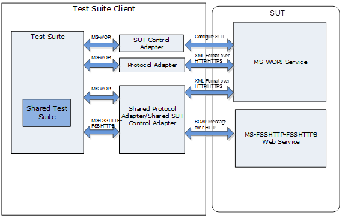

SharePoint File Sync and WOPI Protocol Test Suites Specification
=====================================================================================================================================================================================================================================================================================================================================================================================================================================================================
- [Introduction](#introduction)
- [Requirement specification](#requirement-specification)
- [Design considerations](#design-considerations)
- [Package design](#package-design)

Introduction
=====================================================================================================================================================================================================================================================================================================================================================================================================================================================================

SharePoint File Sync and WOPI Protocol Test Suites are implemented
as synthetic clients running against the server-side implementation of a
given SharePoint protocol. They are designed in a client-to-server
relationship and were originally developed for the in-house testing of
Microsoft Open Specifications.

Microsoft Open Specifications are written using the normative
language defined in [RFC2119](http://go.microsoft.com/fwlink/?LinkId=117453); from which
statements are extracted as protocol requirements to be listed in the requirement specification.
See [Requirement specification](#requirement-specification).
This document describes how SharePoint File Sync and WOPI Protocol
Test Suites are designed to verify that the server behavior is in
compliance with normative protocol requirements in
the technical specification.  

In a single test suite, similar or related requirements are grouped into one
test case. Test cases on the same command or operation are
grouped into one scenario.

The technical specifications in the following table are included
in the SharePoint File Sync and WOPI Protocol Suites package. The
technical specifications version is v20130726.

**SharePoint File Sync and WOPI protocol technical specifications**

Technical specification| Protocol name
:------------ | :-------------
  MS-WOPI     | [Web Application Open Platform Interface Protocol](http://go.microsoft.com/fwlink/?LinkId=389443)
  MS-FSSHTTP  | [File Synchronization via SOAP over HTTP Protocol](http://go.microsoft.com/fwlink/?LinkId=389444)
  MS-FSSHTTPB | [Binary Requests for File Synchronization via SOAP Protocol](http://go.microsoft.com/fwlink/?LinkId=389445)
  MS-FSSHTTPD | [Binary Data Format for File Synchronization via SOAP](http://go.microsoft.com/fwlink/?LinkId=389446)
  MS-ONESTORE | [OneNote Revision Store File Format](https://go.microsoft.com/fwlink/?linkid=2080738)

Requirement specification 
======================================================================================================================================================================================================================================================================

A requirement specification contains a list of requirements that is
extracted from statements in the technical specification. Each technical
specification has one corresponding requirement specification named as
MS-XXXX\_RequirementSpecification.xlsx, which can be found in the
Docs\\MS-XXXX folder in the SharePoint File Sync and WOPI Protocol Test
Suites package with the technical specification.

The requirements are categorized as normative or informative. If the
statement of the requirement is required for interoperability, the
requirement is normative. If the statement of the requirement is for a
high-level introduction or clarification, and removal of the content
does not affect interoperability, the requirement is informative.

Each requirement applies to a specific scope: server, client, or both.
If the requirement describes the behavior of the responder, the
scope of the requirement is the server. If the requirement describes the
behavior of the initiator, the scope of the requirement is
the client. If the requirement describes the behavior of the
initiator and responder, the scope of the requirement is both the client and server.

Test suites cover normative requirements that describe the behavior
of the responder. For a detailed requirement list and
classification, see MS-XXXX\_RequirementSpecification.xlsx.

Design considerations
=====================

Assumptions
-----------

-   The MS-FSSHTTP-FSSHTTPB test suite tests one client and
    one connection.

	This is because there is no specification in the open
	specification. By default, it is assumed that the server behaves the
	same toward multiple clients as toward a single client.

-   Here are the prerequisities of the system under test (SUT) in the
    MS-WOPI test suite:

	-   The SUT can store files of the following three file types in a
		document library:
		-   \*.txt
		-   \*.zip
		-   \*.one

	-   The SUT enables a user to upload files of the above three file types
		into the specified document library.

	-   Make sure the HTTP port 80 can be used by the MS-WOPI test suite.

	-   Make sure there is no SharePoint WOPI binding for the client machine
		in the SUT before running any test cases.

		**Note** In Microsoft SharePoint Foundation 2013 Service Pack
		1 (SP1) and Microsoft SharePoint Server 2013 Service Pack 1 (SP1),
		the **Get-SPWOPIBinding** command can be used to get the binding
		information and the **Remove-SPWOPIBinding** command can be used to
		remove the binding.

Dependencies
------------

All SharePoint File Sync and WOPI Protocol Test Suites depend on
Protocol Test Framework (PTF) to derive managed adapters.

Package design
==============

SharePoint File Sync and WOPI Protocol Test Suites are implemented
as synthetic clients running against the server-side implementation of a
given SharePoint protocol. Test suites verify the server-side and
testable requirements.

Architecture
------------

The following figure illustrates the SharePoint File Sync and WOPI
Protocol Test Suites architecture.

**Figure 1: Architecture**

The following outlines details of the test suites architecture:

**SUT**

The SUT hosts the server-side implementation of the protocol, which test
suites run against.

-   From a third-party user’s point of view, the SUT is of the protocol
    server implementation.

-   The following products have been tested with the test suite on the
    Windows platform:
	-   Microsoft SharePoint Foundation 2010 Service Pack 2 (SP2)
	-   Microsoft SharePoint Foundation 2013 Service Pack 1 (SP1)
	-   Microsoft SharePoint Server 2010 Service Pack 2 (SP2)
	-   Microsoft SharePoint Server 2013 Service Pack 1 (SP1)
    -   Microsoft SharePoint Server 2016
    -   Microsoft SharePoint Server 2019

**Test Suite Client**

Test suites act as clients to communicate with an SUT and validate
the requirements gathered from technical specifications. SharePoint
File Sync and WOPI Protocol Test Suites include one common library, two
adapters and three test suites.

-   Test suites communicate with an SUT via a protocol adapter and
    an SUT control adapter to verify if an SUT is behaving in
    compliance with normative protocol requirements.

-   The shared test suite implements MS-FSSHTTP and is shared with MS-WOPI to
    verify whether or not MS-FSSHTTP can be sent as an HTTP body by using the
    MS-WOPI transport format.
-   MS-ONESTORE can be transmitted using the File Synchronization via SOAP over HTTP Protocol by Shared adapter.
-   All protocol adapters communicate directly with an SUT.

Common library
--------------

The common library provides implementation of common messages
structures and helper methods.

### Helper methods

The common library defines a series of helper methods. The helper
methods can be classified into following categories:

-   Access the properties in the configuration file.
-   Generate resource name.
-   Verify the remote Secure Sockets Layer (SSL) certificate.
-   Used by multiple test suites.

### Message structures

Because the C\# proxy class is used by the MS-FSSHTTP-FSSHTTPB test
suite and the MS-WOPI test suite, it is defined in
the common library.

Adapters
-------

Adapters are interfaces between the test suites and the SUT. There are
two types of adapters: protocol adapter and SUT control adapter. In most
cases, modifications to the protocol adapter will not be required for
non-Microsoft SUT implementation. However, the SUT control adapter
should be appropriately configured to connect to non-Microsoft SUT
implementation. All test suites in the package contain a protocol
adapter and an SUT control adapter.

### Protocol Adapter

The protocol adapter is a managed adapter, which is derived from the
ManagedAdapterBase class in PTF. It provides an interface that is
used by test cases to construct protocol request messages that will
be sent to the SUT. The protocol adapter also acts as an intermediary
between test cases and transport classes to receive messages,
send messages, parse responses from transport classes, and
validate the SUT response according to the normative requirement in
the technical specification.

All protocols in SharePoint File Sync and WOPI Protocol Test Suites
package use the HTTP transport to communicate with the SUT.

### SUT Control Adapter

The SUT control adapter manages all control functions of the test
suites that are not associated with the protocol. For example, the setup
and teardown are managed through the SUT control adapter (that is,
enabling or disabling the asynchronous RPC notification on the SUT). The
SUT control adapter is designed to work with Microsoft
implementation of the SUT. However, it is configurable to allow the test
suites to run against non-Microsoft implementation of the SUT.

All protocols in SharePoint File Sync and WOPI Protocol Test Suites
package have an SUT control adapter.

Test suites
-----------

Test suites verify the server-side and testable requirements
in the requirement specification. Test suites call the protocol
adapter to send and receive messages between a protocol adapter and
an SUT, and call an SUT control adapter to change the SUT state. A
test suite consists of a series of test cases that are categorized into
several scenarios.

### Shared test suite

17 shared test scenarios are designed to cover testable requirements for
MS-FSSHTTP behavior in both MS-WOPI and MS-FSSHTTP-FSSHTTPB test
suites. The following table lists the scenarios in the shared test suite.

 Scenario| Description
:------------ | :-------------
S01\_Cell         |          Verifies the cell sub-request operation.
S02\_Coauth       |          Verifies the co-authoring sub-request operation.
S03\_SchemaLock   |          Verifies the schema lock sub-request operation.
S04\_ExclusiveLock|          Verifies the exclusive lock sub-request operation.
S05\_WhoAmI       |          Verifies the WhoAmI sub-request operation.
S06\_ServerTime   |          Verifies the ServerTime sub-request operation.
S07\_EditorsTable |          Verifies the EditorsTable sub-request operation.
S08\_GetDocMetaInfo |        Verifies the GetDocMetaInfo sub-request operations.
S09\_GetVersions    |        Verifies the GetVersions sub-request operations.
S10\_MultipleSubRequests |   Verifies at least two sub-requests with various dependency types.
S11\_QueryAccess         |   Verifies the QueryAccess sub-request operation.
S12\_QueryChanges        |   Verifies the QueryChanges sub-request operation.
S13\_PutChanges          |   Verifies the PutChanges sub-request operation.
S14\_AllocateExtendedGuidRange  |   Verifies the allocate extended GUID range sub-request operations.
S15\_CreateFile |   Verifies the PutChanges sub-request to create a new file on the server.
S16\_Versioning |   Verifies the GetVersions operation.
S17\_FileOperation | Verifies CellSubRequest operation for fileOperation request.

### MS-FSSHTTP-FSSHTTPB

17 test scenarios are designed to cover testable requirements in the
MS-FSSHTTP-FSSHTTPB test suite. The following table lists the scenarios in the MS-FSSHTTP-FSSHTTPB test suite.

  Scenario| Description
:------------ | :-------------
  MS\_FSSHTTP\_FSSHTTPB\_S01\_Cell        |                Verifies the cell sub-request operation.
  MS\_FSSHTTP\_FSSHTTPB\_S02\_Coauth      |                Verifies the co-authoring sub-request operation.
  MS\_FSSHTTP\_FSSHTTPB\_S03\_SchemaLock  |                Verifies the schema lock sub-request operation.
  MS\_FSSHTTP\_FSSHTTPB\_S04\_ExclusiveLock|               Verifies the exclusive lock sub-request operation.
  MS\_FSSHTTP\_FSSHTTPB\_S05\_WhoAmI       |               Verifies the WhoAmI sub-request operation.
  MS\_FSSHTTP\_FSSHTTPB\_S06\_ServerTime   |               Verifies the ServerTime sub-request operation.
  MS\_FSSHTTP\_FSSHTTPB\_S07\_EditorsTable |               Verifies the EditorsTable sub-request operation.
  MS\_FSSHTTP\_FSSHTTPB\_S08\_GetDocMetaInfo|              Verifies the GetDocMetaInfo sub-request operations.
  MS\_FSSHTTP\_FSSHTTPB\_S09\_GetVersions   |              Verifies the GetVersions sub-request operations.
  MS\_FSSHTTP\_FSSHTTPB\_S10\_MultipleSubRequests |        Verifies at least two sub-requests with various dependency types.
  MS\_FSSHTTP\_FSSHTTPB\_S11\_QueryAccess         |        Verifies the QueryAccess sub-request operation.
  MS\_FSSHTTP\_FSSHTTPB\_S12\_QueryChanges        |        Verifies the QueryChanges sub-request operation.
  MS\_FSSHTTP\_FSSHTTPB\_S13\_PutChanges          |        Verifies the PutChanges sub-request operation.
  MS\_FSSHTTP\_FSSHTTPB\_S14\_AllocateExtendedGuidRange |  Verifies the allocate extended GUID range sub-request operations.
  MS\_FSSHTTP\_FSSHTTPB\_S15\_CreateFile                |  Verifies the PutChanges sub-request to create a new file on the server.
  MS\_FSSHTTP\_FSSHTTPB\_S16\_Versioning                |  Verifies the GetVersions operation.
  MS\_FSSHTTP\_FSSHTTPB\_S17\_FileOperation             |  Verifies CellSubRequest operation for fileOperation request.

### MS-WOPI

In the MS-WOPI test suite, there are a total of twenty two scenarios that are
designed to cover the server-side, testable requirements.

18 scenarios (from MSWOPI\_S01 to MSWOPI\_S16,MSWOPI\_S21 and MSWOPI\_S22) are designed to verify
the MS-FSSHTTP request embedded in the HTTP body depending on whether or not
MS-FSSHTTP is implemented.

4 scenarios (from MSWOPI\_S17 to MSWOPI\_S20) are designed to verify the
operations defined in the MS-WOPI Open Specification.

The following table lists the scenarios in the MS-WOPI test suite.

Scenario| Description
:------------ | :-------------
  MS\_WOPI\_S01\_Cell          |           Verifies the cell sub-request operation.
  MS\_WOPI\_S02\_Coauth        |           Verifies the co-authoring sub-request operation.
  MS\_WOPI\_S03\_SchemaLock    |           Verifies the schema lock sub-request operation.
  MS\_WOPI\_S04\_ExclusiveLock |           Verifies the exclusive lock sub-request operation.
  MS\_WOPI\_S05\_WhoAmI        |           Verifies the WhoAmI sub-request operation.
  MS\_WOPI\_S06\_ServerTime    |           Verifies the ServerTime sub-request operation.
  MS\_WOPI\_S07\_EditorsTable  |           Verifies the EditorsTable sub-request operation.
  MS\_WOPI\_S08\_GetDocMetaInfo|           Verifies the GetDocMetaInfo sub-request operations.
  MS\_WOPI\_S09\_GetVersions   |           Verifies the GetVersions sub-request operations.
  MS\_WOPI\_S10\_MultipleSubRequests |     Verifies at least two sub-requests with various dependency types.
  MS\_WOPI\_S11\_QueryAccess         |     Verifies the QueryAccess sub-request operation.
  MS\_WOPI\_S12\_QueryChanges        |     Verifies the QueryChanges sub-request operation.
  MS\_WOPI\_S13\_PutChanges          |     Verifies the PutChanges sub-request operation.
  MS\_WOPI\_S14\_AllocateExtendedGuidRange |  Verifies the allocate extended GUID range sub-request operations.
  MS\_WOPI\_S15\_CreateFile                |  Verifies the PutChanges sub-request to create a new file on the server.
  MS\_WOPI\_S16\_CellWithRelative          |  Verifies the cell sub-request operation by sending the data with “X-WOPI-RelativeTarget” header, which is specified in section [3.3.5.1.8 of MS-WOPI](https://msdn.microsoft.com/en-us/library/hh642943(v=office.12).aspx).
  MS\_WOPI\_S17\_FileLevelItems |  Verifies the CheckFileInfo, PutRelativeFile, Lock, Unlock, RefreshLock, UnlockAndRelock, ExecuteCellStorageRequest, ExecuteCellStorageRelativeRequest, DeleteFile operations.
  MS\_WOPI\_S18\_FolderLevelItems               |  Verifies the CheckFolderInfo operation.
  MS\_WOPI\_S19\_FileContentLevelItems          |   Verifies the GetFile, PutFile operations.
  MS\_WOPI\_S20\_FolderChildrenLevelItems       |   Verifies the EnumerateChildren operation.
  MS\_WOPI\_S21\_Versioning                     |   Verifies the GetVersions operation.
  MS\_WOPI\_S22\_FileOperation                  |   Verifies CellSubRequest operation for fileOperation request.
### MS-ONESTORE
In the MS-ONESTORE test suite, there are a total of two scenarios that are designed to cover the server-side, testable requirements.

The following table lists the scenarios in the MS-ONESTORE test suite.

Scenario| Description
:------------ | :-------------
  MS\_ONESTORE\_S01\_TransmissionByFSSHTTP        |Verifies the revision store files are transmitted using the File Synchronization via SOAP over HTTP Protocol..
  MS\_ONESTORE\_S02\_OneNoteRevisionStore|Verifies the fileformat of the revision store files.