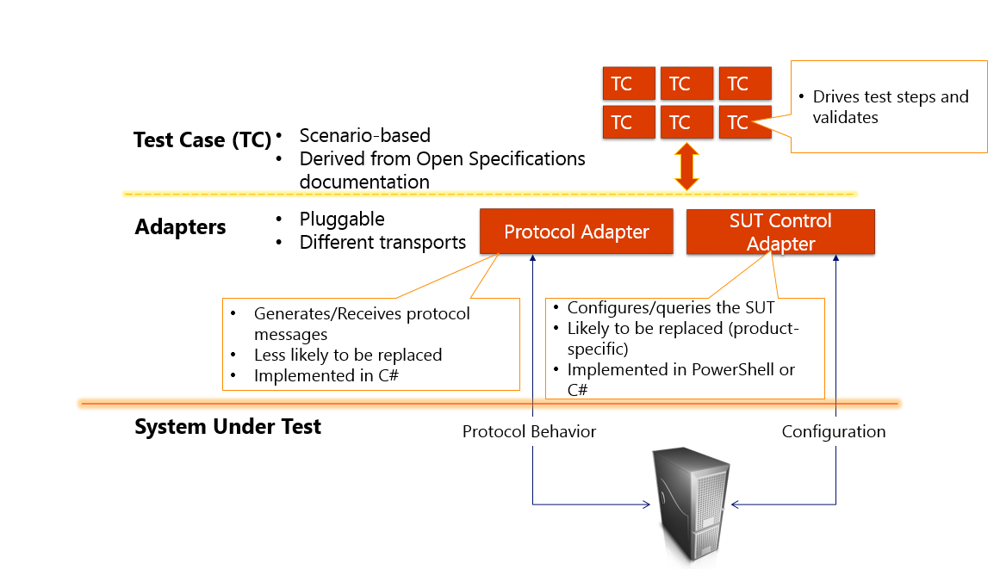
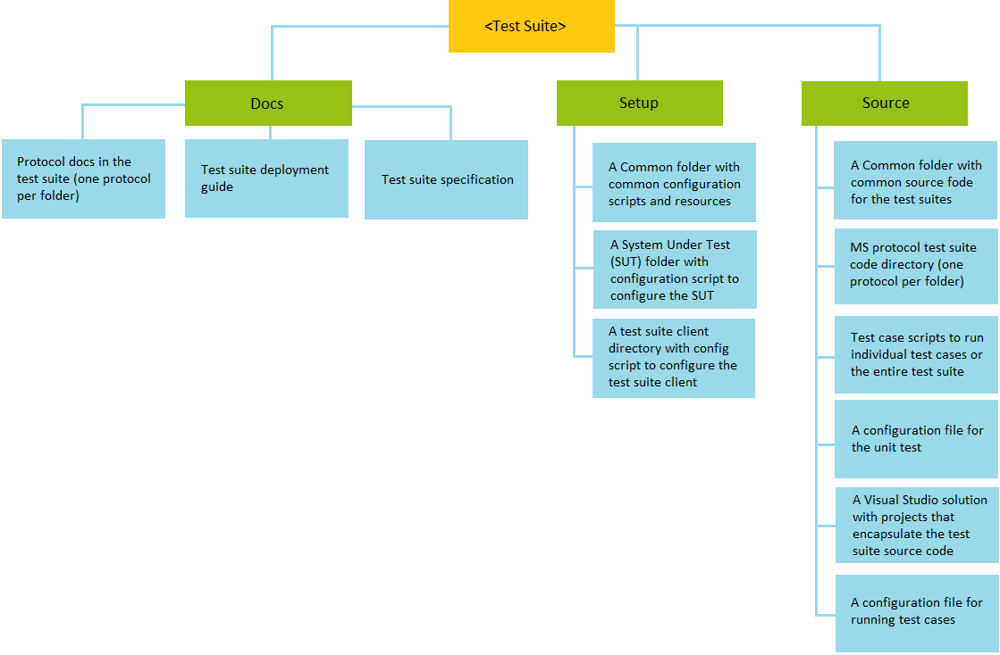
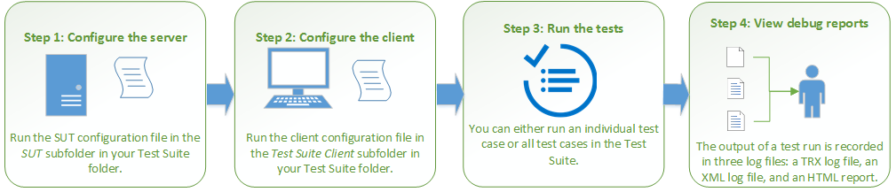


# Interop SharePoint and Exchange Protocol Test Suites

Microsoft Protocol Test Suites are implemented as synthetic clients
running against the server-side implementation of a given protocol. They
are designed in a client-to-server relationship and were originally
developed for the in-house testing of Microsoft Open Specifications.

Test suites evaluate whether or not protocol implementation meets
certain interoperability requirements in Microsoft
Open Specifications. Test suites do not cover every protocol
requirement and do not certify any implementation even if all tests
pass. However, each test suite provides you with a useful indication of
interoperability.

This repository contains SharePoint and Exchange Protocol Test Suites. Inside each test suite folder, you will find configuration files, test cases, and associated supporting files such as scripts, source code, reference guide, deployment guide, and specifications. To get a quick introduction, review this README document which includes the following:

-   [Overview](#overview): An introduction to the test suite design and
    its components.

-   [Get started](#get-started): A generic quick-start guide on how to deploy,
    configure and run test suites, and view test suite reports.

    **Note**: For the detailed guidance on how to deploy a certain
    protocol test suite, see *Deployment Guide* in the *Docs* folder of each test suite.

## Overview

Test Suites are designed to verify that the server behavior is in
compliance with normative protocol requirements in the technical
specifications. Test suites focus on the man-in-the-middle (manipulation
of protocol traffic) and server replacement scenarios.

In a single test suite, similar or related requirements are grouped into
one test case. Test cases on the same command or operation are grouped
into one scenario.

The following diagram illustrates the test suite design and its
components.

**Figure 1: The high-level design of a test suite**

-   **Test case:** A test case is a group of programs and scripts that
    validates how your implementation conform to the
    technical specification. A series of test cases is called
    a scenario.

-   **Adapters:** Adapters are interfaces between the test suites and
    the SUT. There are two types of adapters: the protocol adapter and the
    SUT control adapter.

    a.  **Protocol adapter**: Creates and manages connection between a
        client and a server to generate request protocol messages and
        consume protocol response messages.

    b.  **SUT control adapter**: Queries and configures the SUT at
        runtime when a test case has to control the server outside of
        the protocol. By default, the SUT control adapter can be implemented as one of
        the following:

    -   **managed**: The SUT control adapter is implemented in C\#
            managed code.

	-   **powershell**: The SUT control adapter is implemented
            through Windows PowerShell.

    -   **interactive**: Interactive adapters are used for manually
        configuring a server.
		
			The SUT Control Adapter is primarily designed to
            work with Microsoft implementation of the SUT. If you’re a
            third-party implementer, it is recommended that you further
            configure the test suite by setting the test suite to the
            interactive mode. The SUT Control Adapter can be switched
            between powershell/managed code and interactive adapter by
            changing the MS-XXXX\_TestSuite.ptfconfig file.

-   **System Under Test (SUT):** The SUT is the server side of the test
    suite environment. The SUT can either be Microsoft implementation of
    the protocol or third-party implementation.

## Get started

This section offers a quick introduction to using a test suite. For the
detailed guidance, please go to the test suite folder &gt; *Docs* folder
&gt; *deployment guide*.

### Test suite directories 

A SharePoint or Exchange Protocol test suite folder mainly consists of
the following:

-   ***Docs***: Docs on deployment, test suite specification, and
    requirement specification spreadsheet (a list of normative
    requirements extracted from the technical document for each protocol
    associated with the test suite).

-   ***Setup***: Configuration scripts and resources (both client
    and server-side) for setting up the test suite environment.

-   ***Source*:** Test suite source code and scripts.

**Figure 2: Interop test suite folder structure and its content**

### Test environment for the test suites

The following table summarizes the test environment for the test suites.

**Table 1: Tools and software that are necessary to set up your
environment for Exchange and SharePoint Test Suites**

 
| Machine name | SharePoint test suite environment | Exchange test suite environment 
| :---         | :--- 				 | :---
| SUT          | Microsoft SharePoint Sever 2013/2010/2007  | Microsoft Exchange Server 2016/2013/2010/2007
| Client       | Microsoft Visual Studio 2013 Ultimate  | Microsoft Visual Studio 2013 Ultimate
|              | [Protocol Test Framework](https://github.com/microsoft/protocoltestframework)  | [Protocol Test Framework](https://github.com/microsoft/protocoltestframework)
| Optional     | Microsoft Network Monitor and Parsers or Message Analyzer   | Microsoft Network Monitor and Parsers or Message Analyzer																										
|              |                                                             | [Spec Explorer 2010](https://visualstudiogallery.msdn.microsoft.com/271d0904-f178-4ce9-956b-d9bfa4902745/) 
																																							  
                                                                                                                                                                                                            
### Workflow

The following flowchart illustrates the end-to-end process of
configuring and running test suites, and viewing the results.

**Figure 3: The process of using a test suite**

#### Configure the test suites

The configuration is done in a certain order. The SUT is usually
configured before the test suite client. 

- **Configure the SUT**: Automated script or manual configuration can be used. Varying level of
resources on the SUT may be required for the test suite packages.

- **Configure the test suite client**: The test suite client is managed
through a common configuration file and test suite-specific
configuration files. Modification through direct means or automated
script can be used.

**Note**: The setup configuration scripts are only implemented for
configuring SUT and test suite clients on the Windows platform. See the
sections on manual configuration in *Deployment Guide* if you’re a
third-party implementer.

The following summarizes the configuration steps when using the setup
configuration scripts.

1.  Extract the test suite files: Extract files from the downloaded
    zip package.

2.  Setting up the SUT: Navigate to …\\Setup\\SUT &gt; Right click
    **\[SUTConfiguration.cmd\]** &gt; select **Run as administrator**.

3.  Setting up the test suite client: Navigate to …\\Setup\\Test
    Suite Client &gt; Right click **\[ClientConfiguration.cmd\]** &gt;
    select **Run as administrator**.

#### Run the test suites

Once the required software is installed and both the SUT and the test
suite client are configured appropriately. There are several ways to run
your test suites:

-   Using Visual Studio

    -   Open your Visual Studio test suite solution and rebuild
        the solution.

    -   Open the Test Explorer.

    -   Select test cases, right click and select the option to **Run**
        or **Debug**.

-   Using batch files

    -   Run an individual test case or all test cases.

#### View the test results

The test suites provide detailed reporting in a variety of formats that
allows you to quickly debug failures.

- Test suite configuration logs: The SUT and test suite client
configuration logs are available to inform you whether or not each
configuration step has succeeded and the detailed error information if
the configuration step fails. For the location of where the logs are
saved, please refer to the deployment guide.

- Test suite reports: Reports and logs are generated after a test
suite has run successfully, which include a .trx file containing the
pass/fail information of the run in the TestResults folder along with an
associated directory named user\_MACHINENAME DateTimeStamp that
contains a log file and an HTML report.
