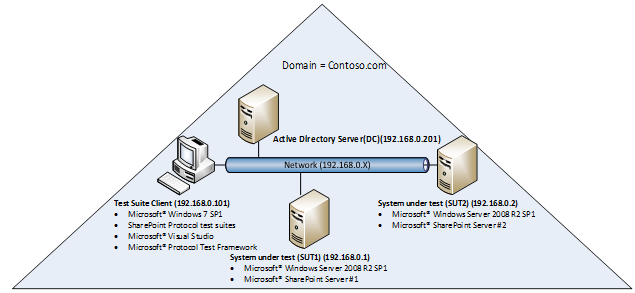
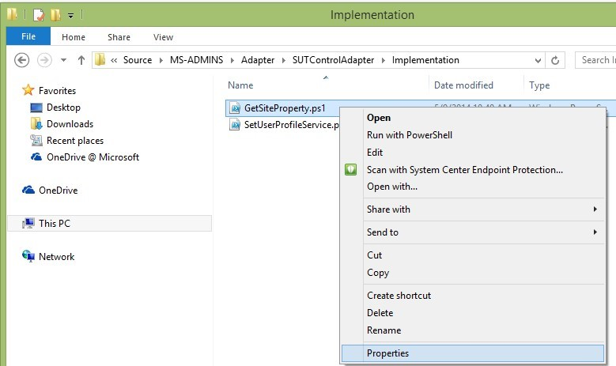
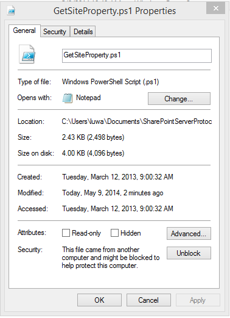
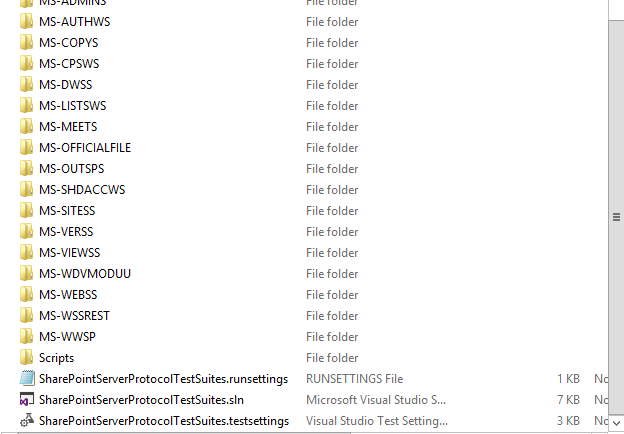
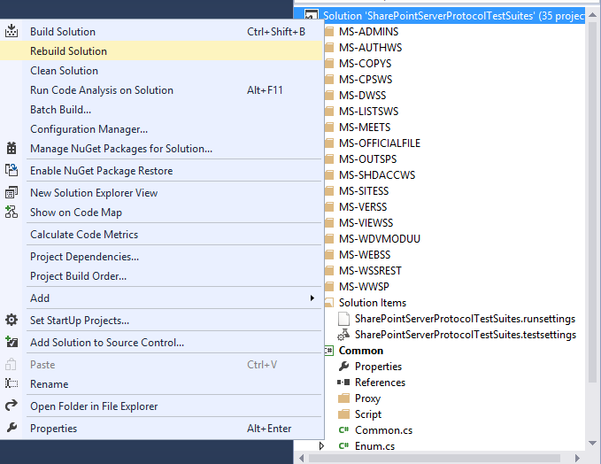
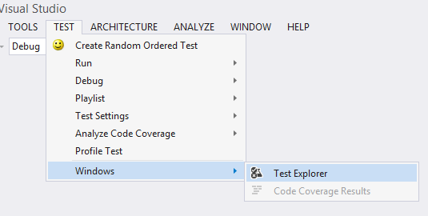
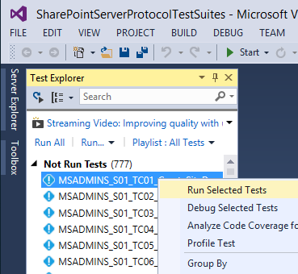
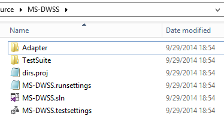
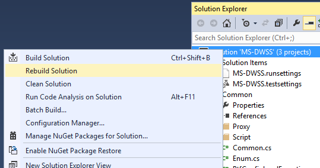

SharePoint Test Suite deployment guide
=====================================================================================================================================================
- [Overview](#overview)
- [Prerequisites](#prerequisites)
- [Deploying test suites](#deploying-test-suites)
- [Using test suite directories](#using-test-suite-directories)
- [Configuring test suites](#configuring-test-suites)
- [Running test suites](#running-test-suites)
- [Viewing test suite results, logs, and reports](#viewing-test-suite-results-logs-and-reports)
- [Appendix](#appendix)

Overview
=====================================================================================================================================================

SharePoint Server Protocol Test Suites are implemented as synthetic
clients running against the server-side implementation of a given
SharePoint protocol. They are designed in a client-to-server
relationship and were originally developed for the in-house testing of
Microsoft Open Specifications. Test Suites have been used
extensively in Plugfests and Interoperability Labs to test partner
implementation.

The SharePoint Test Suite deployment guide introduces the hardware and
software requirements of the test suite client, and the requirements of
the system under test (SUT) if the test suites run against SharePoint
Server. The guide also introduces topics on how to deploy, configure and run the
test suites, and view the test suite reports.

Prerequisites
================================================================================================================================================================================================================================================================================================================================================================================================================

This section describes the hardware and software environment for the
test suites. In a SharePoint server environment, the test suite
installation takes place on both the client and server side. The
following information will help test suite users to plan their
deployment.

Hardware requirements
------------------------------------------------------------------------------------------------------------------------------

### System under test

The SUT is the server side of the test suite environment. SharePoint
server(s) and Active Directory have defined system requirements which
should be taken into account during deployment. The SharePoint Server
Protocol test suites do not have any additional SUT resource
requirements.

### Test suite client

The test suite client is the client side of the test suite environment.
The following table shows the minimum resource requirements for the test
suite client.

**Test suite client resource requirements**

Component  | Test suite client minimum requirement
:------------ | :-------------
**RAM**       |   2GB
**Hard Disk** |  3GB of free space
**Processor** |  >= 1GHz

Software requirements
------------------------------------------------------------------------------------------------------------------------------

###   System under test 

This section is only relevant when running the test suites against the
following versions of SharePoint Server. Some test suites (MS-COPYS)
support two SUTs depending on the protocol requirements:

-   Windows SharePoint Services 3.0 Service Pack 3 (SP3)
-   Microsoft SharePoint Foundation 2010 Service Pack 2 (SP2)
-   Microsoft SharePoint Foundation 2013 Service Pack (SP1)
-   Microsoft Office SharePoint Server 2007 Service Pack 3 (SP3)
-   Microsoft SharePoint Server 2010 Service Pack 2 (SP2)
-   Microsoft SharePoint Server 2013 Service Pack (SP1)
-	Microsoft SharePoint Server 2016

For the MS-WDVMODUU test suite, you have to install a virus scanner software in order to test the
X-Virus-Infected header. You will also require a virus file to perform a
security check behavior for the protocol that can be detected by the
virus scanner. When you download, install, or run the test suite, your
security software may intercept your action or even remove the file
directly. If the file is removed or quarantined by the security
software, some test cases of the test suite may fail. To ensure that the
test suites run successfully, suspend the security software
in your environment. Microsoft guarantees the content of the package is
clean and virus-free.

1.  Install Microsoft Forefront Protection 2010 for SharePoint in the
    following versions of SharePoint:

	-   Windows SharePoint Services 3.0 Service Pack 3 (SP3),
	-   Microsoft SharePoint Foundation 2010 Service Pack 2 (SP2)
	-   Microsoft Office SharePoint Server 2007 Service Pack 3 (SP3)
	-   Microsoft SharePoint Server 2010 Service Pack 2 (SP2)

1.  Install any anti-virus software on the following versions of
    SharePoint:

	-   Microsoft SharePoint Foundation 2013 Service Pack (SP1)
	-   Microsoft SharePoint Server 2013 Service Pack (SP1)
    -	Microsoft SharePoint Server 2016
**Note**   The anti-virus software should implement [Virus Scan Engine
API](http://go.microsoft.com/fwlink/?LinkId=518352). A number of ISVs
ship AV scanners (Symantec, Norton, etc.) integrate with
SharePoint in the same way as Microsoft Forefront Protection 2010 for SharePoint.

The following table describes the required server roles for a
test suite deployment with Microsoft implementation.

**Required SUT roles**

Role | Description
:------------ | :-------------
**Active Directory Domain Controller (AD DC)** |  Active Directory Domain Controller provides secure data for users and computers. An AD DC can coexist with SharePoint Server. A typical test configuration has an AD DC and SharePoint Server installed on separate machines.
**SharePoint Server \#1 (SUT1 must be a SharePoint application server if server installation type is Complete (farm mode))**| The first SharePoint Server in the topology.
**SharePoint Server \#2 (SUT2)**| Only the MS-COPYS test suite requires the second SharePoint Server in the topology.

The following diagram is an example of what a typical SharePoint test
suite environment may look like. This example uses an IPv4, but IPv6 is
also supported in a test suite environment.

###  Test suite client

This section describes the prerequisite software for installing
SharePoint Server Protocol Test Suites on the test suite client. The
following table outlines the software dependencies for the test suite
client.

**Test suite client software dependencies**

|Operating systems |
|:------------ |
|Windows 7 x64 Service Pack 1 and above|
|Windows 8 x64 and above|
|Windows 2008 R2 x64 Service Pack 1 and above|

| Software |
|:------------ |
|Microsoft Visual Studio 2013 Professional|
|Microsoft Protocol Test Framework 1.0.2220.0 and above|

Deploying test suites
================================================================================================================================================================================================================================================================================================================================================================================================================

This section describes the deployment of SharePoint Server Protocol
Test Suites on the test suite client and the SUT. SharePoint Server
Protocol Test Suites are packed in a .zip file, available at
[Microsoft Connect](http://go.microsoft.com/fwlink/?LinkId=516921).
Once you've downloaded the test suites, you need to perform the following
steps to successfully configure the test suites.

1.  Extract the **SharePoint Server Protocol Test Suites** folder from the zip file to a
    directory of your choice on the test suite client.

2.  Copy the **SUT** and **Common** folders under **…\\SharePoint Server
    Protocol Test Suites\\Setup\\** to a directory of your choice on
    the SUT. The SUT configuration scripts are the only requirement for
    the SUT. The scripts facilitate the SUT configuration process and
    are in the **SharePointServerProtocolTestSuites.zip** file.

	**Note**   If your computer blocks scripts that are downloaded from the Internet
	for security reasons, follow these steps to unblock
	PowerShell scripts.

----------------------------------------------------------------------------------------------------------------------------------------
1.  Right-click xxx.ps1 and select **Properties**.   

                                                
---------------------------------------------------- -----------------------------------------------------------------------------------

2.  Click **Unblock** and click **OK**.             

                                           
----------------------------------------------------------------------------------------------------------------------------------------

Using test suite directories
========================================================================================================================================================================================================

This section shows the folder structures in the **SharePointServerProtocolTestSuites.zip** file.

**SharePointServerProtocolTestSuites.zip file contents**

Folders/file | Description
:------------ | :-------------
**EULA.rtf**      | End-User License Agreement.
**ReadMe.txt**    | A doc on deployment and prerequisite software.
**SharePoint Server Protocol Test Suites**    |  --               
**- Docs**                                    | A folder with documents of all protocol test suites.
**- SharePointTestSuiteDeploymentGuide.docx** | A doc on the protocol test suite deployment.
**- MS-XXXX**                                 | The MS-XXXX help documentation.
**- \[MS-XXXX\].pdf**                         | The protocol technical specification.
**- MS-XXXX\_TestSuiteSpecification.docx**    | A doc on the test suite-specific configuration details, architecture, and test case details.
**- MS-XXXX\_SUTControlAdapter.chm**          | A help doc on the SUT control adapter class library such as declaration syntax and their description.
**- MS-XXXX\_RequirementSpecification.xlsx**  | A spreadsheet that outlines all requirements that are associated with the technical specification.
**- Setup**                                   | A folder with configuration scripts.
**- Test Suite Client**                       | A folder with the configuration script to configure the test suite client.
**- SharePointClientConfiguration.cmd**       | A command file that runs SharePointClientConfiguration.ps1 to configure the properties for the protocol test suites.
**- SharePointClientConfiguration.ps1**     | A configuration script that will be invoked by SharePointClientConfiguration.cmd
**- SUT**                                   | A folder with the configuration script to configure the SUT.
**- SharePointSUTConfiguration.cmd**        | A command file that runs the SharePointSUTConfiguration.ps1 to create resources and configure settings on the first SUT.
**- SharePointSUTConfiguration.ps1**        | A configuration script that will be invoked by SharePointSUTConfiguration.cmd.
**-SharePointSecondSUTConfiguration.cmd**   | A command file that runs the SharePointSecondSUTConfiguration.ps1 to create resources and configure settings on the second SUT.
**- SharePointSecondSUTConfiguration.ps1**  | A configuration script that will be invoked by SharePointSecondSUTConfiguration.cmd.
**- MSCOPYS\_SourceFile.txt**               |  A source file, to be copied from a source location to a destination location.
**- MSDWSS\_TestData.txt**                  |  A test file used by the MS-DWSS test suite.
**- MSSHDACCWS\_CoStatusTestData.txt**      |  A test file that will be uploaded to MSSHDACCWS\_DocumentLibrary. This file allows multi-user editing.
**- MSSHDACCWS\_LockedTestData.txt**        |  A test file that will be uploaded to the MSSHDACCWS\_DocumentLibrary. An exclusive lock is applied to this file.
**- MSSHDACCWS\_TestData.txt**              |  A test file that will be uploaded to MSSHDACCWS\_DocumentLibrary without any locks or Co-Authoring status.
**- MSSITESS\_CustomPage.aspx**             |  A custom page used by the MS-SITESS test suite.
**- MSWDVMODUU\_TestData1.txt**             |  The first text test file used by the MS-WDVMODUU test suite.
**- MSWDVMODUU\_TestData2.txt**             |  The second text test file used by the MS-WDVMODUU test suite.
**- MSWDVMODUU\_TestData3.txt**             |  The third text test file used by the MS-WDVMODUU test suite.
**- MSWEBSS\_TestData.docx**                |  A test file used by the MS-WEBSS test suite.
**- Common**                                |  A folder with common configuration scripts and resources.
**-CommonConfiguration.ps1**                |  A library of common functions for configuring Microsoft products and the test suite client.
**-SharePointCommonConfiguration.ps1**      |  A library of common functions for configuring the SUT.
**-SharePointTestSuite.config**             |  The configuration file to store all configuration resources.
**- Source**                                |  A folder with Microsoft Visual Studio solution that contains the source code for the test suites.
**- Common**                                |  A folder with Visual Studio projects that contains the common source code for the test suites.
**- SharePointCommonConfiguration. deployment.ptfconfig** | The common configuration file.
**-SharePointServerProtocolTestSuites.sln**               |    A Visual Studio solution with projects that encapsulate the protocol test suites source code.
**- MS-XXXX**                                             |    A folder with the MS-XXXX test suite source code.
**+ Adapter**                                             |    The Adapter test suite code.
**+ TestSuite**                                           |    The test suite code.
**- MS-XXXX.sln**                                         |    A Visual Studio solution that contains projects of the MS-XXXX test suite.
**-Scripts**                                              |    SharePoint Server Protocol Test Suites can be run using Visual Studio or batch scripts. The Scripts folder contains a collection of command files that allows users to run specific test cases in the test suite or the entire test suite.
**- RunAllSharePointTestCases.cmd**                       |    A script that can be used to run all test cases in the whole package.
**-MS-XXXX**                                              |    A folder with scripts that belong to the MS-XXXX test suite.
**- RunAllMSXXXXTestCases.cmd**                           |    A script that can be used to run all test cases of MS-XXXX.
**- RunMSXXXX\_SYY\_TCZZ\_TestCaseName.cmd**              |    A script that can be used to run a single test case of MS-XXXX.

Configuring test suites
================================================================================================================================================================================================================================================================================================================================================================================================================

This section provides the guidance on configuring SharePoint
Server Protocol Test Suites on the SUT and the test suite client. The
configuration should be done in this order: configure the SUT1,
configure the SUT2 (optional), and then configure the test suite client.

For configuration script, the exit code definition is as follows:

1.  A normal termination will set the exit code to 0.

2.  An uncaught THROW will set the exit code to 1.

3.  Script execution warning and issues will set the exit code to 2.

4.  Exit code is set to the actual error code for other issues.

Configuring the SUT
----------------------------------------------------------------------------------------------------------------------------------------------------------------

You can configure the SUT using automated scripts, as described in [Configuring SUT1 using the setup configuration script](#configuring-sut1-using-the-setup-configuration-script) and [Configuring SUT2 using the setup configuration script](#configuring-sut2-using-the-setup-configuration-script); or
configure the SUT manually, as described in
[Configuring SUT1 manually](#configuring-sut1-manually) and
[Configuring SUT2 manually](#configuring-sut2-manually).

**Note**   The scripts should be run by a user who has domain
administrator rights on the SUT.

### SUT resource requirements 

Each test suite in the SharePoint Server Protocol Test
Suites package may require varying level of resources on the SUT. The
following table outlines these resources for each test suite. The SUT
configuration scripts will automatically create all the required
resources for the Microsoft server implementation. To configure the SUT
manually, refer to [Configuring SUT1 manually](#configuring-sut1-manually) and
[Configuring SUT2 manually](#configuring-sut2-manually).

The client configuration script follows the naming convention shown in
the following table. If a change to the resource name is required, then
the corresponding change to the resource name defined in the
SharePointTestSuite.config is required.

**SharePoint server resources**

| Test suite |  Resource type |  Resource name|
|:------------ | :------------- | :-------------|
|**All**       |      --        |                --|
|**MS-LISTSWS**|      Site collection     |      MSLISTSWS\_SiteCollection|
|              |      Document library    |     MSLISTSWS\_DocumentLibrary|
|**MS-VERSS**  |      Site collection     |     MSVERSS\_SiteCollection|
|**MS-SITESS** |      Site collection     |     MSSITESS\_SiteCollection|
|              |      Site                |     MSSITESS\_Site|
|               |      Site                |     MSSITESS\_NormalSubSite|
|              |      Site                |     MSSITESS\_SpecialSubSite|
|               |      Document library    |     MSSITESS\_DocumentLibrary|
|              |      Document library    |     MSSITESS\_SubSite\_DocumentLibrary|
|              |      Text document       |     MSSITESS\_TestData.txt|
|              |      ASPX file           |     MSSITESS\_CustomPage.aspx|
|**MS-DWSS**   |      Site collection     |     MSDWSS\_SiteCollection|
|              |      Site collection     |     MSDWSS\_SiteCollection\_DocumentWorkspace|
|              |      Site                |     MSDWSS\_Site|
|              |      Site                |     MSDWSS\_InheritPermissionSite|
|              |      Document library    |     MSDWSS\_DocumentLibrary|
|              |      Folder              |     MSDWSS\_TestFolder|
|              |      Text document       |     MSDWSS\_TestData.txt|
|              |      User                |     MSDWSS\_NoneRole|
|              |      User                |     MSDWSS\_ReaderRole|
|              |      User                |     MSDWSS\_GroupOwner|
|              |      Group               |     MSDWSS\_CustomGroup|
|**MS-MEETS**  |      Site collection     |     MSMEETS\_SiteCollection|
|              |      User                |     MSMEETS\_User|
|**MSWEBSS**   |      Site collection     |     MSWEBSS\_SiteCollection|
|              |      Document library    |     MSWEBSS\_DocumentLibrary|
|              |      Word document       |     MSWEBSS\_TestData.docx|
|              |      Site                |     MSWEBSS\_Site|
|**MS-WDVMODUU** |      Site collection   |     MSWDVMODUU\_SiteCollection|
|              |      Document library    |     MSWDVMODUU\_DocumentLibrary1|
|              |      Document library    |     MSWDVMODUU\_DocumentLibrary2|
|              |      Text document       |     MSWDVMODUU\_TestData1.txt|
|              |      Text document       |     MSWDVMODUU\_TestData2.txt|
|              |      Text document       |     MSWDVMODUU\_TestData3.txt|
|              |      Fake virus file     |     FakeVirusInfectedFile\_Get.txt|
|**MS-WWSP**   |      Site collection     |     MSWWSP\_SiteCollection|
|              |      Work Flow           |     MSWWSP\_Workflow|
|              |      Work Flow Task List |     Tasks|
|              |      Work flow History List |  MSWWSP\_WorkflowHistoryList|
|              |      Document library       |  MSWWSP\_DocumentLibrary|
|              |       Group                 |  MSWWSP\_UserGroup|
|              |      User                   |  MSWWSP\_User|
|**MS-OUTSPS** |      Site collection        |  MSOUTSPS\_SiteCollection|
|**MS-AUTHWS** |      Web Application        |  MSAUTHWS\_FormsWebAPP|
|              |      Web Application        |  MSAUTHWS\_NoneWebAPP|
|              |      Web Application        |  MSAUTHWS\_PassportWebAPP|
|              |      Web Application        |  MSAUTHWS\_WindowsAPP|
|**MS-SHDACCWS** |      Site collection      |  MSSHDACCWS\_SiteCollection|
|              |      Document library       |  MSSHDACCWS\_DocumentLibrary|
|              |      Text document          |  MSSHDACCWS\_LockedTestData.txt|
|              |      Text document          |  MSSHDACCWS\_CoStatusTestData.txt|
|              |      Text document          |  MSSHDACCWS\_TestData.txt|
|**MS-CPSWS**  |      User                   |  MSCPSWS\_User|
|**MS-WSSREST**|      Site collection        |  MSWSSREST\_SiteCollection|
|              |      Document library       |  MSWSSREST\_DocumentLibrary|
|              |      Calendar               |  MSWSSREST\_Calendar|
|              |      DiscussionBoard        |  MSWSSREST\_DiscussionBoard|
|              |      GenericList            |  MSWSSREST\_GenericList|
|              |      Survey                 |  MSWSSREST\_Survey|
|              |      WorkflowHistoryList    |  MSWSSREST\_WorkflowHistoryList|
|              |      Tasks                  |  MSWSSREST\_Tasks|
|              |      Work Flow              |  MSWSSREST\_Workflow|
|              |      ChoiceField            |  MSWSSREST\_ChoiceField|
|              |      MultiChoiceField       |  MSWSSREST\_MultiChoiceField|
|              |      ChoiceFieldValue       |  MSWSSREST\_SingleChoiceOption1, MSWSSREST\_SingleChoiceOption2|
|              |      MultiChoiceFieldValue  |  MSWSSREST\_MultiChoiceOption1, MSWSSREST\_MultiChoiceOption2|
|              |      LookupField            |  MSWSSREST\_LookupField|
|**MS-OFFICIALFILE** |  Site collection      |  MSOFFICIALFILE\_SiteCollection|
|                  |  Site                   |  MSOFFICIALFILE\_RoutingRepository|
|                  |  Site                   |  MSOFFICIALFILE\_NoRoutingRepository|
|                  |  Site                   |  MSOFFICIALFILE\_EnabledParsingRepository|
|                  |  Document library       |  Drop Off Library|
|                  |  Document library       |  MSOFFICIALFILE\_DocumentRuleLocationLibrary|
|                  |  Document library       |  MSOFFICIALFILE\_NoEnforceLibrary|
|                  |  Document library       |  MSOFFICIALFILE\_DocumentSetLocationLibrary|
|                  |  DocumentSet            |  MSOFFICIALFILE\_DocumentSetName|
|                  |  User                   |  MSOFFICIALFILE\_User|
|**MS-COPYS**      |  Site collection        |  MSCOPYS\_SiteCollection|
|                  |  Site                   |  MSCOPYS\_SubSiteMeetingWorkspace|
|                  |  User                   |  MSCOPYS\_EditUser|
|                  |  User                   |  MSCOPYS\_limitUser|
|                  |  Text document          |  MSCOPYS\_SourceFile.txt|
|                  |  Document library       |  MSCOPYS\_SubSiteDocumentLibrary|
|                  |  Document library       |  MSCOPYS\_SourceDocumentLibrary|
|                  |  Document library       |  MSCOPYS\_DestinationDocumentLibrary|
|                  |  Column                 |  MSCOPYS\_TestReadOnlyField|
|                  |  Column                 |  MSCOPYS\_WorkFlowEventField|
|                  |  Column field value     |  MSCOPYS\_Source|
|                  |  Column field value     |  MSCOPYS\_Destination|
|**MS-VIEWSS**     |  Site collection        |  MSVIEWSS\_SiteCollection|
|                  |  GenericList            |  MSVIEWSS\_ViewList|
|                  |  ListItem               |  MSVIEWSS\_ListItem1|
|                  |  ListItem               |  MSVIEWSS\_ListItem2|
|                  |  ListItem               |  MSVIEWSS\_ListItem3|
|                  |  ListItem               |  MSVIEWSS\_ListItem4|
|                  |  ListItem               |  MSVIEWSS\_ListItem5|
|                  |  ListItem               |  MSVIEWSS\_ListItem6|
|                  |  ListItem               |  MSVIEWSS\_ListItem7|
|                  |  ListItem               |  MSVIEWSS\_ListItem7|

### Configuring SUT1 using the setup configuration script

The setup configuration script is only used for configuring the SUT on the Windows platform.

To configure SUT1 using the setup configuration script, navigate to the
**SUT** folder, right-click **SharePointSUTConfiguration.cmd** and
select **Run as administrator**.

### Configuring SUT1 manually 

If the SUT is non-Microsoft implementation of SharePoint Server, you
will not be able to run the setup configuration script. The following
steps explain what needs to be created or configured on the SUT
to run the test suites.

1.  In Windows Powershell, set the execution policy to **RemoteSigned**,
    enable remoting, and increase the memory allocated per shell for
    remote shell management to **1024MB** or more if you plan to run the
    SUT control adapter in PowerShell mode.

2.  Configure the SUT to support HTTPS.

3.  Set the Alternate Access Mapping (AAM) value to HTTPS on the SUT.

4.  Add the username for the user (who will configure the SUT) in the
    user policy. Please note that if the user policy of the Web
    application has a username with a claim prefix (such as i:0\#.w|),
    you will need to add the username without the claim in the
    user policy.

5.  If the WebDAV Publishing role service is installed on the SUT,
    remove it.

**Note**   

-   The steps in the subsequent sections
    should be performed by the SUT administrator.

-   All site templates mentioned in the subsequent sections apply to
    Microsoft implementation only.

-   Any site collection created on the SharePoint site should follow the *Team
    Site* template.

#### MS-SITESS

1.  Create a site collection named **MSSITESS\_SiteCollection**.

2.  Verify if the Workflows feature is activated.

3.  Create a subsite named **MSSITESS\_Site** in
    **MSSITESS\_SiteCollection** using the *Document Workspace*
    site template.

4.  Create two subsites named **MSSITESS\_NormalSubSite** and **MSSITESS\_SpecialSubSite** in MSSITESS\_Site
    using the *Team Site* template.

5.  Create a document library named **MSSITESS\_DocumentLibrary**
    in MSSITESS\_SiteCollection.

6.  Create a document library named **MSSITESS\_SubSite\_DocumentLibrary**
    in MSSITESS\_SpecialSubSite.

7.  Upload a file **MSSITESS\_TestData.txt** with the file size 24MB to
    MSSITESS\_SubSite\_DocumentLibrary in MSSITESS\_SpecialSubSite.

8.  Upload a custom page named **MSSITESS\_CustomPage.aspx** to
    MSSITESS\_SubSite\_DocumentLibrary in MSSITESS\_SpecialSubSite.

9.  Update the **Web.config** file to enable the custom pages on the server.

#### MS-DWSS

1.  Create the following new users as specified in [SUT resource requirements](#sut-resource-requirements)
    and set their password to never expire on the domain controller.

    **MSDWSS\_NoneRole**, **MSDWSS\_ReaderRole**, and
    **MSDWSS\_GroupOwner**.

2.  Create a site collection named **MSDWSS\_SiteCollection**.

3.  Add an email address for the administrator on MSDWSS\_SiteCollection.

4.  Create a site collection named **MSDWSS\_SiteCollection\_DocumentWorkspace**
    using the *Document Workspace* template.

5.  Create a subsite named **MSDWSS\_Site** and
    **MSDWSS\_InheritPermissionSite** in MSDWSS\_SiteCollection using
    the *Document Workspace* template.

6.  In MSDWSS\_Site, break inheritance to the top-level site.

7.  Create a document library named **MSDWSS\_DocumentLibrary**
    in MSDWSS\_Site.

8.  Create a folder named **MSDWSS\_TestFolder** on
    MSDWSS\_DocumentLibrary, and then upload an arbitrary text file
    named MSDWSS\_TestData.txt into this folder.

9.  Grant read permissions to MSDWSS\_ReaderRole on MSDWSS\_Site.

10. Create a group named **MSDWSS\_CustomGroup**, and add
    MSDWSS\_GroupOwner as the group owner on MSDWSS\_Site.

11. Grant full control permissions to MSDWSS\_CustomGroup
    on MSDWSS\_Site.

#### MS-VERSS

1.  Create a site collection named **MSVERSS\_SiteCollection**.

#### MS-LISTSWS

1.  Create a site collection named **MSLISTSWS\_SiteCollection**.

2.  Create a document library named **MSLISTSWS\_DocumentLibrary**
    in MSLISTSWS\_SiteCollection.

#### MS-WWSP

The MS-WWSP test suite supports only the following versions of SharePoint:

-   Microsoft Office SharePoint Server 2007
-   Microsoft SharePoint Server 2010
-   Microsoft SharePoint Server 2013
-	Microsoft SharePoint Server 2016

1.  Create a group with the name **MSWWSP\_UserGroup** on the
    domain controller.

2.  Add a default administrator to **MSWWSP\_UserGroup**.

3.  Create a user named **MSWWSP\_User** and set the password to never
    expires on the domain controller.

4.  Add **MSWWSP\_User** to the MSWWSP\_UserGroup.

5.  Create a site collection named **MSWWSP\_SiteCollection**.

6.  Grant full control permissions to **MSWWSP\_User**
    on MSWWSP\_SiteCollection.

7.  Create the document library **MSWWSP\_DocumentLibrary**
    in MSWWSP\_SiteCollection.

8.  Activate the **Workflows** feature on the site features page.

	**Note** This step applies only to Microsoft SharePoint Server 2010, Microsoft SharePoint Server 2013 and Microsoft SharePoint Server 2016 only.

1.  Create a workflow association named **MSWWSP\_Workflow**
    in MSWWSP\_DocumentLibrary.

2.  Create a workflow task list named **Tasks**
    in MSWWSP\_SiteCollection.

3.  Create a workflow history list named **MSWWSP\_WorkflowHistoryList**
    in MSWWSP\_SiteCollection.

	**Note** The workflow association template name and task name will be used in the MS-XXX\_TestSuite.deployment.ptfconfig file in the test suite.

	The workflow association template name must be **Approval** for Microsoft SharePoint Server 2007, and **Approval - SharePoint 2010** for Microsoft SharePoint Server 2010, Microsoft SharePoint Server 2013 and Microsoft SharePoint Server 2016.

#### MS-MEETS

1.  Create a new user named **MSMEETS\_User** and set the password to
    never expire on the domain controller.

2.  Create a site collection named **MSMEETS\_SiteCollection**.

3.  Make sure the Meeting Workspace template is enabled.

	**Note**

	-   All Meeting Workspace site templates are hidden from the user
		interface, but a server administrator can remove the hidden flag by
		editing the WEBTEMP.XML file.

	-   In Microsoft SharePoint Server 2013 in the Windows platform, the
		following templates are hidden:

	Basic Meeting Workspace, Blank Meeting Workspace, Decision Meeting Workspace, Social Meeting Workspace, and Multipage Meeting Workspace.

1.  Restart Internet Information
    Services (IIS).

#### MS-WEBSS

1.  Create a site collection named **MSWEBSS\_SiteCollection**.

2.  Create a subsite named **MSWEBSS\_Site** in MSWEBSS\_SiteCollection
    using the *Team Site* template. The value of the description field
    of the subsite is *MSWEBSS\_SiteDescription*. The language pack is
    installed on the server originally, for example: the LCID for
    English - United States is 1033.

3.  Create a document library **MSWEBSS\_DocumentLibrary** in the
    MSWEBSS\_Site site.

4.  Upload one arbitrary .docx file named MSWEBSS\_TestData.docx
    into MSWEBSS\_DocumentLibrary.

#### MS-ADMINS

1.  In IIS, configure the SharePoint site to support HTTPS.

2.  In IIS, set Alternate Access Mapping for HTTPS for the SharePoint
    Central Administration site.

3.  Activate the features DocumentManagement and DocumentSet on
    Microsoft SharePoint Server 2013.

4.  Add a firewall rule to allow HTTPS port of the SharePoint Central Administration
    site to receive TCP data.

#### MS-OUTSPS

1.  Create a site collection named **MSOUTSPS\_SiteCollection**.

#### MS-WDVMODUU

1.  Create a site collection named **MSWDVMODUU\_SiteCollection**.

2.  Create a document library **MSWDVMODUU\_DocumentLibrary1**
    in MSWDVMODUU\_SiteCollection.

3.  Create the document library **MSWDVMODUU\_DocumentLibrary2**
    in MSWDVMODUU\_SiteCollection. Upload two arbitrary text files named
    MSWDVMODUU \_TestData1.txt and MSWDVMODUU \_TestData2.txt
    into MSWDVMODUU\_DocumentLibrary1.

4.  Create a folder named **MSWDVMODUU \_TestFolder** on
    MSWDVMODUU\_DocumentLibrary1, and upload an arbitrary text file
    named MSWDVMODUU \_TestData3.txt into this folder.

5.  Upload a fake virus file mentioned in [System under test](#system-under-test)
    into MSWDVMODUU\_DocumentLibrary2.

#### MS-AUTHWS

1.  Create three web Applications named
    **MSAUTHWS\_FormsWebAPP**, **MSAUTHWS\_NoneWebAPP**, and
    **MSAUTHWS\_PassportWebAPP** with authentication mode set to Forms,
    None, and Passport respectively.

	**Note** If you are using Microsoft SharePoint Foundation 2013 or
	Microsoft SharePoint Server 2013 or Microsoft SharePoint Server 2016, you will need to create a fourth web
	application named MSAUTHWS\_WindowsAPP with authentication mode set to
	Windows.

1.  Configure MSAUTHWS\_FormsWebAPP,
    MSAUTHWS\_NoneWebAPP and MSAUTHWS\_PassportWebAPP,
    MSAUTHWS\_WindowsAPP to support HTTPS.

2.  MSAUTHWS\_FormsWebAPP to support forms-based authentication.

3.  Restart IIS.

4.  Add a firewall rule to allow HTTP and HTTPS ports of
    MSAUTHWS\_FormsWebAPP, MSAUTHWS\_NoneWebAPP, and
    MSAUTHWS\_WindowsAPP to receive TCP data.

#### MS-SHDACCWS

The MS-SHDACCWS test suite supports only the following
versions of SharePoint:

-   Microsoft SharePoint Foundation 2010
-   Microsoft SharePoint Server 2010
-   Microsoft SharePoint Foundation 2013
-   Microsoft SharePoint Server 2013
-	Microsoft SharePoint Server 2016

1.  Create a site collection named **MSSHDACCWS\_SiteCollection**.

2.  Create a document library **MSSHDACCWS\_DocumentLibrary**
    in MSSHDACCWS\_SiteCollection.

3.  Upload three arbitrary text files named MSSHDACCWS\_LockedTestData.txt,
    MSSHDACCWS\_CoStatusTestData.txt and MSSHDACCWS\_TestData.txt
    into MSSHDACCWS\_DocumentLibrary.

#### MS- CPSWS

The MS-CPSWS test suite supports only the following
versions of SharePoint:

-   Microsoft SharePoint Foundation 2010
-   Microsoft SharePoint Server 2010
-   Microsoft SharePoint Foundation 2013
-   Microsoft SharePoint Server 2013
-	Microsoft SharePoint Server 2016

1.  Create a user with the name **MSCPSWS\_User** and set the password
    to never expire on the domain controller.

2.  In IIS, enable anonymous authentication for
    **spclaimproviderwebservice.https.svc** and
    **spclaimproviderwebservice.svc**.

3.  Update the Web.config file to set the **serviceDebug
    includeExceptionDetailInFaults** value to **True** for the behaviors
    ClaimProviderWebServiceBehavior
    and HttpsClaimProviderWebServiceBehavior.

#### MS-WSSREST

The MS-WSSREST test suite supports only the following
versions of SharePoint:

-   Microsoft SharePoint Foundation 2010
-   Microsoft SharePoint Server 2010
-   Microsoft SharePoint Foundation 2013
-   Microsoft SharePoint Server 2013
-	Microsoft SharePoint Server 2016

1.  Create a site collection named **MSWSSREST\_SiteCollection**.

2.  Create a document library named **MSWSSREST\_DocumentLibrary**
    in MSWSSREST\_SiteCollection.

3.  Create a workflow association with the name of
    **MSWSSREST\_Workflow** under MSWSSREST\_DocumentLibrary.

4.  Create a calendar **MSWSSREST\_Calendar**
    in MSWSSREST\_SiteCollection.

5.  Create a discussion board **MSWSSREST\_DiscussionBoard**
    in MSWSSREST\_SiteCollection.

6.  Create a list **MSWSSREST\_GenericList**
    in MSWSSREST\_SiteCollection.

7.  Create a survey **MSWSSREST\_Survey** in the site
    collection MSWSSREST\_SiteCollection.

8.  Create a workflow history list **MSWSSREST\_** **WorkflowHistoryList**
    in MSWSSREST\_SiteCollection.

9.  Create a task **MSWSSREST\_Tasks** in MSWSSREST\_SiteCollection.

10. In MSWSSREST\_GenericList, create columns with these types— Boolean,
    Choice, Currency, GridChoice, Integer, MultiChoice, Number, URL,
    PageSeparator, WorkFlowEventType, and Lookup.

11. In MSWSSREST\_GenericList, create a
    column named **MSWSSREST\_ChoiceField** with *Choice* type, and set
    the choice values to MSWSSREST\_SingleChoiceOption1 and
    MSWSSREST\_SingleChoiceOption2, with the default value set
    to MSWSSREST\_SingleChoiceOption1.

12. In MSWSSREST\_GenericList, create a column named
    **MSWSSREST\_MultiChoiceField** with *MultiChoice* type, and set the
    choice values to MSWSSREST\_MultiChoiceOption1 and
    MSWSSREST\_MultiChoiceOption2, with the default value set
    to MSWSSREST\_MultiChoiceOption1.

13. In MSWSSREST\_Survey, create two columns with types GridChoice
    and PageSeparator.

#### MS-OFFICIALFILE

The MS-OFFICIALFILE test suite supports only the following
versions of SharePoint:

-  Microsoft Office SharePoint Server 2007
-  Microsoft SharePoint Server 2010
-  Microsoft SharePoint Server 2013
-	Microsoft SharePoint Server 2016

For Microsoft Office SharePoint Server 2007, you will only need to
configure the steps from 1 to 7.

1.  Create a site collection named **MSOFFICIALFILE\_SiteCollection**.

2.  Create a subsite named **MSOFFICIALFILE\_RoutingRepository** in
    MSOFFICIALFILE\_SiteCollection using the *Record Center*
    site template.

3.  Create a user with the name **MSOFFICIALFILE\_User** and set the
    password to never expire on the domain controller.

4.  Grant read permissions to **MSOFFICIALFILE\_User**
    on MSOFFICIALFILE\_RoutingRepository.

5.  Create a document library
    **MSOFFICIALFILE\_DocumentRuleLocationLibrary** under
    MSOFFICIALFILE\_RoutingRepository, and create a content organizer
    rule where the content type is *document*.

	**Note** The name and title cannot be empty in the rule.

1.  Create a document library named **Drop Off Library** under
    MSOFFICIALFILE\_RoutingRepository, and create a content organizer
    rule where the content type is default type.

	**Note** The name and title cannot be empty in the rule.

1.  Create a hold **MSOFFICIALFILE\_Holds**
    under MSOFFICIALFILE\_RoutingRepository.

2.  For Microsoft products, create a subsite named
    **MSOFFICIALFILE\_NoRoutingRepository** in
    MSOFFICIALFILE\_SiteCollection using the Record Center
    site template.

3.  Create a document library **Drop Off Library**
    in MSOFFICIALFILE\_NoRoutingRepository.

4.  Create a subsite named **MSOFFICIALFILE\_EnabledParsingRepository**
    in MSOFFICIALFILE\_SiteCollection using the Document Center
    site template.

5.  Create a document library
    **MSOFFICIALFILE\_DocumentRuleLocationLibrary** in
    MSOFFICIALFILE\_EnabledParsingRepository, and in the versioning
    settings of the library, enable major versioning.

6.  Activate the *Content Organizer* site feature on
    MSOFFICIALFILE\_EnabledParsingRepository
    and MSOFFICIALFILE\_RoutingRepository.

7.  Deactivate the *Content Organizer* site feature
    on MSOFFICIALFILE\_NoRoutingRepository.

8.  Disable the document parser on MSOFFICIALFILE\_RoutingRepository.

9.  Enable the document parser
    on MSOFFICIALFILE\_EnabledParsingRepository.

10. Enable the *Document Sets* site collection feature
    on MSOFFICIALFILE\_SiteCollection.

11. Add a default administrator to the SharePoint group **Records Center
    Web Service Submitters** for MSOFFICIALFILE\_RoutingRepository
    on MSOFFICIALFILE\_RoutingRepository.

12. Add a default administrator to the SharePoint group **Records Center
    Web Service Submitters** for MSOFFICIALFILE\_NoRoutingRepository"
    on MSOFFICIALFILE\_NoRoutingRepository.

13. Add a default administrator to the SharePoint group **Records Center
    Web Service Submitters** for
    MSOFFICIALFILE\_EnabledParsingRepository
    on MSOFFICIALFILE\_EnabledParsingRepository.

14. In MSOFFICIALFILE\_RoutingRepository, add *Document Set* from the
    existing site content types
    on MSOFFICIALFILE\_DocumentRuleLocationLibrary.

15. In MSOFFICIALFILE\_RoutingRepository, create a document set
    **MSOFFICIALFILE\_DocumentSetName** on MSOFFICIALFILE\_DocumentRuleLocationLibrary.

#### MS-COPYS

1.  Create two users with name of **MSCOPYS\_limitUser** and
    **MSCOPYS\_EditUser**, and set their password never expire on the
    domain controller.

2.  Create a site collection named **MSCOPYS\_SiteCollection**.

3.  Grant the user MSCOPYS\_EditUser with Edit permission level
    on MSCOPYS\_SiteCollection.

4.  Create subsites named **MSCOPYS\_SubSite MeetingWorkspace** in
    MSCOPYS\_SiteCollection using the **Basic Meeting Workspace**
    site template.

5.  Create a document library **MSCOPYS\_SubSiteDocumentLibrary**
    in MSCOPYS\_SubSiteMeetingWorkspace.

6.  Create a document library **MSCOPYS\_SourceDocumentLibrary**
    in MSCOPYS\_SiteCollection.

7.  Create a document library **MSCOPYS\_DestinationDocumentLibrary**
    in MSCOPYS\_SiteCollection.

8.  Create a column named **MSCOPYS\_TestReadOnlyField** in MSCOPYS\_SourceDocumentLibrary with
    Text type, and set the default value to *MSCOPYS\_Source*, and the
    read-only properties to false.

9.  Create a column named **MSCOPYS\_WorkFlowEventField** in
    MSCOPYS\_SourceDocumentLibrary with WorkFlowEvent type.

10. Create a column named **MSCOPYS\_TestReadOnlyField** in
    **MSCOPYS\_DestinationDocumentLibrary** with Text type, set the
    default value to *MSCOPYS\_Source* and the read-only properties to
    true.

11. Create a column named **MSCOPYS\_WorkFlowEventField** in
    MSCOPYS\_DestinationDocumentLibrary with WorkFlowEvent type.

12. Upload a file MSCOPYS\_SourceFile.txt to
    MSCOPYS\_SourceDocumentLibrary in MSCOPYS\_SiteCollection. The
    contents of the file should be “MSCOPYS\_SourceFile”. The file uses
    a form of ANSI.

#### MS-VIEWSS

1.  Create a site collection named **MSVIEWSS\_SiteCollection**.

2.  Create a generic list **MSVIEWSS\_ViewList** in MSVIEWSS\_SiteCollection.

3.  Create the following items in list MSVIEWSS\_ViewList.

    **Note** Two of the eight items should have the same title.

	MSVIEWSS\_ListItem1, MSVIEWSS\_ListItem2, MSVIEWSS\_ListItem3,
	MSVIEWSS\_ListItem4, MSVIEWSS\_ListItem5, MSVIEWSS\_ListItem6,
	MSVIEWSS\_ListItem7, MSVIEWSS\_ListItem7

### Configuring SUT2 using the setup configuration script

To configure SUT2 using the setup configuration script, navigate to the
SUT folder, right-click **SharePointSecondSUTConfiguration.cmd** and
select **Run as administrator.**

**Note** The setup configuration script is only used for configuring
the SUT on Windows.

### Configuring SUT2 manually 

If the SUT is non-Microsoft implementation of SharePoint Server, you
will not be able to run the setup configuration script. The following
steps explain what needs to be created or configured on the SUT
to run the test suites.

1.  In Powershell, set the execution policy to **RemoteSigned**, enable
    remoting, and increase the memory allocated per shell for remote
    shell management to **1024MB** or more.

2.  Configure the SUT to support HTTPS.

3.  Set the Alternate Access Mapping value to HTTPS on the SUT.

4.  Add the username for the user (who will configure the SUT) in the
    user policy. Please note that if the user policy of the Web
    application has a username with a claim prefix (such as i:0\#.w|),
    you will need to add the username without the claim in the
    user policy.

	**Note**   
	-   The steps in the subsequent sections should be performed by the
	SUT administrator.

	-   Any site collection created on the SharePoint site should follow
	the **Team Site** template.

#### MS-COPYS

1.  Create a site collection named **MSCOPYS\_SiteCollection**.

2.  Create a document library **MSCOPYS\_SourceDocumentLibrary**
    on MSCOPYS\_SiteCollection.

3.  Create subsites named **MSCOPYS\_SubSiteMeetingWorkspace**
    in MSCOPYS\_SiteCollection.

	For Microsoft SharePoint Server, use the **Basic Meeting Workspace** site template.

4.  Create column named **MSCOPYS\_TestReadOnlyField** in list
    MSCOPYS\_SourceDocumentLibrary with “Text” type, set the default
    value to **MSCOPYS\_Source**.

5.  Create a column named **MSCOPYS\_WorkFlowEventField** in list
    MSCOPYS\_SourceDocumentLibrary with “WorkFlowEvent” type.

6.  Upload a file MSCOPYS\_SourceFile.txt use a form of ANSI with the
    content **MSCOPYS\_SourceFile** to MSCOPYS\_SourceDocumentLibrary
    under MSCOPYS\_SiteCollection.

Configuring the test suite client
-------------------------------------------------------------------------------------------------------------------------------

The test suite client is managed through a common configuration file,
two test-suite specific configuration files and six SHOULD/MAY
configuration files that have a “.ptfconfig” extension. These
configuration files can be modified directly; the common configuration
file and the test-suite specific configuration files can also be
modified through a script.

### Common configuration file

The common configuration file contains configurable properties common to all
SharePoint Server Protocol Test Suites. This file must be modified to
match the characteristics of the environment where the test suites are
installed.

**SharePoint common configuration file**

Configuration file | Description
:------------ | :-------------
**SharePointCommonConfiguration.deployment.ptfconfig** | The deployment configuration file provides the common environmental details for the protocol test suites.

### Test-suite specific configuration files

In addition to the common configuration file, each individual test suite
has the following two configuration files for test-suite specific
modification.

**Test-suite specific configuration files**

Configuration file | Description
:------------ | :-------------
**MS-XXXX\_TestSuite.deployment.ptfconfig**  | The deployment configuration file provides the environmental details that are specific to the test suite. The configuration file allows for test-suite specific customization.
**MS-XXXX\_TestSuite.ptfconfig**  |  The test suite configuration file contains details that specify the behavior of the test suite operation.

Both files are in the TestSuite folder of each test suite directory.

If you need to modify the common configuration values for a specific
test suite, you must copy the common properties to the
**MS-XXXX\_TestSuite.deployment.ptfconfig** file and change the values
of the properties. The specific configuration file will take precedence
over the common configuration file when the same property exists in both
places.

#### Set the test suite to interactive mode 

If the SUT is non-Microsoft implementation of SharePoint Server, it is
recommended that you further configure the test suite by setting the
test suite to interactive mode. Interactive mode enables the test suite
to function in a manual way, enabling you to perform setup, teardown,
and other tasks in a step-by-step approach. To enable interactive mode
for a specific test suite, do the following:

1.  Browse to the **MS-XXXX\_TestSuite.ptfconfig** configuration file in **\\Source\\MS-XXXX\\TestSuite\\**.

1.  Set the type value of the Adapter property to **Interactive** for the
    SUT control adapter\*\*.

**Interactive mode values**

|Property name | Default value\* |Optional value |Description |
|:------------ | :------------- | :------------- | :-------------|
|  Adapter     |    managed or powershell |  interactive\*\* |  **managed**: The SUT control adapter is implemented in C\# managed code. |                                                         
||||**powershell**: The SUT control adapter is implemented through PowerShell.|                                                           
||||**interactive**: Interactive adapter is used for manually configuring the server. Interactive adapter displays a dialog box to perform manual test each time when one of its methods is called. The dialog box will show the method name, parameter names and values\*\*\*.|

\*The Adapter property value is set to either **managed** or
**powershell** depending on whether the SUT control adapter is
implemented in managed C\# code or through Powershell.

\*\*When changing from managed mode to interactive mode, the
“adaptertype” attribute must be deleted to avoid a runtime error. When
changing from powershell mode to interactive mode, an additional step is
required—delete the “scriptdir” attribute to avoid a runtime error.

\*\*\*When the manual operation completes successfully, enter the
return value (if any) in **Action Results** and click **Succeed** in
the dialog box. When the manual operation is unable to complete, enter
the error messages in the **Failure Message** text box and click
**Fail** to terminate the test. In this case, the test will be treated
as “Inconclusive”.

Further customization can be done by creating your own SUT control
adapter that matches the server implementation. For information about
how to create a SUT control adapter, see the [Protocol Test Framework
(PTF) user documentation](https://github.com/Microsoft/ProtocolTestFramework).

#### Configure TSAP broadcast

Test Session Announcement Protocol (TSAP) is used by PTF to broadcast
test information when the test suite is running. TSAP broadcast helps with
mapping test cases to captured frames.

By default, TSAP packets are broadcasted in the network. Users can
disable TSAP broadcast by adding an entry “BeaconLogTargetServer” to
TestSuite.deployment. config to target TSAP for the specified
machine.

To change the TSAP packet broadcast, do the following:

1.  Browse to the **MS-XXXX\_TestSuite.deployment.ptfconfig**
    configuration file in the **\\Source\\MS-XXXX\\TestSuite\\** folder.

2.  Add a property “BeaconLogTargetServer” along with the value of the
    specified machine name.

	For example: &lt;Property name="BeaconLogTargetServer" value="SUT01"/&gt;

###  SHOULD/MAY configuration files

The test suite has six SHOULD/MAY configuration files that are specific
to all supported versions of the SUT. Each SHOULD/MAY requirement has
an associated parameter with a value of either “true” or “false”
corresponding to the server version that is supported. The value of “true” means
that the requirement must be validated, whereas “false” means that the
requirement must not be validated.

If the SUT is non-Microsoft implementation of SharePoint Server,
configure the properties in the configuration file for the SUT to be
the closest match to the SUT implementation.

**SHOULD/MAY configuration files**

Configuration file  | Description
:------------ | :-------------
**MS-XXXX\_WindowsSharePointServices3\_SHOULDMAY.deployment.ptfconfig**  | Provides the configuration properties for SHOULD and MAY requirements supported by Windows SharePoint Services 3.0 Service Pack 3 (SP3).
**MS-XXXX\_SharePointFoundation2010\_SHOULDMAY.deployment.ptfconfig**    | Provides the configuration properties for SHOULD and MAY requirements supported by Microsoft SharePoint Foundation 2010 Service Pack 2 (SP2).
**MS-XXXX\_SharePointFoundation2013\_SHOULDMAY.deployment.ptfconfig**    | Provides the configuration properties for SHOULD and MAY requirements supported by Microsoft SharePoint Foundation 2013 Service Pack 1 (SP1).
**MS-XXXX\_SharePointServer2007\_SHOULDMAY.deployment.ptfconfig**        | Provides the configuration properties for SHOULD and MAY requirements supported by Microsoft Office SharePoint Server 2007 Service Pack 3 (SP3).
**MS-XXXX\_SharePointServer2010\_SHOULDMAY.deployment.ptfconfig**        | Provides the configuration properties for SHOULD and MAY requirements supported by Microsoft SharePoint Server 2010 Service Pack 2 (SP2).
**MS-XXXX\_SharePointServer2013\_SHOULDMAY.deployment.ptfconfig**        | Provides the configuration properties for SHOULD and MAY requirements supported by Microsoft SharePoint Server 2013 Service Pack 1 (SP1).
**MS-XXXX\_SharePointServer2016\_SHOULDMAY.deployment.ptfconfig**        | Provides the configuration properties for SHOULD and MAY requirements supported by Microsoft SharePoint Server 2016.
### Configuring the test suite client using the setup configuration script

The setup configuration script is only implemented for
configuring the test suite client on the Windows platform.

To configure the test suite using the setup configuration script,
navigate to the **Setup\\Test Suite Client**\\ folder, right-click
**SharePointClientConfiguration.cmd** and select **Run as
administrator.**

###  Configuring the test suite client manually

If you didn’t use the setup configuration script to configure the test
suite client as described in the previous section, follow the steps
below to update configuration files and configure the test suite client.

1.  Update the property value in the common configuration file and the test-suite specific configuration files according to the comment of the property.

2.  By default, the test suites use PowerShell script in the SUT control adapter to configure the SUT. If you chose interactive mode for the SUT control adapter as described in [Set the test suite to interactive mode](#set-the-test-suite-to-interactive-mode), skip this step.

    a.  Set the execution policy to **RemoteSigned**.

    b.  Add the SUT to the **TrustedHosts** to ensure that the Windows
        Remote Management (WinRM) client can process remote calls
        against the SUT if the test suite client is not joined to
        the domain.

Running test suites
==============================================================================================================================================================================================================================================================================================================================================================================================================

Once the required software is installed and both the SUT and test
suite client are configured appropriately, the test suite is ready
to run. The test suite can run only on the test suite client and can be
initiated in one of the following two ways: Visual Studio or batch
scripts.

If you need to run the test suite MS-WDVMODUU, copy the fake virus file that was mentioned in [System under test](#system-under-test) to the folder **\\Source\\MS-WDVMODUU\\TestSuite\\** **Resources**.

Microsoft Visual Studio
-------------------------------------------------------------------------------------------------------------------------------------------------------------------------------------------------------------------

A Microsoft Visual Studio solution file
**SharePointServerProtocolTestSuites.sln** is provided in the **Source**
folder. You can run a single or multiple test cases in Visual Studio.

1.  Open **SharePointServerProtocolTestSuites.sln** in Visual Studio.                                                                        

2.  In the **Solution Explorer** pane, right-click **Solution ‘SharePointServerProtocolTestSuites’**, and then click **Rebuild Solution**.                                                                                                   

3.  Open **Test Explorer**. On the ribbon, click **TEST** , then click **Windows**, and finally click **Test Explorer**.                   

4.  Select the test case to run. Right-click the test case and then select **Run Selected Tests**.                                                                                                                                                      

A Visual Studio solution file
**MS-XXXX.sln** is provided in each test suite folder.

1.  Select the test suite you would like to run. Let’s take MS-DWSS as an example here, so browse to the **Source\\MS-DWSS\\** directory.

2.  Open **MS-DWSS.sln** in Visual Studio.

3.  In the Solution Explorer pane, right-click **Solution ‘MS-DWSS**’, and then click **Rebuild Solution**.

4.  Open Test Explorer. On the ribbon, click **TEST** , then click **Windows**, and finally click **Test Explorer**

5.  Select the test case to run. Right-click the test case and then select **Run Selected Tests**.

Batch scripts
--------------------------------------------------------------------------------------------------------------------------------------------------------------------------------------------------------------------------------------------------------------------------------------------------------------------------------------------------------------------------------------------------------------
SharePoint Server Protocol Test Suites are installed with a collection
of scripts that enables a user to run individual test cases
(RunMSXXXX\_SYY\_TCZZ \_TestCaseDescription.cmd) or all test cases in a
test suite (RunAllMSXXXXTestCases.cmd), or all test cases of SharePoint
Server Protocol test suites at once (RunAllSharePointTestCases.cmd).
These scripts can be found in the **\\Source\\Scripts** directory.

**Note**   These scripts depend on having the compiled binaries in the
bin folder.

Batch script  | Script description
:------------ | :-------------
**RunAllSharePointTestCases.cmd**   |  Runs all the test cases in the SharePoint Server Protocol test suites.
**RunAllMSXXXXTestCases.cmd**       |  Runs all MS-XXXX test cases.
**RunMSXXXX\_S01\_TC01\_TestCaseDescription.cmd** |  Runs a specific test case in the test suite.

Viewing test suite results, logs, and reports
==============================================================================================================================================================================================================================================================================================================================================================================================================

The test suites provide detailed reporting in a variety of formats that enables users to quickly debug failures.

Test suite configuration logs
--------------------------------------------------------------------------------------------------------------------------------------------------------------------------

The configuration logs show whether or not each
configuration step succeeds and detailed information on errors if the
configuration step fails.

### SUT configuration logs

The configuration scripts create a directory named **SetupLogs** under
**…\\Setup\\SUT\\** separately. The SUT configuration scripts save the
logs from the configuration process as
“SharePointSUTConfiguration.ps1.debug.log” and
“SharePointSUTConfiguration.ps1.log.

The second SUT configuration scripts save the logs as”
SharePointSecondSUTConfiguration.ps1.log”
and”SharePointSecondSUTConfiguration.ps1.debug.log”.

### Test suite client configuration logs

The configuration scripts create a directory named **SetupLogs** under
**…\\Setup\\Test Suite Client\\**. The test suite client configuration
scripts save the logs from configuration process as
“SharePointClientConfiguration.ps1.debug.log” and
“SharePointClientConfiguration.ps1.log”

Test suite reports
---------------------------------------------------------------------------------------------------------------------------------------------------------------------------------------------------------------------------------------------------------------------------------------------------------------------------------------------------------------------------------------------------------------

### Microsoft Visual Studio

Reports are created only after the package level solution or an
individual test suite solution has run successfully in Visual Studio.

-   Reporting information for **SharePointServerProtocolTestSuites.sln**
    is saved in **…\\Source\\TestResults**.

-   Reporting information for an individual test suite **MS-XXXX.sln**
    is saved in **…\\Source\\MS-XXXX\\TestResults**.

### Batch scripts

If the SharePoint Server Protocol Test Suites are run by the
RunAllSharePointTestCases.cmd batch file, the reporting information is
saved in **…\\Source\\Scripts\\TestResults**.

If the test suite is run by the batch file RunAllMSXXXXTestCases.cmd or
RunMSXXXX\_SYY\_TCZZ\_Name.cmd, the reporting information is saved in
**…\\Source\\Scripts\\MS-XXXX\\TestResults.**

By default, a .trx file containing the pass/fail information of the run
is created in the TestResults folder along with an associated directory
named **user\_MACHINENAME DateTimeStamp** that has a log file and
an HTML report.

Appendix
==============================================================================================================================================================================================================================================================================================================================================================================================================
  References |  Description
:------------ | :-------------
<dochelp@microsoft.com> | The alias for Interoperability documentation help, which provides support for the Open Specifications and protocol test suites.
[Open Specifications Forums](http://go.microsoft.com/fwlink/?LinkId=111125)    |  The Microsoft Customer Support Services forums, the actively monitored forums that provide support for Open Specifications and the protocol test suites.
[Open Specifications Developer Center](http://go.microsoft.com/fwlink/?LinkId=254469)    |   The Open Specifications home page on MSDN.
[Open Specifications](http://go.microsoft.com/fwlink/?LinkId=179743)    |   The Open Specifications documentation on MSDN.
[SharePoint Products and Technologies Protocols](http://go.microsoft.com/fwlink/?LinkId=202122)   |     The SharePoint Open Specifications documentation on MSDN.
[RFC2119](http://go.microsoft.com/fwlink/?LinkId=117453)          |   The normative language reference.
[Windows SharePoint Services 3.0 deployment](http://go.microsoft.com/fwlink/?LinkId=517502)    |  Windows SharePoint Services 3.0 deployment on TechNet.
[Microsoft SharePoint Foundation 2010 deployment](http://go.microsoft.com/fwlink/?LinkId=517503) |Microsoft SharePoint Foundation 2010 deployment on TechNet.
[Microsoft SharePoint Foundation 2013 installation and configuration](http://go.microsoft.com/fwlink/?LinkId=517504) |  Microsoft SharePoint Foundation 2013 installation and configuration on TechNet.
[Microsoft Office SharePoint Server 2007 deployment](http://go.microsoft.com/fwlink/?LinkId=517506) | Microsoft Office SharePoint Server 2007 deployment on TechNet.
[Microsoft SharePoint Server 2010 deployment](http://go.microsoft.com/fwlink/?LinkId=517505)  | Microsoft SharePoint Server 2010 deployment on TechNet.
[Microsoft SharePoint Server 2013 installation and configuration](http://go.microsoft.com/fwlink/?LinkId=517504) | Microsoft SharePoint Server 2013 installation and configuration on TechNet.
[Microsoft SharePoint Server 2016 Installation and configuration](https://technet.microsoft.com/zh-cn/library/cc303422(v=office.16).aspx) | Microsoft SharePoint Server 2016 installation and configuration on TechNet
[Microsoft Forefront Protection 2010 for SharePoint deployment](http://go.microsoft.com/fwlink/?LinkId=517510) | Microsoft Forefront Protection 2010 for SharePoint deployment on TechNet.
